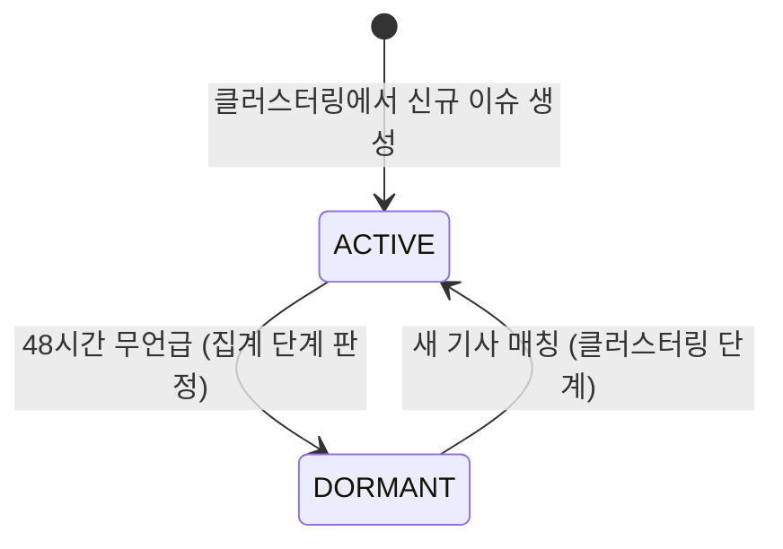
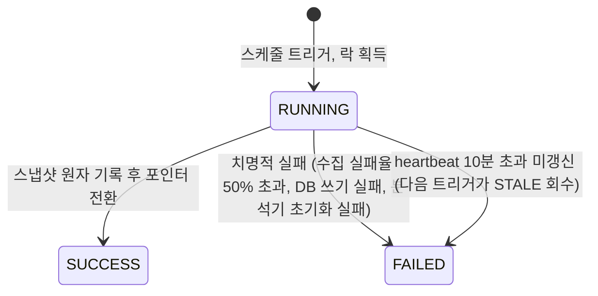

# Korea Pulse 백엔드 기능 정의서

| 항목 | 내용 |
| --- | --- |
| 문서 번호 | 01 |
| 문서 버전 | v0.2 정합 (2026-09-14) |
| 대상 | Korea Pulse MVP 백엔드 (Java 21, Spring Boot 4.1.1, PostgreSQL, Redis) |
| 근거 문서 | 00-프로젝트-정의서-v0.2 §6(MVP 범위), §8(이슈 분석과 지표), §10(API 계약 초안), §11(운영 품질) |
| 관련 문서 | 00-프로젝트-정의서-v0.2, 02-시스템-설계서, 03-DB-설계, 04-API-명세, 05-개발-계획서 |
| 이전 버전 | v1.0 (2026-09-13, PRD v0.1 기반). 변경 요약은 11절 |

---

## 1. 개요와 문서 목적

Korea Pulse는 수집한 국내 뉴스에서 관심이 증가하는 이슈(topic)를 탐지하고, 관련 기사와 시간별 변화를 보여주는 웹 서비스다. 이 문서는 백엔드가 MVP에서 제공해야 하는 기능을 입력, 출력, 예외, 상태 변화 네 축으로 정의한다. 시스템 구조는 02, 테이블은 03, 엔드포인트 형식은 04가 다룬다.

정의서 §1에 따라 백엔드가 계산하는 모든 지표는 **수집한 뉴스 기준**이다. 국민 전체의 관심이나 여론을 측정한 값이 아니며, Hot Score는 내부 상대 점수다. API 응답과 문서 어디에서도 "국민 관심 비율", "여론"으로 표현하지 않는다.

### 1.1 MVP 기능 범위

정의서 §6의 P0 항목을 백엔드 기능으로 옮긴 것이다.

| 구분 | 기능 | 성격 | 정의서 대응 |
| --- | --- | --- | --- |
| 기능 1 | 이슈 순위 (급상승·언급량·Hot Score) | 읽기 전용 조회 | P0 급상승·언급량 순위, 카테고리 필터 |
| 기능 2 | 이슈 상세 (요약 지표·추이·관련 기사·연관 키워드) | 읽기 전용 조회 | P0 이슈 상세 |
| 기능 3 | 이슈 검색 | 읽기 전용 조회 | P0 검색 |
| 기능 4 | 수집·분석 파이프라인 | 주기 실행 배치 (15분 목표 주기) | P0 뉴스 파이프라인, 이슈 클러스터 |
| 기능 5 | 검색 관심도 보조 지표 (Google Trends) | 파이프라인 부가 + 상세 응답 필드 | P1 |
| 기능 6 | 영상 관심도 보조 지표 (YouTube) | 파이프라인 부가 + 상세 응답 필드 | P1 |

기능 5·6은 P1이며, 실패하거나 데이터가 없으면 null로 응답한다. 기능 1~4가 동작하지 않으면 출시할 수 없다.

**기능 5는 Google Trends 알파 승인이 없으면 통짜로 비활성**이다(정의서 §5.3). 승인을 출시 선행 조건으로 두지 않는다.

### 1.2 MVP 제외 범위

정의서 §6 "MVP 이후"에 따라 다음은 이 문서에서 설계하지 않는다.

회원가입·로그인, 결제, 자동 알림, 개인화, **AI 요약**, 댓글·커뮤니티, 모바일 앱, 글로벌 비교, B2B 키워드 워치(정의서 §12)가 여기에 해당한다. 따라서 MVP 백엔드에는 인증이 없고 모든 API는 익명 읽기 요청만 처리한다.

AI 요약은 v0.1 계획에서 MVP 필수였으나 정의서 §6에서 MVP 이후로 이동했다. LLM은 MVP에서 **이슈 카테고리 분류 폴백**에만 쓴다(5절).

### 1.3 용어

| 용어 | 정의 |
| --- | --- |
| 기사(article) | NAVER News Search API가 반환한 한 건의 기사 메타데이터. 제목, 요약 스니펙, 원문·공급자 링크, 발행 시각, 출처. 본문은 저장하지 않는다 |
| 영상(video) | YouTube 인기 차트·뉴스 채널 업로드에서 받은 영상 메타. **언급량·순위에 들어가지 않고** 상세의 보조 지표와 후보 키워드에만 쓴다 |
| 중복 그룹(duplicate group) | 같은 기사의 재배포·전재본을 묶은 단위. 언급량은 그룹 하나를 1건으로 센다 |
| 키워드(keyword) | 기사 제목과 스니펫에서 추출·정규화한 명사. 별칭(alias)을 가질 수 있다 |
| 이슈(topic) | 같은 사건을 다루는 기사들을 묶은 클러스터. 대표 키워드 조합이 이슈 제목이 된다 |
| 런(run) | 파이프라인 1회 실행 단위. `collection_run` 한 행에 대응한다 |
| 시간 버킷(bucket) | UTC 정각 기준 1시간 구간. 집계의 최소 단위다 |
| 기간(period) | 순위·상세의 조회 구간 길이. 1h, 6h, 24h, 7d |
| T (dataThrough) | 완료된 공통 집계 시점. 모든 카테고리·기간이 같은 T를 쓴다 |
| 스냅샷(snapshot) | 한 런이 계산한 전체 순위 결과 묶음. `snapshotId` 하나로 식별하며 일괄 게시된다 |
| 언급량(mentionCount) | 구간 안에 발행된, 해당 이슈에 속한 **중복 제거 후 기사 수**. 영상은 포함하지 않는다 |
| 출처 수(sourceCount) | 구간 안에 그 이슈를 보도한 서로 다른 매체 수 |
| Hot Score | 뉴스 지표만으로 계산한 내부 상대 점수 (8절). 진실성·중요도가 아니다 |

### 1.4 시각과 기간 원칙

- 저장은 UTC, 응답은 KST(+09:00) ISO 8601이다. 버킷 경계는 UTC 정각이며 KST로 변환해도 정각이다.
- 현재 구간은 `[T-P, T)`, 비교 구간은 `[T-2P, T-P)`다. T는 완료된 버킷 경계이고, 진행 중인 버킷은 과소 집계되므로 T에 포함하지 않는다.
- 한 응답 안의 모든 값은 같은 `snapshotId`와 같은 T를 기준으로 한다. 순위와 상세를 이어서 호출해도 기준이 섞이지 않는다.

---

## 2. 기능 1: 이슈 순위

메인 화면의 데이터다. 카테고리·기간·정렬을 받아 최대 `limit`개 이슈를 순위순으로 돌려준다.

### 2.1 입력

| 파라미터 | 필수 | 허용값 | 기본값 |
| --- | --- | --- | --- |
| category | 아니오 | 아래 6종 탭 코드 중 하나 | ALL |
| period | 아니오 | 1h, 6h, 24h, 7d | 24h |
| sort | 아니오 | hot, growth, mentions | hot |
| limit | 아니오 | 1~50 | 20 |

카테고리 코드는 정의서 §6을 그대로 따른다.

| 코드 | 표시명 | 저장 여부 | 비고 |
| --- | --- | --- | --- |
| ALL | 전체 | 저장 안 함 | 카테고리를 구분하지 않은 통합 조회. 카테고리 자체가 아니다 |
| ECONOMY | 경제 | 저장 | |
| SPORTS | 스포츠 | 저장 | |
| ENTERTAINMENT | 연예 | 저장 | |
| POLITICS_SOCIAL | 정치/사회 | 저장 | 하나의 카테고리로 취급 |
| IT_SCIENCE | IT/과학 | 저장 | 하나의 카테고리로 취급 |
| UNCLASSIFIED | (탭 없음) | 저장 | 분류 실패·보류 상태. 탭으로 노출하지 않고 ALL 조회에만 포함된다 |

v0.1의 `POLITICS_SOCIETY`는 `POLITICS_SOCIAL`로, `ETC`는 `UNCLASSIFIED`로 바뀌었다. `UNCLASSIFIED`는 정의서 §8 "미분류 상태를 허용한다"를 구현한 값이며 사용자에게 탭으로 보이지 않는다.

공개 시점에 실제로 수집·분류하는 카테고리 범위는 응답 메타 `coveredCategories`로 알린다(정의서 §6: "공개 시점의 전체 탭은 실제로 수집·분류하는 범위를 명시한다"). 첫 검증은 경제·스포츠 표본부터 진행하므로 초기에는 이 배열이 6종보다 짧을 수 있다.

### 2.2 출력

응답의 순위·지표는 가장 최근에 게시(PUBLISHED)된 스냅샷 값이다. 이슈 제목은 라이브 `topic.title`을 조인한다.

공통 메타 (정의서 §10):

| 필드 | 설명 |
| --- | --- |
| snapshotId | 이 응답이 읽은 스냅샷. 상세·시계열 호출에 그대로 넘겨 같은 기준을 고정할 수 있다 |
| generatedAt | 스냅샷 계산 완료 시각 |
| dataThrough | 집계 기준 시점 T |
| period, sort, category | 적용된 요청 값 |
| timezone | 항상 `Asia/Seoul` |
| dataStatus | fresh / stale / insufficient (2.5절) |
| scoreVersion | Hot Score 공식 버전 문자열 |
| availablePeriods | 비교 구간까지 데이터가 확보된 기간 목록. 프론트는 이 목록만 활성화한다 |
| coveredCategories | 현재 수집·분류가 실제로 이루어지는 카테고리 목록 |
| notices | 폴백·저하 상태 안내 코드 배열. `SNAPSHOT_FALLBACK`, `SORT_FALLBACK_MENTIONS`, `PROVIDER_PARTIAL`, `COVERAGE_DEGRADED`(2.3절), `SCORE_UNAVAILABLE`(3.2.1절) |

항목별 정보 (rank 오름차순):

| # | 항목 | 필드명 | 타입 | 산출 규칙 |
| --- | --- | --- | --- | --- |
| 1 | 순위 | rank | int | 선택한 sort 기준 내림차순. 동률 규칙은 2.4절 |
| 2 | 이슈 식별자 | topicId | long | 기능 2·3 호출에 사용 |
| 3 | 이슈 제목 | title | string | 대표 키워드 최대 3개를 공백으로 이은 문자열 |
| 4 | 카테고리 | category | string | ALL을 제외한 저장 코드 6종 중 하나 |
| 5 | 언급량 | mentionCount | int | 현재 구간 중복 제거 후 기사 수 |
| 6 | 원본 기사 수 | rawArticleCount | int | 중복 제거 전 기사 수. 두 값을 구분해 노출한다(정의서 §8) |
| 7 | 이전 언급량 | previousMentionCount | int | 비교 구간 중복 제거 후 기사 수 |
| 8 | 증가율 | growthRate | float nullable | 이전이 양수일 때 `(현재 - 이전) / 이전 × 100`. 이전 0건이면 null |
| 9 | 증가량 | growthDelta | int | `현재 - 이전`. 소량 기사의 과장된 증가율을 보완하는 지표 |
| 10 | 증가 상태 | growthStatus | string | OK / NEW / INSUFFICIENT (2.3절) |
| 11 | 출처 수 | sourceCount | int | 현재 구간 서로 다른 매체 수 |
| 12 | Hot Score | hotScore | float | 0~100. 8절 공식, scoreVersion과 함께 해석한다 |
| 13 | 근거 문장 | reason | string | 실제 집계로 생성. 예: `최근 1시간 42건, 이전 1시간 12건` |

순위 응답에는 `searchInterest`가 **없다**. 검색 관심도는 정의서 §5.4·§8에 따라 순위·점수와 분리된 상세 전용 보조 지표이며(6.3절), 03 문서 3.13절도 `trend_snapshot_entry`에 넣지 않는다고 규정한다. 순위 응답에 실으면 Redis 랭킹 캐시가 적중해도 항목 50건에 대해 PostgreSQL을 조인해야 해서 캐시를 둔 이유가 상쇄된다.

`growthRate`는 nullable이다. 나머지 필드는 항상 값이 있다.

### 2.3 증가율과 증가 상태

| growthStatus | 조건 | growthRate | 표시 문구 |
| --- | --- | --- | --- |
| OK | 비교 구간이 확보되어 있고 previousMentionCount > 0 | 계산값 | 증가율 그대로 |
| NEW | 비교 구간이 확보되어 있고 previousMentionCount = 0 | null | "신규" |
| INSUFFICIENT | 비교 구간 `[T-2P, T-P)`가 수집 개시 이후 데이터로 채워지지 않음, 또는 그 구간의 **결손 비율이 임계치 초과** | null | "비교 데이터 부족" |

부분 수집 실패 구간을 정상 0건으로 계산하지 않는다(정의서 §11). 다만 버킷 하나라도 결손이면 구간 전체를 무효로 보는 all-or-nothing 규칙은 쓰지 않는다. 7d는 현재+비교 336버킷, 24h는 48버킷이라 하루 96런 중 한 번의 부분 실패만으로 급상승 순위가 종일 죽기 때문이다.

```
결손 비율 = (MISSING 버킷 수 + PARTIAL 버킷 수 × 0.5) / 구간 버킷 수
```

비교 구간의 결손 비율이 **0.10을 초과**하면 INSUFFICIENT이고, 그 이하면 OK/NEW 규칙을 그대로 적용한다. 현재 구간이 임계를 넘으면 지표는 제공하되 `meta.notices`에 `COVERAGE_DEGRADED`를 넣는다. 버킷 단위 판정과 임계값은 03 문서 3.11절을 따른다.

### 2.4 순위 결정

| 항목 | 규칙 |
| --- | --- |
| 순위 후보 | ACTIVE 이슈 중 아래 최소 조건을 만족하는 것 |
| 최소 언급량 | 1h: 3건, 6h: 5건, 24h: 8건, 7d: 15건 (설정값, 표본 검토 후 확정) |
| 최소 출처 수 | 2개 (설정값) |
| sort=hot | hotScore 내림차순 → mentionCount 내림차순 → topicId 오름차순 |
| sort=growth | growthStatus가 OK인 이슈를 growthRate 내림차순으로 먼저, 그다음 NEW를 growthDelta 내림차순으로, INSUFFICIENT는 제외 |
| sort=mentions | mentionCount 내림차순 → sourceCount 내림차순 → topicId 오름차순 |
| **정렬별 독립 선정** | 세 정렬은 **각각 전체 순위 후보를 대상으로** 상위 50을 매긴다. 한 정렬의 상위 50을 다시 정렬해 다른 정렬을 만들지 않는다 |
| 1h·6h 후보 제외 | 자가시딩 순환 티어 이슈(02 문서 6.1.2절)는 단시간 구간이 구조적으로 과소 집계되므로 1h·6h 순위 후보에서 제외한다. 24h·7d에는 정상 참여 |
| ALL | 카테고리 필터 없이 같은 규칙 적용. UNCLASSIFIED 이슈도 포함된다 |
| 카테고리별 | 이슈의 category로 먼저 거른 뒤 같은 규칙 적용. 한 이슈는 정확히 한 카테고리에 속하므로 ALL을 제외하면 중복이 없다 |

최소 조건은 정의서 §8 "소량 기사의 과장된 증가율을 막기 위해 최소 기사 수·출처 수 조건"의 초기값이다. 표본 검토 전까지는 확정값이 아니며 설정으로 바꿀 수 있어야 한다.

**정렬별 독립 선정이 필수인 이유**: hot 상위 50만 저장하고 그 안에서 growth를 재정렬하면, hot 51위이지만 증가율 1위인 이슈가 `sort=growth`에 영원히 나오지 않는다. 정의서 §6의 P0 "급상승 순위"가 hot 점수의 부분집합으로 전락한다. 또한 `sort=growth`는 INSUFFICIENT를 제외하므로, hot 상위 50에서 제외분을 걸러내면 `limit=50`을 채우지도 못한다. 저장 모델은 03 문서 3.13절(`rank_hot`·`rank_growth`·`rank_mentions`)을 따른다.

### 2.5 데이터 상태 (dataStatus)

| 값 | 조건 | 응답 |
| --- | --- | --- |
| fresh | 마지막 게시 스냅샷의 dataThrough가 현재 시각 기준 케이던스의 2배 이내이고, 현재 구간 버킷에 수집 실패가 없음 | 200 |
| stale | 위 조건을 벗어남 (수집 지연, 연속 실패로 마지막 정상 스냅샷을 계속 서빙 중) | 200. 프론트는 갱신 지연을 표시한다 |
| insufficient | 요청 period의 비교 구간이 확보되지 않음 | 200. 순위는 제공하되 growthRate 전부 null, sort=growth는 mentions 순서로 폴백하고 메타에 알린다 |

외부 API 장애 시 마지막 정상 스냅샷과 갱신 지연 표시를 제공한다(정의서 §11). 장애는 503이 아니라 stale로 나타낸다. 503은 게시된 스냅샷이 한 번도 없을 때만 쓴다.

### 2.6 예외

| 상황 | 동작 | 응답 |
| --- | --- | --- |
| 지원하지 않는 category / period / sort 값 | 요청 거부 | 400 |
| limit이 1~50 밖 | 요청 거부 | 400 |
| 게시된 스냅샷이 한 번도 없음 | 서빙할 데이터 없음 | 503, 재시도 힌트 |
| 마지막 런 실패 | 직전 게시 스냅샷을 그대로 서빙 | 200, dataStatus=stale |
| 순위 대상 이슈가 limit 미만 | 있는 만큼 반환. 빈 배열도 정상 | 200 |
| 비교 구간 미확보 | 2.3·2.5절 규칙 적용 | 200 |
| 검색 관심도 없음 | `searchInterest: null` | 200 |

### 2.7 상태 변화

없다. 스냅샷과 라이브 테이블을 읽기만 하며 조회수 집계도 하지 않는다.

---

## 3. 기능 2: 이슈 상세

순위에서 이슈 하나를 골랐을 때 보여주는 데이터다. 정의서 §7의 상세 화면 순서(이슈명·요약 지표 → 추이 → 증가 근거 → 대표·관련 기사 → 연관 키워드 → 선택적 검색 관심도)를 뒷받침한다. 데이터 성격이 달라 네 부분으로 나눈다.

### 3.1 입력

| 부분 | 파라미터 | 필수 | 설명 |
| --- | --- | --- | --- |
| 공통 | topicId | 예 | 기능 1·3이 돌려준 식별자 |
| 공통 | period | 아니오 | 1h, 6h, 24h, 7d. 기본 24h |
| 공통 | snapshotId | 아니오 | 지정하면 그 스냅샷 기준으로 지표를 읽는다. 생략하면 최신 게시 스냅샷 |
| 시계열 | period, interval | 아니오 | interval은 hour 또는 day. 기본은 period에 따라 결정(3.2.2) |
| 관련 기사 | page, size | 아니오 | 0부터 시작. 기본 page=0, size=10, size 최대 50 |

### 3.2 출력

#### 3.2.1 이슈 기본 정보와 요약 지표

| 항목 | 필드명 | 타입 | 산출 규칙 |
| --- | --- | --- | --- |
| 이슈 식별자 | topicId | long | |
| 이슈 제목 | title | string | 기능 1과 동일 |
| 카테고리 | category | string | 저장 코드 6종 중 하나 |
| 상태 | status | string | ACTIVE 또는 DORMANT |
| 언급량 | mentionCount | int | 스냅샷의 현재 구간 값 |
| 원본 기사 수 | rawArticleCount | int | 중복 제거 전 |
| 이전 언급량 | previousMentionCount | int | 비교 구간 값 |
| 증가율·증가량·상태 | growthRate, growthDelta, growthStatus | 기능 1과 동일 | |
| 출처 수 | sourceCount | int | |
| Hot Score | hotScore | float | |
| 근거 문장 | reason | string | 정의서 §7 "증가 근거" |
| 대표 기사 | representativeArticles | 배열 (최대 3) | 중복 그룹 대표 기사 중 출처 다양성·최신순으로 선정 |
| 최초 관측 시각 | firstSeenAt | datetime | 이슈가 처음 만들어진 시각 |
| 최근 언급 시각 | lastMentionedAt | datetime | 소속 기사 중 가장 최신 발행 시각 |
| 검색 관심도 | searchInterest | object nullable | 6.1절. Trends 알파 미승인이면 항상 null |
| 영상 관심도 | videoInterest | object nullable | 6.2절. 매칭 영상이 없으면 null |

AI 요약(`summary`, `summaryGeneratedAt`)은 MVP 응답에 없다. MVP 이후 추가할 때도 기존 필드를 바꾸지 않고 추가만 한다.

#### 순위권 밖 이슈의 조회 시점 계산

순위에 오르지 못한 이슈(최소 조건 미달, 또는 상위 50 밖)도 상세 조회는 가능하다. 이때 구간 지표는 `topic_hourly_stat`에서 조회 시점에 같은 규칙으로 계산하고 `rank`는 null이다.

`hotScore`는 다르다. 8.1절의 growth·mentions·sources는 **기준 집단 min-max로 정규화**되므로, 순위 후보 집단에 없는 이슈의 점수를 내려면 전체 후보 집단을 다시 구성해야 한다. 매 요청마다 할 수 없는 일이다.

대신 스냅샷 헤더의 `score_norm_params`(03 문서 3.12절)에 기간별 min·max·클리핑 경계를 저장해 두고, 조회 시점에는 그 파라미터로만 정규화한다.

| 조건 | `hotScore` |
| --- | --- |
| 스냅샷 항목에 있음 | 저장된 값 그대로 |
| 순위권 밖 + 해당 period의 `score_norm_params` 있음 | 저장된 파라미터로 정규화해 계산. 범위를 벗어나면 0 또는 100으로 클램프 |
| 게시된 스냅샷이 없거나 해당 period 파라미터가 없음 | **null** + `meta.notices`에 `SCORE_UNAVAILABLE` |
| `period=7d` 요청 | **null** + `SCORE_UNAVAILABLE`. 336버킷 온더플라이 집계는 P95 500ms 목표와 양립할 수 없다 |

이때 점수는 같은 기준으로 정규화된 값이므로 순위권 항목과 직접 비교해도 의미가 유지된다. `scoreVersion`은 그 스냅샷의 값을 그대로 돌려준다.

#### 3.2.2 시간별 추이 (timeline)

| 항목 | 필드명 | 타입 | 설명 |
| --- | --- | --- | --- |
| 구간 시작·끝 | from, to | datetime | 실제 적용된 반개구간 `[from, to)` |
| 간격 | interval | string | hour 또는 day |
| 시계열 | points | [{ bucket, mentionCount, status }] | 간격별 1개 |

`interval` 기본값은 1h·6h·24h가 hour, 7d가 day다. `points[].status`는 OK / PARTIAL / MISSING이며, 수집 실패나 미수집 구간을 0과 구분한다(정의서 §7 "차트는 누락 구간과 실제 0을 구분"). PARTIAL·MISSING 버킷의 mentionCount는 참고값이며 프론트는 값을 끊어 그린다.

조회 폭은 최대 14일이다. 그 이상은 400으로 거부한다.

#### 3.2.3 관련 기사 목록 (articles)

| 항목 | 필드명 | 타입 | 설명 |
| --- | --- | --- | --- |
| 전체 건수 | totalCount | int | 중복 제거 후 그룹 수 |
| 페이지 | page, size | int | 적용된 값 |
| 기사 목록 | items | 배열 | 발행 시각 내림차순. 각 항목은 중복 그룹 대표 기사 |
| 기사.제목 | title | string | 태그 제거 후 |
| 기사.원문 링크 | originalUrl | string | 언론사 원문 URL |
| 기사.공급자 링크 | providerUrl | string nullable | 공급자(네이버 등) 링크. 없으면 null |
| 기사.출처 | source | string nullable | 매체 표시명. 매핑이 없으면 null (임의 추정 금지, 정의서 §5.3) |
| 기사.발행 시각 | publishedAt | datetime | |
| 기사.중복 수 | duplicateCount | int | 이 그룹에 묶인 재배포 기사 수 |
| 공급자 표기 | providerNotice | string | 공급자별 출처 표기 문자열 (9절) |

기사 본문과 스니펫은 응답에 포함하지 않는다. 사용자는 링크로 이동해 원문을 읽는다.

관련 기사 조회가 외부 API 호출을 동반하는 경우(정의서 §5.3), 그 실패가 상세 전체를 실패시키지 않는다. 저장된 기사만으로 응답하고 `partial: true`로 표시한다.

#### 3.2.4 연관 키워드 (related-keywords)

| 항목 | 필드명 | 타입 | 설명 |
| --- | --- | --- | --- |
| 키워드 목록 | items | [{ keyword, articleCount }] | 최대 10개, articleCount 내림차순 |

### 3.3 예외

| 상황 | 동작 | 응답 |
| --- | --- | --- |
| 존재하지 않는 topicId | 요청 거부 | 404 |
| topicId 형식 오류 | 요청 거부 | 400 |
| DORMANT 이슈 조회 | 정상 제공. status로 구분 | 200 |
| 지정한 snapshotId가 없거나 만료 | 최신 게시 스냅샷으로 폴백하고 메타에 알림 | 200 |
| 기사 보존 기간 만료로 전부 삭제 | totalCount 0, items 빈 배열 | 200 |
| from > to, 폭 14일 초과, interval 값 오류 | 요청 거부 | 400 |
| page 음수, size가 1~50 밖 | 요청 거부 | 400 |
| 범위를 넘는 page | items 빈 배열, totalCount는 정상 | 200 |

### 3.4 상태 변화

조회는 상태를 바꾸지 않는다. `status` 값은 파이프라인이 관리한다.

| 전이 | 조건 | 판단 주체 |
| --- | --- | --- |
| (생성) → ACTIVE | 클러스터링에서 새 이슈 생성 | 클러스터 단계 |
| ACTIVE → DORMANT | lastMentionedAt 기준 48시간 동안 새 기사 없음 | 집계 단계 |
| DORMANT → ACTIVE | DORMANT 이슈에 새 기사 매칭 | 클러스터 단계 |

DORMANT는 순위 후보에서 빼기 위한 상태이지 삭제가 아니다.

---

## 4. 기능 3: 이슈 검색

정의서 §6에서 P0로 올라온 기능이다. 정의서 §7의 검색 규칙을 그대로 따른다.

### 4.1 입력

| 파라미터 | 필수 | 설명 |
| --- | --- | --- |
| q | 예 | 검색어. 트림 후 1~50자 |
| limit | 아니오 | 1~50, 기본 20 |

### 4.2 출력과 매칭 규칙

검색 대상은 **추적 중인 이슈**다. 이슈 제목, 키워드 별칭, 연관 키워드를 대상으로 정규화 후 매칭한다.

| 항목 | 필드명 | 설명 |
| --- | --- | --- |
| 결과 목록 | items | topicId, title, category, matchedBy(TITLE / ALIAS / KEYWORD), mentionCount(24h), hotScore(**nullable**), lastMentionedAt |
| 결과 수 | totalCount | 최대 limit까지 반환 |
| 빈 결과 안내 | emptyReason | 결과가 없을 때 `NOT_TRACKED` |

`hotScore`는 3.2.1절과 같은 규칙을 따른다. 스냅샷 항목에 있으면 그 값, 없으면 24h `score_norm_params`로 재현하고, 파라미터가 없으면 null이다.

검색되지 않은 키워드의 Hot Score를 임의로 만들지 않는다. 미추적 키워드는 빈 목록과 `emptyReason: "NOT_TRACKED"`를 돌려주고, 프론트가 "아직 분석 중인 이슈가 없습니다"와 관련 뉴스 탐색 경로를 보여준다.

### 4.3 예외

| 상황 | 응답 |
| --- | --- |
| q 누락, 공백만, 50자 초과 | 400 |
| limit 범위 밖 | 400 |
| 매칭 이슈 없음 | 200, items 빈 배열, emptyReason=NOT_TRACKED |

---

## 5. 기능 4: 수집·분석 파이프라인

정의서 §9의 흐름(데이터 소스 → Collector → 정규화·중복 제거 → 키워드·클러스터 → 분류·시간 집계 → 점수 → 스냅샷 → 랭킹 캐시 → API)을 런 단위로 구체화한 것이다.

### 5.1 주기와 데이터 소스

| 항목 | 내용 |
| --- | --- |
| 목표 주기 | 15분. 정의서 §9 "15분 배치는 목표 주기다. 실제 공급 지연과 호출 한도 확인 후 확정한다" |
| 축퇴 주기 | 쿼터·지연 상황에서 30분, 60분으로 단계 축소 (02 문서) |
| 측정 항목 | 배치 실행 간격과 "뉴스 발생 → 화면 노출" 지연을 각각 측정해 `collection_run`에 기록 |
| 뉴스 공급원 | **NAVER News Search API로 확정**(정의서 §5.1). 언급량·증가율·Hot Score의 유일한 입력. `NewsProvider` 인터페이스는 교체 가능성을 위해 유지 |
| 영상 공급원 | YouTube Data API v3. **`search.list`를 쓰지 않는다**(하루 100호출 제한). 국내 인기 차트와 지정 뉴스 채널의 업로드 플레이리스트만 읽는다 |
| 검색 관심도 | Google Trends API. 알파 승인 전에는 비활성이 기본값이다 |
| 관련 기사 | 이슈 상세의 관련 기사 조회에 네이버 API를 사용할 수 있다. 저장·캐시·재표시 범위는 약관 확인 후 확정 |

뉴스 공급원이 바뀜면 이 문서에서 바뀜는 것은 5.2의 1~2단계와 9절의 공급자별 저장 정책뿐이다. 3단계 이후는 공급원과 무관하다.

**영상과 검색 관심도는 주 파이프라인을 멈추지 않는다.** 둘 다 비치명적 보조 지표이고, 전부 실패해도 순위·상세·검색은 그대로 동작한다.

### 5.2 런 프레임

| 항목 | 내용 |
| --- | --- |
| 입력 | 스케줄러 트리거 (fixedDelay, 기본 15분) |
| 락 | `collection_run`에 RUNNING 행 삽입. 이미 RUNNING 행이 있고 heartbeat가 10분 이내면 스킵, 10분 초과 미갱신이면 STALE로 회수 후 새 런 시작 |
| 출력 | runId |
| 종료 | 전 단계 완료 시 SUCCESS, 치명적 실패 시 FAILED와 실패 단계·사유 기록 |
| 재실행 | 같은 구간을 다시 수집해도 중복 집계되지 않는다(정의서 §6 P0 완료 기준). 기사 중복은 `content_hash`/공급자 ID로, 집계는 구간 재계산 upsert로 보장한다 |

스테일 기준 10분은 정상 런 소요(수 분)보다 넉넉하고 15분 주기보다 짧다.

### 5.3 단계 정의

실패는 치명적(런 FAILED)과 비치명적(건너뛰고 계속)으로 나눈다. 원칙은 하나다. 새 데이터를 만들지 못하더라도 기존 데이터로 스냅샷을 갱신할 수 있으면 계속 간다.

| # | 단계 | 입력 | 출력 | 예외와 동작 |
| --- | --- | --- | --- | --- |
| 1 | 후보 생성 + 영상 수집 | CandidateSource 3종(YouTube, Google Trends, 자가시딩) | `video` upsert, 중복 제거된 검색 키워드 풀 (최대 150개, 자가시딩 110 / YouTube 25 / Trends 15 고정 슬롯) | YouTube 인기차트 5호출 + 채널 업로드 12호출로 영상을 받아 저장하고 제목에서 키워드를 뽑는다. 외부 소스 실패는 빈 목록이고 그 슬롯은 자가시딩이 회수. 우선순위 절단은 금지(02 문서 6.1절). 후보 0개면 2~7단계를 건너뛰고 8단계부터 진행 |
| 2 | 수집 | 키워드 풀 | 공급자 원시 결과 | 429는 지수 백오프 3회 후 해당 키워드 포기. 시도 키워드 중 실패율 50% 초과일 때만 런 FAILED. 쿼터 도달은 미시도로 분류하고 부분 수집으로 계속하되 해당 버킷을 PARTIAL로 표시 |
| 3 | 정규화 | 원시 결과 | `article` 행 (태그 제거, UTC 변환, URL 정규화, 출처 도메인 추출) | 발행 시각 파싱 실패 건은 폐기하고 카운트만 기록 |
| 4 | 중복 제거 | 신규 기사 | `article_duplicate_group` 배정 | 정규화 URL·공급자 ID 동일 → 같은 기사. 제목·허용 텍스트 유사도가 임계값 이상 → 재배포로 묶는다. 판정 불가면 단독 그룹 |
| 5 | 키워드 추출 | 신규 기사 | `article_keyword`, `keyword` upsert | 명사 0개 기사는 클러스터링에서 제외. 분석기 초기화 실패는 치명적 |
| 6 | 클러스터링 | 신규 기사 키워드 + 기존 이슈 키워드 | `topic`, `topic_keyword`, `topic_article` | 기존 이슈와 유사도가 임계값 이상이면 병합, 아니면 신규 생성. 같은 기업명이라는 이유만으로 다른 사건을 합치지 않는다(7절) |
| 7 | 분류 | 신규·미분류 이슈 | `topic.category`, `topic_tag` | 휴리스틱 → LLM 폴백 순. 둘 다 실패하면 UNCLASSIFIED로 두고 계속 |
| 8 | 집계 | `topic_article` + 발행 시각 | `topic_hourly_stat` upsert (언급량·원본 수·출처 수) | DB 쓰기 실패는 치명적. 48시간 무언급 이슈를 DORMANT로 전이 |
| 9 | 점수 계산 | 후보 이슈의 구간 집계 | 기간 4종 × 카테고리 6종별로 **정렬 3종 각각의 상위 50**과 Hot Score, 그리고 `score_norm_params` (메모리) | 계산 자체는 실패 요소가 없다. 후보 0개 카테고리는 빈 목록 |
| 10 | 보조 지표 | 상위 이슈 대표 키워드, 1단계가 모은 영상 | `search_interest_snapshot`, `topic_video`, `video.view_count` | 세 가지. ① 영상 제목 키워드와 이슈 키워드 매칭(공통 2개 이상) ② 상위 영상 조회수 갱신 ③ Trends 조회. 전부 비치명적. Trends 미승인이면 ③ 생략하고 `NO_ACCESS` 기록 |
| 11 | 스냅샷 게시 | 9~10단계 결과 | `trend_snapshot`(헤더) + `trend_snapshot_entry`, Redis 랭킹 키, 현재 스냅샷 포인터 전환 | 단일 트랜잭션으로 기록한 뒤 포인터를 전환한다. 실패 시 롤백하고 런 FAILED. 서로 다른 배치 결과가 섞이지 않는다 |

### 5.4 실패 시 서비스 영향

| 실패 지점 | 런 상태 | 사용자 영향 |
| --- | --- | --- |
| 1단계 YouTube 장애·쿼터 | SUCCESS (축퇴) | 신규 이슈 발견 지연, 영상 관심도 갱신 중단. 기존 이슈 추적과 순위는 정상 |
| 1단계 Trends 미승인·장애 | SUCCESS (기본 상태) | 검색 관심도 null. 후보 슬롯은 자가시딩이 회수 |
| 2단계 쿼터 소진 | SUCCESS | 수집 범위 축소. 해당 버킷 PARTIAL 표시 |
| 2단계 실패율 50% 초과 | FAILED | 직전 게시 스냅샷 유지, dataStatus=stale |
| 7단계 분류 실패 | SUCCESS | 해당 이슈 UNCLASSIFIED. ALL 탭에서만 보인다 |
| 10단계 Trends 실패 | SUCCESS | 검색 관심도 null |
| 10단계 영상 매칭 실패 | SUCCESS | 영상 관심도 null. 순위는 영향 없음 |
| 11단계 게시 실패 | FAILED | 직전 게시 스냅샷 유지 |
| 프로세스 중단 | RUNNING 잔류 → 다음 트리거가 STALE 회수 | 최대 약 25분(10분 + 다음 런 15분) 갱신 지연 |

연속 실패가 이어져도 마지막 게시 스냅샷은 삭제하지 않는다. 503은 게시된 스냅샷이 한 번도 없을 때만 나간다.

### 5.5 런 단위 자원 상한

| 자원 | 상한 | 근거 |
| --- | --- | --- |
| 뉴스 공급자 호출 | 런당 300회, 키워드 풀 150개 × 96런 = 하루 최대 약 14,400회 | 네이버 일 25,000회의 약 58% (02 문서 쿼터 절) |
| YouTube units | 런당 19 (인기차트 5 + 채널 12 + 조회수 2) = 하루 약 1,824 | 일 10,000 units의 약 18%. `search.list`는 0 |
| Google Trends 호출 | 상위 이슈 대표 키워드, 당일 미조회만 | 한도 미공개. 승인 후 실측해 확정 |
| LLM 분류 폴백 | 런당 10회 | 신규 이슈에 한정 |
| heartbeat 미갱신 | 10분 초과 시 스테일 회수 | 5.2절 |

---

## 6. 보조 지표 (검색·영상)

둘 다 상세 전용이고, 둘 다 없어도 서비스가 동작한다.

### 6.1 검색 관심도 (Google Trends)

정의서 §5.3의 제약이 그대로 필드 정의가 된다.

| 제약 | 값 | 영향 |
| --- | --- | --- |
| 접근 | 알파 신청제 | 미승인이면 10단계를 생략하고 항상 null |
| 시간 해상도 | 일·주·월·년 | 시간별 급상승 입력으로 쓰지 않는다 |
| 최신성 | **2일 전까지** | `asOf`를 반드시 함께 표시한다. 48시간 지연은 장애가 아니다 |
| 스케일 | 요청 간 **일관** | 서로 다른 조회 결과를 이어 시계열로 그릴 수 있다 |

`searchInterest` 객체:

| 필드 | 타입 | 의미 |
| --- | --- | --- |
| value | float | 대표 키워드의 일관 스케일 검색 관심도. **0~100 재정규화값이 아니다** |
| asOf | date (KST) | 그 값의 기준 일자. 보통 2일 전 |
| geo | string | 조회 지역. MVP는 `KR` |
| timeUnit | string | `day` 고정 |
| unavailableReason | string nullable | NO_DATA / QUOTA / ERROR / **NO_ACCESS**(알파 미승인) |

프론트는 `value`를 `asOf` 없이 단독 표시하지 않는다. 데이터가 없으면 객체 전체를 null로 주고 "검색 데이터 없음"으로 표시한다. 오늘의 실시간 검색량으로 표현하지 않는다.

순위에서 보이는 값은 절대치가 아니므로, 프론트는 순위 목록이 아니라 상세의 추이 그래프로만 그린다.

### 6.2 영상 관심도 (YouTube)

정의서 §5.2에 따라 **키워드 검색을 쓰지 않고** 국내 인기 차트와 지정 뉴스 채널 업로드만 수집한다. 그 결과 이슈별 커버리지가 균등하지 않으며, 이 한계를 응답과 UI에 명시한다.

`videoInterest` 객체:

| 필드 | 타입 | 의미 |
| --- | --- | --- |
| videoCount | int | 현재 구간에 이 이슈와 매칭된 영상 수 |
| viewCountSum | long | 그 영상들의 관측 조회수 합 |
| topVideos | 배열 (최대 3) | `{ videoId, title, channelTitle, publishedAt, viewCount }`. `match_score` 내림차순 |
| statsAsOf | datetime nullable | 조회수 마지막 관측 시각. 구버전일 수 있음을 드러낸다 |
| coverage | string | `POPULAR`(인기 차트에서 발견) / `CHANNEL`(채널 업로드) / `MIXED` |
| unavailableReason | string nullable | NO_MATCH / QUOTA / ERROR / NO_ACCESS |

매칭된 영상이 없으면 객체 전체가 null이다. 이것은 "이 이슈의 영상이 없다"가 아니라 **"우리가 보는 범위에서 못 찾았다"**다. 프론트는 영상 수를 이슈 간 비교에 쓰지 않고 해당 이슈 안에서만 보여준다.

영상은 링크아웃 또는 공식 임베드로만 제공한다. 자막·썰네일을 복제해 재호스팅하지 않는다.

### 6.3 순위와의 관계

검색 관심도와 영상 관심도는 **둘 다** Hot Score와 순위 계산에 들어가지 않는다(정의서 §8). 이유는 같다. 두 지표 모두 **이슈별 커버리지가 불균등**해서, 있는 이슈에만 가산하면 데이터 존재 여부가 공지사항처럼 순위에 반영된다.

| 지표 | 불균등의 원인 |
| --- | --- |
| 검색 관심도 | 상위 이슈만 조회하고, 2일 전 값이라 1h·6h 순위와 기준 시점이 다르다 |
| 영상 관심도 | 키워드 검색을 못 쓰므로 인기 차트·지정 채널에 잡힌 이슈에만 붙는다 |

이슈마다 데이터 유무에 따라 다른 가중치를 적용하는 일도 없다.

분리는 응답 계약에서도 지킨다. **`searchInterest`와 `videoInterest`는 `/topics/{topicId}` 상세 응답에만 실린다.** 순위 응답(`/trends`)과 검색 응답(`/search`)에는 없으며, 저장도 `trend_snapshot_entry`가 아니라 `search_interest_snapshot`·`topic_video`에만 한다(03 문서 3.13~3.16절).

---

## 7. 클러스터 품질 규칙

정의서 §8의 클러스터 규칙을 판정 가능한 형태로 옮긴 것이다.

| 규칙 | 내용 |
| --- | --- |
| 동일 기사 제거 | 정규화 URL(스킴·호스트 소문자화, 추적 파라미터 제거, 끝 슬래시 제거)과 공급자 기사 ID로 판정 |
| 재배포 묶음 | 제목·허용된 텍스트 유사도가 임계값 이상이면 같은 중복 그룹. 임계값은 표본 검토 후 확정 |
| 언급량 정의 | 중복 그룹 1개 = 1건. 원본 기사 수는 별도 필드로 보존 |
| 과병합 방지 | 기업명·인명이 같다는 이유만으로 다른 사건을 합치지 않는다. 유사도에 시간 근접성(기본 48시간 창)을 함께 쓴다 |
| 예시 | 삼성전자 실적 발표와 HBM 공급 계약은 문맥·시간에 따라 별도 이슈가 될 수 있다 |
| 분류 | 대표 카테고리 1개 + 보조 태그 N개. 미분류(UNCLASSIFIED) 상태를 허용한다 |
| 재분류 | 미분류 이슈는 다음 런에서 다시 시도한다. 이미 분류된 이슈는 MVP 기간 동안 고정 |

분류 1차는 공급자 링크·섹션 단서 휴리스틱이며 실측 검증 전이다(05 문서 첫 주 작업). 매칭률이 낮으면 LLM 분류를 1차로 승격한다.

---

## 8. Hot Score

### 8.1 공식

정의서 §8 "권장 MVP"의 가중치를 쓴다. 검색 관심도는 포함하지 않는다.

```
hotScore = 100 × (0.45 × N(growth) + 0.30 × N(mentions) + 0.15 × N(sources) + 0.10 × N(novelty))
```

| 입력 | 정의 | 정규화 |
| --- | --- | --- |
| growth | `(현재 - 이전) / (이전 + k)`, k=3 (평활 상수, 설정값) | 기준 집단 내 min-max, 상위 1% 클리핑 |
| mentions | 현재 구간 중복 제거 기사 수 | `log1p` 후 min-max |
| sources | 현재 구간 출처 수 | `log1p` 후 min-max |
| novelty | `max(0, 1 - 이슈 경과시간(h) / 168)` | 그대로 0~1 |

평활 상수 k를 두는 이유는 이전 0건 이슈에 다른 가중치를 적용하지 않고도 분모 폭발을 막기 위해서다. 표시용 `growthRate`는 정의서 §8의 원식(`(현재-이전)/이전×100`)을 그대로 쓰며 이전 0건이면 null이다. 즉 점수 입력과 표시값의 계산식이 다르고, 이 사실을 04 문서 응답 설명에 명시한다.

### 8.2 기준 집단과 버전

| 항목 | 값 |
| --- | --- |
| 기준 집단 | 같은 snapshotId, 같은 period의 전체 순위 후보(카테고리 무관) |
| 상한 처리 | growth 상위 1% 클리핑, mentions·sources는 log 변환으로 완충 |
| 저장 | 스냅샷 헤더에 `scoreVersion`과 **`score_norm_params`**(기간별 입력별 min·max·클리핑 경계·기준 집단 크기)를 저장한다. 항목별 원값은 `trend_snapshot_entry`의 지표 컸럼에 이미 있으므로 `score_inputs`는 archived 스냅샷에만 남긴다 |
| 재현성 | 순위권 밖 이슈·검색 결과의 점수는 저장된 정규화 파라미터로 재현한다(3.2.1절). 파라미터가 없으면 null이며, 추정값을 만들지 않는다 |
| 초기 버전 | `hot-v0.2-exp1` |

가중치·평활 상수·클리핑 기준을 바꾸면 `scoreVersion`을 올린다. 서로 다른 버전의 점수를 한 화면에서 비교하지 않는다.

### 8.3 의미의 한계

Hot Score는 내부 상대 점수다. 진실성, 사회적 중요도, 국민 관심 비율을 의미하지 않는다. API 문서와 UI 문구 모두 이 표현을 쓴다.

---

## 9. 법적 제약과 공급자 정책

정의서 §5.3·§11을 따른다. 이 항목들은 기능 요구사항과 같은 무게로 취급하며, 어긴 채로 배포하지 않는다.

| # | 제약 | 구현상의 의미 |
| --- | --- | --- |
| 1 | 기사 본문을 저장하거나 표시하지 않는다 | 원문 크롤링을 하지 않는다. 공급자가 반환한 제목, 스니펫, 링크, 발행 시각만 저장한다 |
| 2 | 뉴스는 링크아웃으로만 제공한다 | 목록은 제목과 링크만 준다. 앱 내 뷰어에 본문을 렌더링하지 않는다 |
| 3 | 원문 링크와 출처를 표시한다 | 응답에 `providerNotice`를 담아 표기 누락을 막는다 |
| 4 | 공급자별 저장 정책을 적용한다 | 저장·캐시·재표시·상업 이용 범위는 공급자 약관 확인 후 설정으로 관리한다. 기사 본문 재배포 권한을 API 접근 권한과 동일하게 취급하지 않는다 |
| 5 | 언론사명을 추정하지 않는다 | 매체명 매핑이 없으면 null로 둔다 |
| 6 | 영상은 링크아웃·공식 임베드로만 제공한다 | 영상 파일·자막을 다운로드하지 않고, 썰네일을 복제해 재호스팅하지 않는다. 저장하는 것은 영상 ID·제목·채널명·게시 시각·조회수뿐이다 |
| 7 | 검색 관심도는 기준일과 함께만 표시한다 | Trends 값은 2일 전 기준이므로 `asOf` 없이 단독 노출하지 않는다 |

보존 기간은 03 문서를 따른다(기본 article 14일). 공급자 약관이 더 짧은 보존을 요구하면 그 값이 우선한다.

---

## 10. 상태 정의 종합

### 10.1 이슈 상태 (topic.status)

| 상태 | 의미 | 순위 후보 | 상세 조회 |
| --- | --- | --- | --- |
| ACTIVE | 최근 48시간 안에 매칭된 기사가 있음 | 포함 | 가능 |
| DORMANT | 48시간 동안 새 기사 없음 | 제외 | 가능 |



### 10.2 런 상태 (collection_run.status)

| 상태 | 의미 | 스냅샷 영향 |
| --- | --- | --- |
| RUNNING | 실행 중. 락 역할 겸함 | 없음 |
| SUCCESS | 전 단계 완료, 스냅샷 게시됨 | 이 스냅샷이 다음 게시까지 서빙된다 |
| FAILED | 치명적 실패 또는 스테일 회수 | 없음. 직전 게시 스냅샷 유지 |



### 10.3 스냅샷 상태 (trend_snapshot.status)

| 상태 | 의미 |
| --- | --- |
| BUILDING | 계산·기록 중. 조회에 노출되지 않는다 |
| PUBLISHED | 게시 완료. 현재 포인터가 가리키는 스냅샷 |
| SUPERSEDED | 다음 스냅샷이 게시되어 교체됨. 이력으로 남는다 |

### 10.4 조회 응답 상태 요약

| 조건 | 기능 1 (순위) | 기능 2 (상세) | 기능 3 (검색) |
| --- | --- | --- | --- |
| 게시 스냅샷 없음 | 503 | 이슈가 있으면 200(조회 시점 계산), 없으면 404 | 200, 빈 목록 |
| 마지막 런 실패 | 200, dataStatus=stale | 200 | 200 |
| 비교 구간 미확보 | 200, dataStatus=insufficient | 200, growthStatus=INSUFFICIENT | 200 |
| 파라미터 오류 | 400 | 400 | 400 |
| topicId 없음 | 해당 없음 | 404 | 해당 없음 |

---

## 11. v1.0(PRD v0.1 기반)에서 바뀐 점

| 항목 | v1.0 | v0.2 정합 |
| --- | --- | --- |
| 카테고리 | 7종, POLITICS_SOCIETY·ETC 포함 | 탭 6종, 저장 코드에서 POLITICS_SOCIAL·UNCLASSIFIED 사용 |
| 기간 | 직전 1시간 고정 | 1h·6h·24h·7d, 현재 `[T-P,T)` / 이전 `[T-2P,T-P)` |
| 증가율 | 직전 24버킷 평균 대비 비율, 최소 분모 1.0 | 이전 동일 길이 구간 대비 %, 이전 0건은 null + NEW |
| 정렬 | 증가율 단일 | hot / growth / mentions |
| 점수 | 없음 (증가율 정렬) | Hot Score (증가율 45·언급량 30·출처 15·신규성 10), scoreVersion 저장 |
| 중복 처리 | url_hash 동일 기사만 제거 | 중복 그룹으로 재배포 묶음, 원본 수와 중복 제거 수 구분 |
| 검색 | MVP 제외 | P0 기능 (이슈 제목·별칭·연관 키워드) |
| AI 요약 | MVP 필수 | MVP 제외 (LLM은 분류 폴백에만) |
| 검색 관심도 | 순위 배지 | 상세 보조 지표, 조회 조건까지 저장 |
| 주기 | 30분 | 15분 목표, 축퇴 30·60분 |
| 응답 메타 | computedAt, nextExpectedAt | snapshotId, generatedAt, dataThrough, period, timezone, dataStatus, scoreVersion |
| 데이터 소스 | 네이버 뉴스 + DataLab | **네이버 뉴스(확정) + YouTube + Google Trends**. 빅카인즈·GDELT·DataLab 제외 |
| 영상 신호 | 없음 | YouTube 인기차트·채널 업로드. `search.list` 미사용(일 100회 제한). 순위에는 미반영 |
