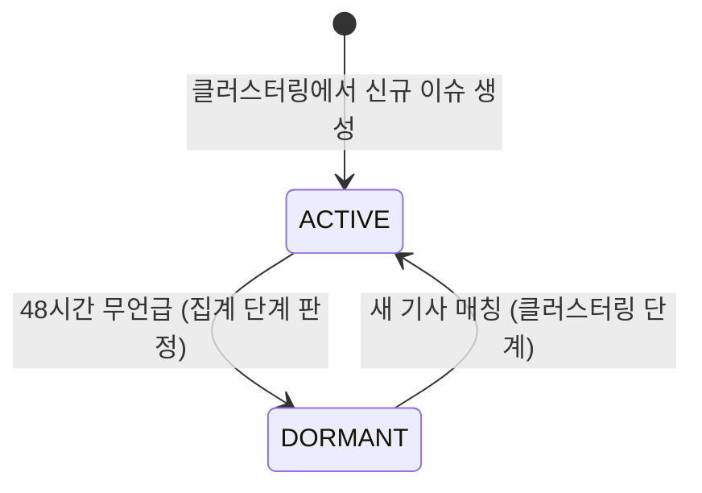
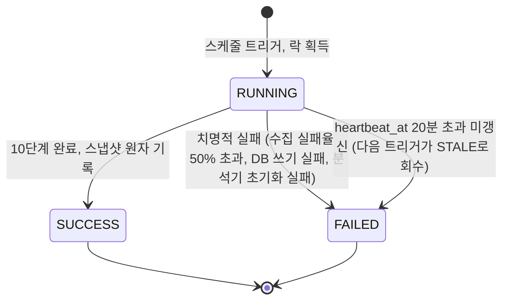

# Korea Pulse 백엔드 기능 정의서

| 항목 | 내용 |
| --- | --- |
| 문서 번호 | 01 |
| 대상 | Korea Pulse MVP 백엔드 (Java 21, Spring Boot 3.5.x, PostgreSQL, Railway) |
| 근거 문서 | PRD "사이드 프로젝트.txt" §5, §8, §9, §11-13 |
| 관련 문서 | 02-시스템-설계서, 03-DB-설계, 04-API-명세, 05-개발-계획서 |
| 작성 기준일 | 2026-09-13 |

---

## 1. 개요와 문서 목적

Korea Pulse는 네이버 뉴스 언급량의 변화를 분석해 "지금 대한민국에서 관심이 빠르게 늘고 있는 이슈"를 카테고리별 TOP-10으로 보여주는 서비스다. 이 문서는 그 백엔드가 MVP에서 제공해야 하는 기능을 입력, 출력, 예외, 상태 변화 네 가지 축으로 정의한다. 시스템 구조, 테이블 정의, 엔드포인트 형식은 각각 02, 03, 04 문서가 다루고, 여기서는 "무엇을 어떤 규칙으로 제공하는가"만 확정한다.

### 1.1 MVP 기능 범위

PRD §8과 §12에 따라 사용자에게 노출되는 기능은 두 가지다. 두 기능이 의존하는 수집 파이프라인은 사용자에게 보이지 않지만 백엔드의 핵심이므로 별도 기능으로 정의한다.

| 구분 | 기능 | 성격 |
| --- | --- | --- |
| 기능 1 | 카테고리별 급상승 이슈 TOP-10 | 읽기 전용 조회 |
| 기능 2 | 이슈 상세 | 읽기 전용 조회 |
| 기능 3 | 수집 파이프라인 | 주기 실행 배치 (30분 간격, 하루 48런 기준) |

### 1.2 MVP 제외 범위

PRD §11, §12에서 제외한 항목은 이 문서에서 설계하지 않는다. 회원가입, 로그인, 개인화(관심 카테고리·키워드 설정, 맞춤 트렌드), 알림, 사용자 직접 키워드 검색, 세부 카테고리, 추천 시스템이 여기에 해당한다. 따라서 MVP 백엔드에는 인증이 없고, 모든 API는 익명 읽기 요청만 처리한다.

### 1.3 용어

| 용어 | 정의 |
| --- | --- |
| 기사(article) | 네이버 뉴스 검색 API가 반환한 한 건의 검색 결과. title, originallink, link, description, pubDate 필드만 가진다. 본문은 없다. |
| 키워드(keyword) | 기사 title과 description에서 추출한 명사. |
| 이슈(issue) | 같은 사건을 다루는 기사들을 키워드 공출현 기준으로 묶은 클러스터. 대표 키워드 조합이 이슈명이 된다. |
| 런(run) | 수집 파이프라인의 1회 실행 단위. pipeline_run 한 행에 대응한다. |
| 시간 버킷(bucket) | UTC 정각 기준 1시간 구간. 언급량 집계의 최소 단위다. |
| 스냅샷(snapshot) | 한 런이 끝날 때 카테고리별 TOP-10을 고정해 저장한 결과. TOP-10의 저장된 순위·지표만 불변·격리되며, 이슈명과 상세/통계/뉴스는 라이브 테이블을 읽는다. |
| 언급량(mention count) | 특정 시간 버킷에 발행된, 해당 이슈에 속한 기사 수. |

### 1.4 시각 표현 원칙

모든 시각은 UTC로 저장하고, API 응답에서는 KST(+09:00) ISO 8601 문자열로 변환한다. 시간 버킷 경계는 UTC 정각이며, KST로 변환해도 정각이므로 사용자 관점의 혼란은 없다.

---

## 2. 기능 1: 카테고리별 급상승 이슈 TOP-10

사용자가 앱을 열었을 때 처음 보는 화면의 데이터다. 카테고리 하나를 받아 최대 10개 이슈를 순위순으로 돌려준다.

### 2.1 입력

| 파라미터 | 필수 | 허용값 | 기본값 |
| --- | --- | --- | --- |
| category | 아니오 | 아래 7종 코드 중 하나 | ALL |

카테고리 코드는 PRD §5의 7종을 그대로 따른다.

| 코드 | 표시명 | 비고 |
| --- | --- | --- |
| ALL | 전체 | 카테고리를 구분하지 않은 통합 순위 |
| ECONOMY | 경제 | |
| SPORTS | 스포츠 | |
| ENTERTAINMENT | 연예 | |
| POLITICS_SOCIETY | 정치/사회 | 하나의 카테고리로 취급 |
| IT_SCIENCE | IT/과학 | 하나의 카테고리로 취급 |
| ETC | 기타 | 분류 실패 이슈의 기본 귀속지 |

### 2.2 출력

응답의 순위·지표는 "가장 최근에 SUCCESS로 끝난 런"의 스냅샷이다. 이 저장값은 다음 SUCCESS까지 바뀌지 않지만, 이슈명은 라이브 issue.name을 조회한다.

응답 메타 정보:

| 항목 | 필드명 | 설명 |
| --- | --- | --- |
| 계산 시각 | computedAt | 스냅샷을 만든 런의 완료 시각 |
| 다음 갱신 예상 시각 | nextExpectedAt | finished_at(= computedAt) + 현재 케이던스(30분, 축퇴 시 60분). 클라이언트 캐시 힌트 |
| 카테고리 | category | 요청한 코드 그대로 |

항목별 정보 (최대 10개, rank 오름차순):

| 순번 | 항목 | 필드명 | 타입 | 산출 규칙 |
| --- | --- | --- | --- | --- |
| 1 | 순위 | rank | int (1-10) | 증가율 내림차순. 동률이면 현재 언급량 큰 쪽이 앞 |
| 2 | 이슈 식별자 | issueId | long | 기능 2 호출에 사용 |
| 3 | 이슈명 | issueName | string | 대표 키워드 최대 3개를 공백으로 이은 문자열 |
| 4 | 현재 언급량 | mentionCount | int | 런 실행 시각이 속한 직전 완료 버킷 1시간의 기사 수 |
| 5 | 이전 평균 | previousAvgCount | float | 현재 버킷을 제외한 직전 24개 버킷의 시간당 평균 기사 수 |
| 6 | 증가율 | surgeRate | float | (mentionCount - previousAvgCount) / max(previousAvgCount, 1.0). 저장·응답 모두 소수 둘째 자리로 반올림한다. 1.82는 +182%를 뜻한다 |
| 7 | 검색 관심 배지 | searchInterestIndex, searchInterestAsOf | int (0-100) nullable, date nullable | 6절 참조. 데이터랩 값이 없으면 둘 다 null |
| 8 | NEW 배지 | isNew | boolean | 베이스라인 부족 시 true (2.4절) |
| 9 | 스파크라인 | sparkline | int[24] | 현재 버킷을 마지막 원소로 하는 최근 24개 버킷의 언급량. 데이터가 없는 버킷은 0 |

PRD §8이 요구한 "이슈 발생 시점"은 sparkline에서 언급량이 처음 0을 넘는 위치로 표현하며, 별도 필드는 두지 않는다. 24시간 이전에 시작된 이슈는 기능 2의 48시간 통계로 확인한다.

### 2.3 급상승 판정 규칙 (PRD §9)

PRD §9의 "현재 언급량 vs 이전 시간대 평균 언급량"을 다음처럼 구체화한다. 아래 숫자는 초기값이며 운영 데이터를 보고 조정할 수 있는 파라미터다.

| 규칙 | 초기값 | 목적 |
| --- | --- | --- |
| 현재 구간 | 직전 완료 1시간 버킷 | 진행 중인 버킷은 아직 채워지지 않아 과소 집계되므로 제외 |
| 베이스라인 구간 | 직전 24개 버킷 | 하루 주기성을 한 번 포함 |
| 최소 현재 언급량 | 3건 | 기사 1건으로 순위에 오르는 노이즈 차단 |
| 최소 베이스라인 분모 | 1.0 | previousAvgCount가 이보다 작으면 분모를 1.0으로 고정해 무한대 증가율을 막는다 |
| 순위 대상 | ACTIVE 상태 이슈 | DORMANT 이슈는 후보에서 제외 |

ALL 카테고리는 카테고리를 무시하고 위 규칙을 전체 ACTIVE 이슈에 적용한다. 나머지 6개 카테고리는 이슈의 category 값으로 먼저 거른 뒤 적용한다. 한 이슈는 정확히 하나의 카테고리에 속하므로 ALL을 제외한 카테고리 간에는 중복이 없다.

### 2.4 예외

| 상황 | 동작 | 응답 |
| --- | --- | --- |
| 지원하지 않는 category 값 | 요청 거부 | 400 |
| SUCCESS 런이 한 번도 없음 (최초 배포 직후, 또는 연속 실패로 스냅샷 부재) | 서빙할 데이터 없음 | 503, 재시도 힌트 포함 |
| 마지막 런이 FAILED | 직전 SUCCESS 런의 스냅샷을 그대로 서빙 | 200, computedAt으로 오래됨을 알 수 있음 |
| 카테고리에 순위 대상 이슈가 10개 미만 | 있는 만큼만 반환 | 200, 항목 0~9개. 빈 배열도 정상 응답 |
| 베이스라인 부족 (직전 24개 버킷 중 언급량 0이 아닌 버킷이 3개 미만, 또는 previousAvgCount < 1.0) | 증가율은 최소 분모 규칙으로 계산하되 isNew=true | 200 |
| 데이터랩 조회 실패 또는 미조회 | 배지 필드 null | 200 |

### 2.5 상태 변화

없다. 이 기능은 스냅샷을 읽기만 하며 어떤 테이블도 갱신하지 않는다. 조회수 집계도 MVP에서는 하지 않는다.

---

## 3. 기능 2: 이슈 상세

TOP-10에서 이슈 하나를 골랐을 때 보여주는 데이터다. PRD §13 사용자 흐름의 "언급량/관심도/추이 확인 → AI 요약 확인 → 관련 뉴스 확인 → 네이버 뉴스 또는 원문 이동"을 뒷받침한다. 한 화면이지만 데이터 성격이 달라 세 부분으로 나눈다.

### 3.1 입력

| 부분 | 파라미터 | 필수 | 설명 |
| --- | --- | --- | --- |
| 공통 | issueId | 예 | 기능 1이 돌려준 식별자 |
| 시간대별 언급량 | from, to | 아니오 | 조회 구간. 기본은 현재 시각 기준 최근 48시간 |
| 관련 뉴스 | page, size | 아니오 | 0부터 시작하는 페이지 번호와 페이지 크기. 기본 page=0, size=10, size 최대 50 |

### 3.2 출력

3.2.1 이슈 기본 정보와 요약

| 항목 | 필드명 | 타입 | 산출 규칙 |
| --- | --- | --- | --- |
| 이슈 식별자 | issueId | long | |
| 이슈명 | issueName | string | 기능 1과 동일 |
| 카테고리 | category | string | 7종 코드 중 ALL을 제외한 하나 |
| 상태 | status | string | ACTIVE 또는 DORMANT |
| 현재 언급량 | mentionCount | int | 조회 시점 기준 직전 완료 버킷의 기사 수. 스냅샷이 아니라 issue_hourly_stat에서 직접 읽는다 |
| 증가율 | surgeRate | float | 기능 1과 같은 규칙으로 조회 시점에 계산 |
| 검색 관심 배지 | searchInterestIndex, searchInterestAsOf | nullable | 6절 참조 |
| 관련 키워드 | keywords | string[] (최대 10) | 이슈에 속한 기사들에서 빈도 상위 키워드. 이슈명에 쓰인 키워드 포함 |
| AI 요약 | summary | string nullable | 7절 정책으로 생성한 2~3문장. 미생성이면 null |
| 요약 생성 시각 | summaryGeneratedAt | datetime nullable | summary가 null이면 null |
| 최초 관측 시각 | firstSeenAt | datetime | 이슈가 처음 생성된 런의 시각. PRD §8 "이슈 발생 시점" |
| 최근 언급 시각 | lastMentionedAt | datetime | 이슈에 속한 가장 최신 기사의 발행 시각 |

기능 1의 mentionCount와 surgeRate는 런 시점에 고정된 스냅샷 값이고, 기능 2의 값은 조회 시점 계산값이다. 상세/통계/뉴스는 라이브 테이블을 읽으므로 진행 중이거나 실패한 런의 반영분으로도 스냅샷과 값이 달라질 수 있다. 이 차이는 허용한다.

3.2.2 시간대별 언급량 (48h)

| 항목 | 필드명 | 타입 | 설명 |
| --- | --- | --- | --- |
| 구간 시작 | from | datetime | 실제 적용된 구간 (기본값이면 48시간 전 정각) |
| 구간 끝 | to | datetime | |
| 시계열 | points | [{hour, mentionCount}] | 버킷별 1개. 기본 구간이면 48개. 데이터 없는 버킷은 0으로 채운다 |

from과 to의 폭은 최대 7일까지 허용하며, 그 이상은 400으로 거부한다. issue_hourly_stat 보존 기간(30일, 03 문서)을 넘는 구간은 0으로 채워진다.

3.2.3 관련 뉴스 목록 (페이징)

| 항목 | 필드명 | 타입 | 설명 |
| --- | --- | --- | --- |
| 전체 건수 | totalCount | int | 이슈에 연결된 기사 수 |
| 페이지 | page, size | int | 적용된 값 |
| 기사 목록 | items | 배열 | 발행 시각 내림차순 |
| 기사.제목 | title | string | HTML 태그를 제거한 title |
| 기사.원문 링크 | originallink | string | 언론사 원문 URL |
| 기사.네이버 링크 | naverLink | string | 네이버 뉴스 URL (API의 link 필드). 원문과 같으면 originallink와 동일 값 |
| 기사.언론사 | publisher | string nullable | originallink 도메인에서 파생. 알 수 없으면 null |
| 기사.발행 시각 | publishedAt | datetime | pubDate를 KST로 변환 |
| 출처 표기 | source | string | 고정값 "출처: 네이버 뉴스" (8절) |

기사 본문과 description은 응답에 포함하지 않는다. 사용자는 링크로 이동해 원문을 읽는다.

### 3.3 예외

| 상황 | 동작 | 응답 |
| --- | --- | --- |
| 존재하지 않는 issueId | 요청 거부 | 404 |
| issueId 형식 오류 (숫자 아님) | 요청 거부 | 400 |
| DORMANT 상태 이슈 조회 | 정상 제공. status로 구분 가능. 스냅샷 이력에서 도달할 수 있으므로 404로 만들지 않는다 | 200 |
| 요약 미생성 | summary, summaryGeneratedAt null | 200 |
| 요약 생성 시도 후 실패 | 위와 동일하게 null. 실패 사실은 클라이언트에 노출하지 않는다 | 200 |
| 이슈에 연결된 기사가 보존 기간(14일) 만료로 모두 삭제됨 | totalCount 0, items 빈 배열 | 200 |
| from > to, 또는 폭 7일 초과 | 요청 거부 | 400 |
| page 또는 size가 음수, size > 50 | 요청 거부 | 400 |
| 범위를 넘는 page | items 빈 배열, totalCount는 정상 | 200 |

### 3.4 상태 변화

조회 자체는 상태를 바꾸지 않는다. 다만 이 기능이 보여주는 status 필드는 파이프라인이 관리하는 이슈 상태이며 규칙은 다음과 같다.

| 전이 | 조건 | 판단 주체 |
| --- | --- | --- |
| (생성) → ACTIVE | 클러스터링 단계에서 새 이슈가 만들어짐 | 파이프라인 5단계 (클러스터링) |
| ACTIVE → DORMANT | lastMentionedAt 기준 48시간 동안 새 기사가 하나도 매칭되지 않음 | 파이프라인 6단계 (집계 후 일괄 판정) |
| DORMANT → ACTIVE | DORMANT 이슈에 새 기사가 매칭됨 | 파이프라인 5단계 (클러스터링) |

DORMANT 전이는 순위 후보에서 빼기 위한 것이지 삭제가 아니다. 상세 조회, 스냅샷 이력, 통계는 그대로 남는다.

---

## 4. 기능 3: 수집 파이프라인

30분마다 한 번 실행되는 배치다. 하루 48런을 기준으로 쿼터와 비용을 계산한다. 런 하나는 락 획득으로 시작해 10단계를 순서대로 거치고 락 해제로 끝난다.

### 4.1 런 프레임: 락 획득과 해제

| 항목 | 내용 |
| --- | --- |
| 입력 | 스케줄러 트리거 (fixedDelay 30분) |
| 동작 | pipeline_run에 RUNNING 행을 삽입한다. 이미 RUNNING 행이 있으면 heartbeat_at의 마지막 갱신이 20분 이내면 이번 트리거를 건너뛰고, 20분 넘게 미갱신이면 그 행을 FAILED(사유: STALE)로 바꾸고 새 런을 시작한다 |
| 출력 | run_id |
| 종료 | 10단계가 모두 끝나면 SUCCESS, 중간에 치명적 실패가 나면 FAILED와 실패 단계, 사유를 기록한다 |

스테일 락 20분은 정상 런의 예상 소요 시간(수 분)보다 넉넉하고 런 간격 30분보다 짧아, 프로세스가 죽어도 다음 트리거가 복구할 수 있는 값이다.

### 4.2 10단계 정의

각 단계의 실패는 "치명적(런 FAILED)"과 "비치명적(건너뛰고 계속)"으로 나눈다. 원칙은 하나다. 새 데이터를 만들지 못하더라도 기존 데이터로 스냅샷을 갱신할 수 있으면 계속 간다.

| # | 단계 | 입력 | 출력 | 예외와 동작 | 상태 변화 |
| --- | --- | --- | --- | --- | --- |
| 1 | 후보 생성 (candidate) | CandidateSource 3종: Google Trends RSS(best-effort), 네이버 데이터랩 보조 목록, 자가시딩(ACTIVE 이슈의 대표 키워드) | 중복 제거된 검색 키워드 풀 (최대 200개) | RSS 장애/파싱 실패 → 빈 목록으로 취급하고 나머지 두 소스로 계속. 후보 0개 → 비치명적, 2~5단계를 건너뛰고 기존 기사로 6단계(집계)부터 진행 | 없음 |
| 2 | 수집 (collect) | 키워드 풀 | 네이버 뉴스 검색 API 원시 결과 (키워드당 최대 100건, sort=date) | 429 → 지수 백오프 재시도 최대 3회 후 해당 키워드 포기. 빈 결과 → 정상(0건). 401/403도 해당 키워드 수집 실패로 집계한다. 수집 시도 키워드 중 실패 비율이 50%를 초과할 때만 수집 단계가 런을 FAILED로 만든다. 런당 호출 상한 또는 일 쿼터(25,000회/일) 예산 도달 → 미시도 키워드는 실패율에서 제외하고 부분 수집으로 3단계부터 계속 | 없음 |
| 3 | 정규화 (normalize) | 원시 결과 | article 행: title/description의 HTML 태그와 엔티티 제거, pubDate를 UTC로 변환, originallink 기준 url_hash 계산 | url_hash 중복 → 삽입 생략(이미 수집된 기사). pubDate 파싱 실패 → 해당 건 폐기하고 카운트만 기록 | article 삽입 |
| 4 | 키워드 추출 (keyword) | 이번 런에 새로 삽입된 article | article_keyword 행 (기사당 명사 목록) | 명사 0개 → 해당 기사는 클러스터링에서 제외. 형태소 분석기 초기화 실패 → 치명적 | article_keyword 삽입 |
| 5 | 클러스터링 (cluster) | 새 기사의 키워드 집합 + 기존 ACTIVE/DORMANT 이슈의 키워드 집합 | 기사→이슈 매핑 (issue_article), 신규 issue, 갱신된 issue_keyword | 기존 이슈와 Jaccard 유사도가 병합 임계값을 넘으면 그 이슈에 붙이고, 아니면 새 이슈를 만든다. 새 이슈는 5절 규칙으로 카테고리를 정한다. LLM 폴백 실패 → ETC로 두고 계속 | issue 생성, DORMANT→ACTIVE 복귀 |
| 6 | 집계 (aggregate) | issue_article과 article.published_at | issue_hourly_stat (issue_id, bucket_hour, mention_count) upsert | 없음. DB 쓰기 실패는 치명적 | issue_hourly_stat 갱신, 48시간 무언급 이슈 ACTIVE→DORMANT |
| 7 | 판정 (detect) | ACTIVE 이슈의 최근 25개 버킷 | 카테고리 7종별 순위 목록 (증가율, 이전 평균, isNew, 스파크라인 포함) | 순위 대상 0개인 카테고리 → 빈 목록. 계산 자체는 실패할 요소가 없다 | 없음 (메모리 내 결과) |
| 8 | 검증 (validate) | 7단계 순위에 오른 이슈의 대표 키워드 | search_interest_daily upsert, 각 이슈의 searchInterestIndex/AsOf | 데이터랩 오류, 일 쿼터(1,000회/일) 예산 소진 → 비치명적, 해당 이슈 배지 null. 당일 이미 조회한 키워드는 재호출하지 않는다 | search_interest_daily 갱신 |
| 9 | 요약 (summarize) | 7단계 순위에 오른 이슈 중 7절 조건을 만족하는 이슈와 그 기사들의 title+description | issue.summary, summary_generated_at | LLM 오류/타임아웃 → 비치명적, 기존 summary 유지(없으면 null). 런당 콜 상한 도달 → 남은 이슈는 다음 런으로 이월 | issue.summary 갱신 |
| 10 | 스냅샷 (snapshot) | 7~9단계 결과 | trending_snapshot_entry (run_id, category, rank) 최대 7×10행 | 쓰기 실패 → 치명적. 스냅샷이 원자적으로 기록된 뒤에만 런을 SUCCESS로 바꾼다 | pipeline_run RUNNING→SUCCESS |

### 4.3 실패 시 서비스 영향

| 실패 지점 | 런 상태 | 사용자 영향 |
| --- | --- | --- |
| 1단계 RSS 장애 | SUCCESS (축퇴 모드) | 새 후보가 줄어 신규 이슈 발견이 늦어질 수 있음. 기존 이슈 순위는 정상 |
| 2단계 쿼터 소진 | SUCCESS | 수집 범위 축소. 순위는 기존 데이터로 갱신 |
| 2단계 수집 시도 키워드 중 50% 초과 실패 (인증 오류 포함) | FAILED | 직전 SUCCESS 스냅샷 계속 서빙. computedAt이 30분 이상 과거가 되면 클라이언트가 인지 가능 |
| 8단계 데이터랩 실패 | SUCCESS | 해당 런 배지 null |
| 9단계 LLM 실패 | SUCCESS | 요약 null 또는 이전 요약 유지 |
| 10단계 쓰기 실패 | FAILED | 직전 SUCCESS 스냅샷 계속 서빙 |
| 프로세스 중단 | RUNNING 잔류 → 다음 트리거가 heartbeat_at 20분 초과 미갱신 확인 후 FAILED(STALE) 처리 | 최대 약 50분(20분 + 다음 런 30분) 동안 스냅샷 갱신 지연 |

연속 FAILED가 이어져도 마지막 SUCCESS 스냅샷은 삭제하지 않는다. 503은 SUCCESS 런이 한 번도 없을 때만 나간다.

### 4.4 런 단위 자원 상한

| 자원 | 상한 | 근거 |
| --- | --- | --- |
| 네이버 뉴스 검색 호출 | 런당 약 400회, 키워드 풀 200개 × 48런 = 하루 약 9,600회 | 일 쿼터 25,000회 대비 여유율 약 62% |
| 네이버 데이터랩 호출 | 5그룹/호출, 당일 미조회 키워드만 | 일 쿼터 1,000회 |
| LLM 요약 호출 | 런당 약 20회 | 7절 |
| heartbeat 미갱신 시간 | 20분 초과 시 스테일 락 회수 (전체 실행 시간 상한 아님) | 4.1절 |

---

## 5. 카테고리 분류 메커니즘

### 5.1 전제: API가 카테고리를 주지 않는다

네이버 뉴스 검색 API의 응답 필드는 title, originallink, link, description, pubDate 다섯 개뿐이다. 경제/스포츠 같은 섹션 정보는 없다. 따라서 카테고리는 백엔드가 스스로 정해야 하며, 이 부분이 PRD 요구사항 중 가장 구체화가 덜 된 영역이다.

### 5.2 분류 단위

분류는 기사가 아니라 이슈 단위로 확정한다. 기사마다 1차 추정을 하되, 최종적으로 저장되는 값은 issue.category 하나다. 이유는 두 가지다. 사용자에게 보이는 단위가 이슈이고, LLM 폴백 비용을 이슈당 1회로 묶을 수 있기 때문이다.

### 5.3 1차: link 필드 휴리스틱

| 단계 | 규칙 | 결과 |
| --- | --- | --- |
| 1 | 기사의 link(네이버 뉴스 URL) 호스트와 경로에서 섹션 단서를 찾는다. 예를 들어 스포츠·연예 전용 서브도메인이나 경로의 섹션 식별자 | 기사별 추정 카테고리 또는 미분류 |
| 2 | 이슈에 속한 기사들의 추정 카테고리를 다수결한다 | 과반 카테고리가 있으면 채택 |
| 3 | 과반이 없거나 분류된 기사 비율이 50% 미만이면 2차로 넘긴다 | |

이 휴리스틱은 아직 검증되지 않았다. 네이버 뉴스 URL에 섹션 식별자가 안정적으로 들어 있는지, 스포츠·연예 링크가 별도 도메인으로 오는지는 실제 응답을 표본 조사해야 알 수 있다. 개발 계획서(05)에서 첫 주 작업으로 이 조사를 배정하며, 조사 결과에 따라 1차 규칙의 구체 패턴이 정해진다. 조사 결과 휴리스틱이 쓸 수 없는 수준이면 2차(LLM)를 1차로 승격한다.

### 5.4 2차: 신규 이슈당 LLM 폴백

| 항목 | 내용 |
| --- | --- |
| 호출 시점 | 5단계에서 새 이슈가 만들어졌고 1차 휴리스틱이 결론을 내지 못했을 때, 이슈당 1회 |
| 입력 | 이슈 대표 키워드 + 소속 기사 title 최대 5개 |
| 출력 | ECONOMY, SPORTS, ENTERTAINMENT, POLITICS_SOCIETY, IT_SCIENCE, ETC 중 하나 |
| 실패 시 | ETC로 저장하고 계속 진행. 다음 런에서 재시도하지 않는다 (비용 상한 보호) |
| 재분류 | 하지 않는다. 한 번 정해진 카테고리는 MVP 기간 동안 고정이다 |

### 5.5 ALL과 ETC

ALL은 저장되는 값이 아니라 조회 시 카테고리 필터를 걸지 않는다는 뜻이다. ETC는 저장되는 값이며, 어느 카테고리에도 넣기 어려운 이슈(예: 날씨, 사건사고 중 사회로 보기 애매한 것)와 분류 실패 이슈가 함께 들어간다. ETC 비중이 지나치게 높다면 휴리스틱 또는 폴백 프롬프트를 손봐야 한다는 신호로 본다.

---

## 6. 검색 관심도의 의미

### 6.1 데이터의 성격

검색 관심 배지는 네이버 데이터랩 검색어 트렌드 값이다. 이 API의 제약이 배지의 의미를 결정한다.

| 제약 | 값 | 배지에 미치는 영향 |
| --- | --- | --- |
| 시간 해상도 | timeUnit은 date, week, month만 지원. 시간 단위 없음 | 배지는 일 단위 값이다. "지금 이 시간" 검색 관심도가 아니다 |
| 값의 형태 | 조회 구간 내 최대치를 100으로 둔 상대값 | 키워드 간, 날짜 간 절대 비교가 안 된다. 같은 키워드 안에서 오늘이 최근 며칠 대비 높은지만 말해 준다 |
| 호출 한도 | 1,000회/일, 호출당 최대 5개 키워드 그룹 | 순위에 오른 이슈만 조회하고 당일 결과는 캐시한다 |

### 6.2 필드 정의

| 필드 | 타입 | 의미 |
| --- | --- | --- |
| searchInterestIndex | int 0-100, nullable | 대표 키워드(primary, issue_keyword 중 article_count 최다 1개)의 가장 최근 가용 일자 상대 검색량. 최근 7일 구간을 조회해 그중 최신 ratio를 ROUND()한 정수를 쓴다 |
| searchInterestAsOf | date (KST), nullable | 그 값이 어느 날짜의 것인지. 데이터랩은 당일 값이 확정되지 않으므로 보통 전일이 되며, 최대 24시간 지연이 정상이다 |

두 필드는 항상 함께 있거나 함께 null이다. 클라이언트는 searchInterestAsOf를 반드시 같이 표시해 "어제 기준"임을 드러내야 한다. 이 필드를 빼고 지수만 보여주면 사용자는 실시간 값으로 오해한다.

### 6.3 급상승 판정과의 관계

검색 관심도는 순위 계산에 들어가지 않는다. 순위는 오직 뉴스 언급량 증가율로 정한다. 데이터랩 값은 "뉴스만 떠들썩한 건지, 사람들도 실제로 찾아보는지"를 보조적으로 보여주는 배지일 뿐이다. 일 단위 값으로 시간 단위 급상승을 검증할 수 없기 때문에 PRD §7의 "검색 관심도 검증"은 MVP에서 이 배지 수준으로 축소한다. PRD §6.0이 언급한 Google Trends는 후보 키워드 생성(4.2절 1단계)에만 쓰고 배지 값으로는 쓰지 않는다. 공식 API가 일반 공개 상태가 아니고 RSS는 비공식이라 값의 지속 제공을 보장할 수 없어서다.

---

## 7. 요약 생성 정책

### 7.1 대상

| 조건 | 내용 |
| --- | --- |
| 생성 대상 | 이번 런의 7단계에서 7개 카테고리 중 어느 하나라도 TOP-10에 오른 이슈 |
| 최초 생성 | summary가 null인 대상 이슈 |
| 재생성 | 이미 summary가 있어도 다음 중 하나면 다시 만든다. (a) 마지막 요약 이후 이슈에 새로 붙은 기사가 요약 당시 기사 수의 30%를 넘음, (b) summary_generated_at으로부터 6시간 경과 |
| 제외 | 순위에 오르지 않은 이슈. 이슈 수가 수백 개여도 요약은 순위권만 만든다 |

### 7.2 상한과 우선순위

런당 LLM 호출은 약 20회로 제한한다. 순위권 이슈는 최대 70개(7×10)지만 ALL과 다른 카테고리가 겹치고 대부분은 이미 요약이 있어 재생성 조건에 걸리지 않으므로 20회면 대체로 충분하다. 넘칠 때는 다음 순서로 자른다.

1. summary가 null인 이슈, 그중 ALL 카테고리 순위가 높은 순
2. 재생성 조건 (a) 신규 기사 비율 초과
3. 재생성 조건 (b) 6시간 경과

밀린 이슈는 다음 런에서 같은 규칙으로 다시 평가된다. 하루 48런 기준 최대 약 960회이며, 이 수치가 05 문서 비용 추정의 입력이 된다.

### 7.3 입출력 계약

| 항목 | 내용 |
| --- | --- |
| 입력 | 이슈의 최신 기사 최대 20건의 title과 description (HTML 제거 후). 기사 본문은 넣지 않는다 |
| 출력 | 한국어 2~3문장, 사실 서술형. 예측이나 의견은 넣지 않도록 프롬프트에서 제한 |
| 후처리 | 빈 문자열이나 300자 초과 결과는 실패로 간주해 폐기 |
| 저장 | issue.summary, issue.summary_generated_at, 요약 당시 기사 수 |

LLM 제공자는 GPT 루나와 딥시크를 동급 후보로 두고 구현 시점에 짧은 벤치마크를 거쳐 하나를 고른다. 클라이언트 코드는 "스니펫 목록 → 요약 문자열" 인터페이스 뒤에 숨겨 교체할 수 있게 한다. 벤치마크 방법 자체는 이 문서 범위가 아니다.

### 7.4 예외

| 상황 | 동작 |
| --- | --- |
| LLM 응답 오류, 타임아웃 | 해당 이슈 건너뜀. 기존 summary가 있으면 유지, 없으면 null 유지 |
| 후처리 실패 (빈 결과, 길이 초과) | 위와 동일 |
| 런당 상한 도달 | 남은 이슈 이월 |
| 입력 기사 0건 (보존 기간 만료) | 생성 시도하지 않음 |

요약 실패는 어떤 경우에도 런을 FAILED로 만들지 않는다. 요약은 있으면 좋은 정보이고, 순위와 뉴스 목록이 핵심 가치이기 때문이다(PRD §14).

---

## 8. 법적 제약

뉴스 기사는 언론사의 저작물이고, 네이버 뉴스 검색 API는 검색 결과 노출을 위한 도구다. 백엔드는 다음 네 가지를 지킨다. 이 항목들은 기능 요구사항과 같은 무게로 취급하며, 어긴 채로 배포하지 않는다.

| # | 제약 | 구현상의 의미 |
| --- | --- | --- |
| 1 | 기사 본문을 저장하거나 표시하지 않는다 | 원문 페이지 크롤링을 하지 않는다. article 테이블에는 API가 돌려준 title, description(스니펫), 링크, 발행 시각만 있다. description은 키워드 추출과 요약 입력에만 쓰고 API 응답으로 내보내지 않는다 |
| 2 | 뉴스는 링크아웃으로만 제공한다 | 관련 뉴스 목록은 제목과 링크를 주고, 읽기는 네이버 뉴스 또는 언론사 원문 페이지에서 이루어진다. 앱 내 뷰어에 본문을 렌더링하지 않는다 |
| 3 | "출처: 네이버 뉴스"를 표기한다 | 관련 뉴스 응답에 source 고정 필드를 포함하고, 클라이언트는 목록 근처에 표기한다. 출처 표기는 서버 응답에 담아 누락을 막는다 |
| 4 | 요약 입력은 API가 반환한 title과 description만 쓴다 | 본문을 요약하지 않으므로 요약 품질에 한계가 있다. 이 한계는 감수하며, 개선을 위해 크롤링을 도입하지 않는다 |

추가로 title과 description은 API가 검색어 강조용 `<b>` 태그를 넣어 돌려주므로 저장 전에 제거한다. 보존 기간은 03 문서를 따르며(article 14일), 만료 삭제는 이 제약을 뒷받침하는 장치이기도 하다.

---

## 9. 상태 정의 종합

### 9.1 이슈 상태 (issue.status)

| 상태 | 의미 | 순위 후보 | 상세 조회 |
| --- | --- | --- | --- |
| ACTIVE | 최근 48시간 안에 매칭된 기사가 있음 | 포함 | 가능 |
| DORMANT | 48시간 동안 새 기사가 없음 | 제외 | 가능 (status로 구분) |

삭제 상태는 없다. 이슈 행은 보존하며, 소속 기사만 보존 정책에 따라 사라진다.

### 9.2 파이프라인 런 상태 (pipeline_run.status)

| 상태 | 의미 | TOP-10 스냅샷 영향 |
| --- | --- | --- |
| RUNNING | 실행 중. 락 역할을 겸한다 | 없음. 조회는 마지막 SUCCESS를 본다 |
| SUCCESS | 10단계까지 완료, 스냅샷 기록됨 | 이 런의 스냅샷이 다음 SUCCESS까지 서빙된다 |
| FAILED | 치명적 실패 또는 스테일 회수. 실패 단계와 사유 기록 | 없음. 직전 SUCCESS 계속 서빙 |

### 9.3 요약 상태 (issue.summary 파생)

별도 상태 컬럼은 두지 않고 summary와 summary_generated_at의 null 여부로 구분한다.

| 조합 | 의미 |
| --- | --- |
| summary null | 미생성. 아직 순위권에 오른 적이 없거나, 시도했으나 실패 |
| summary 있음, 재생성 조건 미충족 | 유효한 요약 |
| summary 있음, 재생성 조건 충족 | 다음 런에서 상한 안에 들면 갱신 대상 |

### 9.4 검색 관심 배지 상태 (스냅샷 항목 파생)

| 조합 | 의미 |
| --- | --- |
| searchInterestIndex, searchInterestAsOf 모두 null | 데이터랩 미조회 또는 실패 |
| 둘 다 있음 | asOf 일자 기준 상대값. asOf가 스냅샷 일자보다 하루 전이면 정상 지연 |

### 9.5 조회 응답 상태 요약

| 조건 | 기능 1 | 기능 2 |
| --- | --- | --- |
| SUCCESS 런 없음 | 503 | 이슈가 있으면 200 (이슈는 런 SUCCESS와 무관하게 존재 가능), 없으면 404 |
| 마지막 런 FAILED | 200 (직전 SUCCESS) | 200 |
| 카테고리 오류 | 400 | 해당 없음 |
| issueId 없음 | 해당 없음 | 404 |
