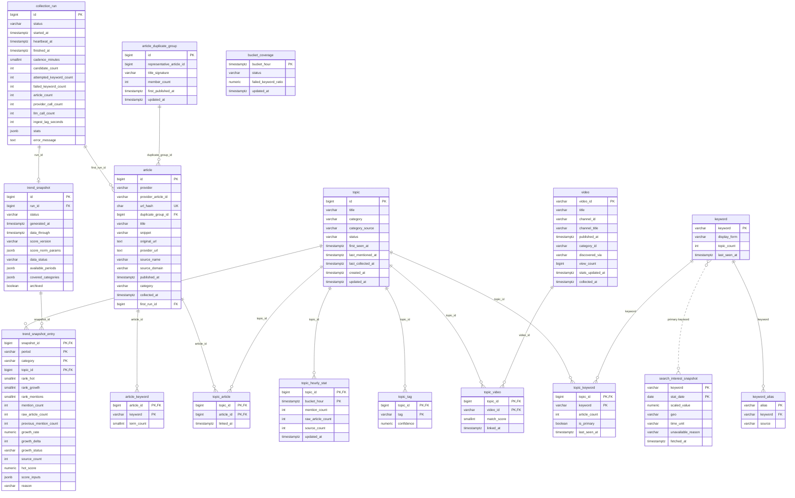

# Korea Pulse 백엔드 DB 설계

| 항목 | 내용 |
| --- | --- |
| 문서 번호 | 03 |
| 문서 버전 | v0.2 정합 (2026-09-14) |
| 근거 문서 | 00-프로젝트-정의서-v0.2 §8(지표), §9(저장 모델), §11(운영 품질) |
| 관련 문서 | 01-기능-정의서, 02-시스템-설계서, 04-API-명세, 05-개발-계획서 |

테이블과 컬럼의 의미를 정의하는 문서다. 실제 DDL은 Flyway 마이그레이션에서 관리하며 여기에는 싣지 않는다. 정의서 §9의 모델 목록(Article, ArticleDuplicateGroup, Topic/TopicArticle, Keyword/TopicKeyword, TrendSnapshot, SearchInterestSnapshot, CollectionRun)을 테이블 이름의 기준으로 삼았다.

## 1. 설계 원칙

- PostgreSQL 16 이상을 전제로 한다. jsonb와 부분 인덱스만 쓰고 확장(extension)은 쓰지 않는다.
- 모든 시각 컬럼은 TIMESTAMPTZ이고 UTC로 저장한다. KST 변환은 API 응답 직전에만 한다. 버킷은 UTC 정시 기준이다.
- 스키마 변경은 Flyway로만 한다. `V1__init.sql`에 아래 17개 테이블을 담고 JPA `ddl-auto`는 `validate`로 고정한다.
- 기사 본문은 어떤 테이블에도 저장하지 않는다. 공급자가 돌려준 제목, 스니펙, 링크, 발행 시각, 출처까지만 보관한다(01 문서 9절).
- 영상도 마찬가지다. 영상 ID·제목·채널명·게시 시각·조회수만 저장하고 자막·썰네일 바이너리를 보관하지 않는다.
- **뉴스와 영상은 섞지 않는다.** `article`과 `video`는 별도 테이블이고, `topic_hourly_stat`의 집계는 전부 기사 기준이다. 영상은 상세 보조 지표에만 쓴다(정의서 §8).
- 순위·지표는 게시된 스냅샷에서 읽는다. 한 응답은 하나의 `snapshot_id`를 기준으로 하며, 계산이 끝난 스냅샷만 게시한다.
- MVP 제외 기능(회원, 결제, 알림, AI 요약, B2B 키워드 워치)을 위한 테이블은 만들지 않는다.
- 식별자는 BIGINT identity를 쓰고, 자연 복합키가 분명한 연결·집계 테이블은 복합 PK를 쓴다.
- 열거값은 PostgreSQL enum 대신 VARCHAR + CHECK로 둔다.

### 공통 코드 값

| 구분 | 값 | 비고 |
| --- | --- | --- |
| 저장 카테고리 | ECONOMY, SPORTS, ENTERTAINMENT, POLITICS_SOCIAL, IT_SCIENCE, UNCLASSIFIED | 정의서 §6의 5개 분야 + 미분류. ALL은 조회 코드이며 저장하지 않는다 |
| 조회 카테고리(탭) | ALL, ECONOMY, SPORTS, ENTERTAINMENT, POLITICS_SOCIAL, IT_SCIENCE | UNCLASSIFIED는 탭이 아니며 ALL에만 포함된다 |
| 기간(period) | 1h, 6h, 24h, 7d | |
| 정렬(sort) | hot, growth, mentions | |
| collection_run.status | RUNNING, SUCCESS, FAILED | |
| trend_snapshot.status | BUILDING, PUBLISHED, SUPERSEDED | |
| topic.status | ACTIVE, DORMANT | 48시간 무언급 시 DORMANT |
| topic.category_source | HEURISTIC, LLM, NONE | NONE은 UNCLASSIFIED 상태 |
| growth_status | OK, NEW, INSUFFICIENT | 01 문서 2.3절 |
| bucket_coverage.status | OK, PARTIAL, MISSING | 부분 수집 실패를 0건과 구분한다 |

## 2. ERD

17개 테이블. 실선은 FK, 점선은 문자열 키로만 이어지는 논리 관계다.



### 파이프라인 단계와 쓰기 대상

| 단계 | 쓰는 테이블 |
| --- | --- |
| 0 런 락 | collection_run |
| 1 후보 | collection_run (candidate_count, youtube_unit_count, stats), topic(last_collected_at), **video** |
| 2 수집 | article, bucket_coverage |
| 3 정규화 | article |
| 4 중복 제거 | article_duplicate_group, article.duplicate_group_id |
| 5 키워드 | article_keyword, keyword, keyword_alias |
| 6 클러스터 | topic, topic_keyword, topic_article |
| 7 분류 | topic(category, category_source), topic_tag |
| 8 집계 | topic_hourly_stat, topic(status, last_mentioned_at) |
| 9 점수 | (없음, 메모리) |
| 10 보조 지표 | search_interest_snapshot, topic_video, video(view_count) |
| 11 게시 | trend_snapshot, trend_snapshot_entry, collection_run |

## 3. 테이블별 컬럼 설명

### 3.1 collection_run

파이프라인 실행 1회를 기록한다. 스케줄러 락, 쿼터 추적, 지연 측정, "마지막 성공 런" 판별에 쓴다.

| 컬럼 | 타입 | 제약 | 설명 |
| --- | --- | --- | --- |
| id | BIGINT | PK, identity | 런 식별자 |
| status | VARCHAR(10) | NOT NULL, CHECK, IDX | RUNNING / SUCCESS / FAILED. RUNNING은 동시에 최대 1건 |
| started_at | TIMESTAMPTZ | NOT NULL | 시작 시각 |
| heartbeat_at | TIMESTAMPTZ | NOT NULL | 단계 전환마다 갱신. 10분 초과 미갱신 RUNNING은 STALE로 회수 |
| finished_at | TIMESTAMPTZ | NULL | 종료 시각 |
| cadence_minutes | SMALLINT | NOT NULL | 이 런이 돌 때의 케이던스(15/30/60). health와 축퇴 추적용 |
| candidate_count | INT | NOT NULL DEFAULT 0 | 후보 키워드 수 |
| attempted_keyword_count | INT | NOT NULL DEFAULT 0 | 실제 수집을 시도한 키워드 수. 실패율의 분모 |
| failed_keyword_count | INT | NOT NULL DEFAULT 0 | 실패한 키워드 수. 50% 초과면 런 FAILED |
| article_count | INT | NOT NULL DEFAULT 0 | 새로 저장한 기사 수 |
| provider_call_count | INT | NOT NULL DEFAULT 0 | 뉴스 공급자 호출 수. 일 쿼터 카운터에 합산 |
| youtube_unit_count | INT | NOT NULL DEFAULT 0 | YouTube Data API 소모 units. 일 10,000 카운터에 합산. `search.list`는 쓰지 않으므로 항상 0 |
| trends_call_count | INT | NOT NULL DEFAULT 0 | Google Trends 호출 수. 알파 미승인이면 0 |
| llm_call_count | INT | NOT NULL DEFAULT 0 | 분류 폴백 호출 수 |
| ingest_lag_seconds | INT | NULL | 이번 런에 수집된 기사의 발행 → 게시 지연 중앙값. 정의서 §9의 두 번째 측정값 |
| stats | JSONB | NULL | 사용 소스 목록, 단계별 소요, 축퇴 여부 등 런 메타 |
| error_message | TEXT | NULL | FAILED 원인 요약. 스택 트레이스는 넣지 않는다 |

### 3.2 article

수집한 기사 메타데이터. 본문 컬럼은 없다.

| 컬럼 | 타입 | 제약 | 설명 |
| --- | --- | --- | --- |
| id | BIGINT | PK, identity | |
| provider | VARCHAR(20) | NOT NULL, IDX | 공급자 코드(NAVER, BIGKINDS 등). 공급원 교체·비교에 쓴다 |
| provider_article_id | VARCHAR(100) | NULL | 공급자 기사 ID. (provider, provider_article_id) UNIQUE (부분 인덱스, NULL 제외) |
| url_hash | CHAR(64) | NOT NULL, UNIQUE | 정규화 원문 URL의 SHA-256 hex. 원문 URL이 없으면 공급자 URL로 대체. 동일 기사 판정의 기준 |
| duplicate_group_id | BIGINT | NULL, FK article_duplicate_group(id), IDX | 재배포 묶음. 4단계에서 배정 |
| title | VARCHAR(500) | NOT NULL | 태그·엔티티 제거 후 제목 |
| snippet | VARCHAR(1000) | NOT NULL | 공급자 요약 스니펫. 키워드 추출·유사도에만 쓰고 API 응답에 내보내지 않는다 |
| original_url | TEXT | NOT NULL | 언론사 원문 URL |
| provider_url | TEXT | NULL | 공급자 링크. 원문과 같으면 NULL |
| source_name | VARCHAR(100) | NULL | 공급자가 제공한 매체명. 없으면 NULL. 추정하지 않는다 |
| source_domain | VARCHAR(100) | NULL, IDX | 원문 URL 호스트. 출처 수(sourceCount) 계산 기준 |
| published_at | TIMESTAMPTZ | NOT NULL, IDX | UTC 변환 발행 시각. 버킷·보존 기준 |
| category | VARCHAR(20) | NULL, CHECK | 링크·섹션 휴리스틱으로 추정한 기사 카테고리. 이슈 분류의 투표 재료 |
| collected_at | TIMESTAMPTZ | NOT NULL | 최초 저장 시각 |
| first_run_id | BIGINT | NOT NULL, FK collection_run(id) | 최초 저장 런 |

`source_name`이 없을 때 `source_domain`으로 매체명을 만들어 내지 않는다. 응답 `source`는 매핑이 있을 때만 값이 있다(정의서 §5.3).

### 3.3 article_duplicate_group

같은 기사의 재배포·전재본 묶음. 언급량은 이 그룹 수로 센다.

| 컬럼 | 타입 | 제약 | 설명 |
| --- | --- | --- | --- |
| id | BIGINT | PK, identity | |
| representative_article_id | BIGINT | NOT NULL | 대표 기사. 가장 이른 발행 시각, 동률이면 원문 URL이 있는 기사 |
| title_signature | VARCHAR(100) | NOT NULL, IDX | 제목 정규화 후 해시 앞자리. 유사도 후보 축소용 |
| member_count | INT | NOT NULL DEFAULT 1 | 묶인 기사 수. 원본 기사 수 계산에 쓴다 |
| first_published_at | TIMESTAMPTZ | NOT NULL | 그룹 최초 발행 시각. 버킷 귀속 기준 |
| updated_at | TIMESTAMPTZ | NOT NULL | |

그룹 귀속 버킷은 `first_published_at`이다. 같은 사건의 전재본이 여러 버킷에 퍼져 언급량을 부풀리지 않게 한다.

### 3.4 article_keyword

기사에서 추출한 명사. 클러스터링 입력이다.

| 컬럼 | 타입 | 제약 | 설명 |
| --- | --- | --- | --- |
| article_id | BIGINT | PK, FK article(id) ON DELETE CASCADE | |
| keyword | VARCHAR(50) | PK, IDX | 정규화 키워드 |
| term_count | SMALLINT | NOT NULL DEFAULT 1 | 제목 + 스니펫 출현 횟수. 병합 가중치 |

### 3.5 keyword / keyword_alias

정의서 §9의 Keyword 모델이다. 검색(01 문서 기능 3)과 클러스터 병합이 같은 정규화 결과를 쓴다.

keyword

| 컬럼 | 타입 | 제약 | 설명 |
| --- | --- | --- | --- |
| keyword | VARCHAR(50) | PK | 정규화 형태 |
| display_form | VARCHAR(50) | NOT NULL | 화면 표시 형태 |
| topic_count | INT | NOT NULL DEFAULT 0 | 이 키워드가 붙은 이슈 수 |
| last_seen_at | TIMESTAMPTZ | NOT NULL | |

keyword_alias

| 컬럼 | 타입 | 제약 | 설명 |
| --- | --- | --- | --- |
| alias | VARCHAR(50) | PK | 별칭 표기 (예: `한은`) |
| keyword | VARCHAR(50) | NOT NULL, FK keyword(keyword), IDX | 대표 키워드 (예: `한국은행`) |
| source | VARCHAR(10) | NOT NULL, CHECK(MANUAL/DERIVED) | 수동 등록인지 파이프라인 파생인지 |

검색은 `q`를 정규화한 뒤 topic.title, keyword_alias.alias, topic_keyword.keyword 순으로 매칭한다.

### 3.6 topic

클러스터링으로 묶인 이슈. 사용자에게 보이는 단위다. MVP에는 요약 컬럼이 없다.

| 컬럼 | 타입 | 제약 | 설명 |
| --- | --- | --- | --- |
| id | BIGINT | PK, identity | API의 topicId |
| title | VARCHAR(100) | NOT NULL, IDX | 대표 키워드 최대 3개를 공백으로 이은 제목 |
| category | VARCHAR(20) | NOT NULL, CHECK(저장 6종), IDX | 대표 카테고리. 미분류는 UNCLASSIFIED |
| category_source | VARCHAR(10) | NOT NULL, CHECK(HEURISTIC/LLM/NONE) | 분류 경로. 휴리스틱 정확도 검증용 |
| status | VARCHAR(10) | NOT NULL, CHECK(ACTIVE/DORMANT), IDX | |
| first_seen_at | TIMESTAMPTZ | NOT NULL | 최초 생성 시각. 신규성 점수 입력 |
| last_mentioned_at | TIMESTAMPTZ | NOT NULL, IDX | 소속 기사 중 최신 발행 시각. DORMANT 판정 기준 |
| last_collected_at | TIMESTAMPTZ | NULL, IDX | 이 이슈의 대표 키워드가 마지막으로 수집 후보 풀에 들어간 시각. 자가시딩 순환 티어의 커서(02 문서 6.1절) |
| created_at / updated_at | TIMESTAMPTZ | NOT NULL | |

### 3.7 topic_tag

정의서 §8의 "대표 카테고리 1개와 보조 태그". 분류 단계가 부여하는 보조 라벨이다.

| 컬럼 | 타입 | 제약 | 설명 |
| --- | --- | --- | --- |
| topic_id | BIGINT | PK, FK topic(id) ON DELETE CASCADE | |
| tag | VARCHAR(30) | PK | 보조 태그 (예: `증시`, `실적발표`) |
| confidence | NUMERIC(3,2) | NOT NULL | 0~1. 휴리스틱은 고정값, LLM은 응답값 |

MVP에서 태그는 저장·표시만 하고 순위 계산에 쓰지 않는다.

### 3.8 topic_keyword

이슈를 구성하는 키워드. 병합과 연관 키워드 응답에 쓴다.

| 컬럼 | 타입 | 제약 | 설명 |
| --- | --- | --- | --- |
| topic_id | BIGINT | PK, FK topic(id) ON DELETE CASCADE | |
| keyword | VARCHAR(50) | PK, IDX | |
| article_count | INT | NOT NULL DEFAULT 0 | 이 키워드를 가진 소속 기사 수. 연관 키워드 정렬 기준 |
| is_primary | BOOLEAN | NOT NULL DEFAULT false | 대표 키워드 여부. Google Trends 조회 대상 |
| last_seen_at | TIMESTAMPTZ | NOT NULL | |

`is_primary`는 이슈당 1건이다. 복합 제목이 아니라 이 키워드로 검색 관심도를 조회한다.

### 3.9 topic_article

이슈와 기사의 N:M 연결.

| 컬럼 | 타입 | 제약 | 설명 |
| --- | --- | --- | --- |
| topic_id | BIGINT | PK, FK topic(id) ON DELETE CASCADE | |
| article_id | BIGINT | PK, FK article(id) ON DELETE CASCADE, IDX | 한 기사가 여러 이슈에 속할 수 있다 |
| linked_at | TIMESTAMPTZ | NOT NULL | |

### 3.10 topic_hourly_stat

이슈별 시간 버킷 집계. 모든 기간(1h~7d)의 구간 지표가 이 테이블의 합으로 계산된다.

| 컬럼 | 타입 | 제약 | 설명 |
| --- | --- | --- | --- |
| topic_id | BIGINT | PK, FK topic(id) ON DELETE CASCADE | |
| bucket_hour | TIMESTAMPTZ | PK, IDX | UTC 정시 버킷 |
| mention_count | INT | NOT NULL DEFAULT 0 | 중복 제거 후 기사 수(중복 그룹 수) |
| raw_article_count | INT | NOT NULL DEFAULT 0 | 중복 제거 전 기사 수 |
| source_count | INT | NOT NULL DEFAULT 0 | 서로 다른 source_domain 수 |
| updated_at | TIMESTAMPTZ | NOT NULL | |

구간 지표는 `[T-P, T)` 합계, 비교 구간은 `[T-2P, T-P)` 합계다. `source_count`는 버킷 단위 값이므로 구간 출처 수는 단순 합이 아니라 구간 재집계로 구한다. 7d 구간은 버킷 168개를 훑으므로 PK 범위 스캔으로 처리한다.

### 3.11 bucket_coverage

수집 실패 구간을 정상 0건과 구분하기 위한 테이블이다(정의서 §11).

| 컬럼 | 타입 | 제약 | 설명 |
| --- | --- | --- | --- |
| bucket_hour | TIMESTAMPTZ | PK | UTC 정시 버킷 |
| status | VARCHAR(10) | NOT NULL, CHECK(OK/PARTIAL/MISSING) | 이 버킷을 덮는 런들의 수집 결과 |
| failed_keyword_ratio | NUMERIC(4,3) | NOT NULL DEFAULT 0 | 해당 버킷 구간 런들의 실패 키워드 비율 최댓값 |
| updated_at | TIMESTAMPTZ | NOT NULL | |

**버킷 단위 판정 규칙**

| status | 조건 |
| --- | --- |
| OK | 버킷을 덤는 런이 하나 이상 SUCCESS이고 `failed_keyword_ratio` ≤ 0.10 |
| PARTIAL | `failed_keyword_ratio` > 0.10, 또는 쿼터 축퇴로 계획 런의 절반 미만만 실행됨 |
| MISSING | 그 버킷을 덤는 런이 없거나 전부 FAILED |

쿼터 축퇴(15 → 30 → 60분)는 정상 운영 경로다. 축퇴 중이라는 이유만으로 PARTIAL을 붙이면 상시 PARTIAL이 되므로, 실패 비율과 런 집행률 두 조건을 모두 본다.

**구간 단위 판정 규칙 (결손 비율)**

버킷 하나라도 결손이면 구간 전체를 무효로 보는 all-or-nothing 규칙은 쓰지 않는다. 7d는 현재+비교 336버킷, 24h는 48버킷이므로 하루 96런 중 한 번의 부분 실패로 급상승 순위가 하루 종일 죽는다.

```
결손 비율 = (MISSING 버킷 수 + PARTIAL 버킷 수 × 0.5) / 구간 버킷 수
```

| 대상 구간 | 결손 비율 ≤ 0.10 | 결손 비율 > 0.10 |
| --- | --- | --- |
| 비교 구간 `[T-2P, T-P)` | `growth_status`는 OK/NEW 규칙 그대로 | `growth_status = INSUFFICIENT` |
| 현재 구간 `[T-P, T)` | 정상 | 지표는 제공하되 `meta.notices`에 `COVERAGE_DEGRADED` |

단일 버킷 구간(1h)은 결손 1개가 곷 비율 0.5·1.0이므로 자연히 임계를 넘어 기존 규칙과 같은 결과가 된다. 임계값 0.10은 설정값이며 표본 검토 후 확정한다.

### 3.12 trend_snapshot

스냅샷 헤더. 응답 공통 메타의 원천이다.

| 컬럼 | 타입 | 제약 | 설명 |
| --- | --- | --- | --- |
| id | BIGINT | PK, identity | API의 snapshotId |
| run_id | BIGINT | NOT NULL, FK collection_run(id) | 계산한 런 |
| status | VARCHAR(12) | NOT NULL, CHECK(BUILDING/PUBLISHED/SUPERSEDED), IDX | 게시 상태 |
| generated_at | TIMESTAMPTZ | NOT NULL | 계산 완료 시각 |
| data_through | TIMESTAMPTZ | NOT NULL | 집계 기준 시점 T. 완료된 버킷 경계 |
| score_version | VARCHAR(20) | NOT NULL | 예: `hot-v0.2-exp1` |
| score_norm_params | JSONB | NOT NULL | 기간별 정규화 파라미터. 순위권 밖 이슈·검색 결과의 hotScore를 같은 기준으로 재현하기 위해 반드시 필요하다. 아래 구조 참고 |
| data_status | VARCHAR(12) | NOT NULL, CHECK(fresh/stale/insufficient) | 생성 시점 판정값. 서빙 시점에 stale로 재평가될 수 있다 |
| available_periods | JSONB | NOT NULL | 비교 구간까지 확보된 기간 목록 |
| covered_categories | JSONB | NOT NULL | 실제 수집·분류가 이루어진 카테고리 목록 |
| archived | BOOLEAN | NOT NULL DEFAULT false | 영구 보존 대상(하루 1건) 표시 |

PUBLISHED는 동시에 최대 1건이다. 새 스냅샷이 PUBLISHED가 되면 직전은 SUPERSEDED로 바뀜다.

**`score_norm_params` 구조**

Hot Score의 growth·mentions·sources는 기준 집단(같은 snapshot·period의 전체 순위 후보) min-max로 정규화된다(01 문서 8.1절). 이 파라미터를 남기지 않으면 **순위권 밖 이슈의 점수를 조회 시점에 계산할 수 없다**. 전체 후보 집단을 매 요청마다 재구성해야 하기 때문이다.

```json
{
  "1h": {
    "cohortSize": 412,
    "growth":   { "min": -0.83, "max": 6.20, "clipP99": 6.20 },
    "mentions": { "min": 1.10, "max": 4.94 },
    "sources":  { "min": 0.69, "max": 3.74 }
  },
  "6h": { "...": "동일 구조" },
  "24h": { "...": "동일 구조" },
  "7d": { "...": "동일 구조" }
}
```

min·max는 log1p·클리핑을 적용한 **변환 후** 값이다. 조회 시점 계산은 같은 변환을 거친 뒤 이 min·max로 정규화하고, 범위를 벗어나면 0 또는 1로 클램프한다. 해당 period의 파라미터가 없으면 `hotScore`는 null이다(01 문서 3.2.1절).

### 3.13 trend_snapshot_entry

스냅샷이 담은 기간 × 카테고리별 순위. `/trends`의 원천이다.

| 컸럼 | 타입 | 제약 | 설명 |
| --- | --- | --- | --- |
| snapshot_id | BIGINT | PK, FK trend_snapshot(id) ON DELETE CASCADE | |
| period | VARCHAR(4) | PK, CHECK(1h/6h/24h/7d) | |
| category | VARCHAR(20) | PK, CHECK(조회 6종, ALL 포함) | ALL은 통합 순위 |
| topic_id | BIGINT | PK, FK topic(id) | 한 (snapshot, period, category) 집합 안에서 이슈는 정확히 1행이다 |
| rank_hot | SMALLINT | NULL, CHECK(1~50) | hot 정렬 순위. 상위 50 밖이면 NULL |
| rank_growth | SMALLINT | NULL, CHECK(1~50) | growth 정렬 순위. INSUFFICIENT 항목을 제외한 뒤 매긴다. 제외되었거나 상위 50 밖이면 NULL |
| rank_mentions | SMALLINT | NULL, CHECK(1~50) | mentions 정렬 순위. 상위 50 밖이면 NULL |
| mention_count | INT | NOT NULL | 현재 구간 중복 제거 기사 수 |
| raw_article_count | INT | NOT NULL | 현재 구간 중복 제거 전 기사 수 |
| previous_mention_count | INT | NOT NULL | 비교 구간 값 |
| growth_rate | NUMERIC(10,2) | NULL | `(현재-이전)/이전 × 100`. 이전 0건 또는 비교 불가면 NULL |
| growth_delta | INT | NOT NULL | 현재 - 이전 |
| growth_status | VARCHAR(12) | NOT NULL, CHECK(OK/NEW/INSUFFICIENT) | |
| source_count | INT | NOT NULL | 현재 구간 출처 수 |
| hot_score | NUMERIC(5,2) | NOT NULL | 0~100 |
| score_inputs | JSONB | NULL | 각 입력의 원값·정규화값. **`archived=true` 스냅샷에만 채운다.** 일반 스냅샷은 헤더의 `score_norm_params` + 이 행의 원값 컸럼(mention_count, source_count, previous_mention_count)으로 재현한다 |
| reason | VARCHAR(120) | NOT NULL | 집계로 생성한 근거 문장 |

추가 제약: `CHECK (rank_hot IS NOT NULL OR rank_growth IS NOT NULL OR rank_mentions IS NOT NULL)`. 세 정렬 중 어느 곳에도 들지 못한 이슈는 저장하지 않는다. 또한 같은 집합 안에서 각 `rank_*`는 유일해야 하므로 부분 UNIQUE 인덱스 3개를 둔다(4절).

**정렬별 상위 50을 독립으로 선정한다**

이전 설계는 hot 기준 상위 50행만 저장하고 growth·mentions는 그 행 집합을 다시 정렬했다. 그러면 **hot 51위이지만 증가율 1위인 이슈가 `sort=growth`에 영원히 나오지 않는다**. 정의서 §6의 P0 "급상승 순위"가 hot 점수의 부분집합으로 전락하고, INSUFFICIENT 제외 후에는 `limit=50`을 채우지도 못한다.

9단계(점수)는 정렬 3종 각각에 대해 상위 50을 독립으로 매기고, 그 **합집합**을 저장한다. 지표 컸럼은 이슈당 1행이므로 중복되지 않고, 정렬별로 달라지는 것은 `rank_*` 세 개뿐이다.

| 항목 | 값 |
| --- | --- |
| 집합당 행 수 | 최대 150 (3×50, 겹침이 클수록 적다. 실측 60~100 예상) |
| API 조회 | 요청 `sort`에 대응하는 `rank_*`가 NOT NULL인 행을 그 컸럼 오름차순으로 `limit`만큼 읽는다 |
| `sort=growth` | `rank_growth IS NOT NULL` 조건이 INSUFFICIENT 제외를 겸한다. NEW 항목은 OK 뒤에 `growth_delta` 내림차순으로 배치된 상태로 순위가 매겨져 있다 |
| Redis | 정렬별 Sorted Set의 멤버는 해당 `rank_*`가 NOT NULL인 topicId만 적재한다(02 문서 4.2절). PostgreSQL 폴백과 같은 집합이 나와야 한다 |

검색 관심도는 이 테이블에 넣지 않는다. 순위·점수와 분리해 상세 응답에서만 조인한다.

### 3.14 search_interest_snapshot

Google Trends 조회 결과다(정의서 §5.3).

| 컸럼 | 타입 | 제약 | 설명 |
| --- | --- | --- | --- |
| keyword | VARCHAR(50) | PK | 대표 키워드(topic_keyword.is_primary) |
| stat_date | DATE | PK | 지수의 기준 일자 (KST). **보통 2일 전**이며 그것이 정상이다 |
| scaled_value | NUMERIC(12,4) | NULL | Trends의 **일관 스케일** 검색 관심도. 0~100 재정규화값이 아니므로 상한 CHECK을 두지 않는다 |
| geo | VARCHAR(8) | NOT NULL DEFAULT 'KR' | ISO 3166-2. MVP는 KR 고정 |
| time_unit | VARCHAR(8) | NOT NULL DEFAULT 'day', CHECK(day/week/month/year) | MVP는 day 고정 |
| unavailable_reason | VARCHAR(12) | NULL, CHECK(NO_DATA/QUOTA/ERROR/NO_ACCESS) | 값이 NULL일 때 사유. `NO_ACCESS`는 알파 미승인 |
| fetched_at | TIMESTAMPTZ | NOT NULL | 마지막 조회 시각 |

**DataLab 설계에서 바뀜 점**: Trends는 요청 간 일관된 스케일을 주므로 조회 조건(`keyword_group`, `period_from/to`)을 PK에 묶어 둘 필요가 없다. 키워드당 독립 조회한 값들을 그대로 이어 시계열로 그릴 수 있다. DataLab 시절에 필요했던 `keyword_group`·`period_from`·`period_to` 컸럼은 삭제했다.

시간 단위 컸럼을 추가하거나 일 값을 24등분해 백필하는 일은 여전히 금지한다.

### 3.15 video

YouTube 영상 메타다. 자막·썰네일 바이너리는 저장하지 않는다.

| 컸럼 | 타입 | 제약 | 설명 |
| --- | --- | --- | --- |
| video_id | VARCHAR(20) | PK | YouTube 영상 ID. 공급자 ID를 그대로 PK로 쓴다 |
| title | VARCHAR(300) | NOT NULL | 영상 제목. 키워드 추출과 이슈 매칭의 입력 |
| channel_id | VARCHAR(30) | NOT NULL | |
| channel_title | VARCHAR(100) | NOT NULL | 화면 표시용 채널명 |
| published_at | TIMESTAMPTZ | NOT NULL, IDX | UTC 변환 게시 시각 |
| category_id | VARCHAR(5) | NULL | YouTube `videoCategoryId`. 우리 카테고리와 1:1이 아니다 |
| discovered_via | VARCHAR(12) | NOT NULL, CHECK(POPULAR/CHANNEL) | 인기 차트인지 채널 업로드인지. 커버리지 편향 분석용 |
| view_count | BIGINT | NULL | 마지막으로 관측한 조회수. 갱신을 건너뛰면 구버전 값이다 |
| stats_updated_at | TIMESTAMPTZ | NULL | `view_count` 관측 시각. 응답에 함께 실어 해석 가능하게 한다 |
| collected_at | TIMESTAMPTZ | NOT NULL | 최초 저장 시각 |

### 3.16 topic_video

이슈와 영상의 N:M 연결이다. `topic_article`과 달리 **집계·순위에 쓰이지 않는다**.

| 컸럼 | 타입 | 제약 | 설명 |
| --- | --- | --- | --- |
| topic_id | BIGINT | PK, FK topic(id) ON DELETE CASCADE | |
| video_id | VARCHAR(20) | PK, FK video(video_id) ON DELETE CASCADE, IDX | |
| match_score | SMALLINT | NOT NULL | 영상 제목 키워드와 이슈 키워드의 공통 개수. 대표 영상 선정 기준 |
| linked_at | TIMESTAMPTZ | NOT NULL | |

매칭은 10단계가 수행하며 `match_score`가 임계치(기본 2) 미만이면 연결하지 않는다. 어느 이슈에도 붙지 않는 영상은 `video`에만 남아 후보 키워드 용도로만 쓰이고 보존 기간이 지나면 삭제된다.

## 4. 인덱스 전략

PK·UNIQUE가 만드는 인덱스 외에 아래를 둔다.

| 테이블 | 인덱스 | 근거 |
| --- | --- | --- |
| collection_run | (finished_at DESC) WHERE status='SUCCESS' | 마지막 성공 런 1건 조회 (health) |
| collection_run | (status) WHERE status='RUNNING' | 런 락, 스테일 회수 |
| article | (published_at) | 버킷 집계 범위 스캔, 보존 정리 |
| article | (provider, provider_article_id) UNIQUE WHERE provider_article_id IS NOT NULL | 공급자 ID 기준 동일 기사 차단 |
| article | (duplicate_group_id) | 그룹 구성원 조회 |
| article | (source_domain, published_at DESC) | 구간 출처 수 계산 |
| article_keyword | (keyword, article_id) | 키워드로 기사 집합 찾기 (PK 역방향) |
| keyword_alias | (keyword) | 대표 키워드의 별칭 목록 |
| topic | (status, last_mentioned_at) | ACTIVE 목록, DORMANT 전이 대상 |
| topic | (category, status) | 카테고리별 후보 조회 |
| topic | (title) `gin_trgm` 미사용, 접두 검색용 B-tree | 검색 1차 매칭. 부분 일치는 키워드 매칭이 담당 |
| topic_keyword | (keyword) | 병합 후보 탐색, 검색 매칭 |
| topic_article | (article_id) | 기사 삭제 cascade 탐색 |
| topic_hourly_stat | (bucket_hour) | 보존 정리, 구간 전체 스캔 |
| trend_snapshot | (status) WHERE status='PUBLISHED' | 현재 스냅샷 1건 조회 |
| trend_snapshot_entry | (snapshot_id, period, category, rank_hot) UNIQUE WHERE rank_hot IS NOT NULL | hot 정렬 조회 및 순위 중복 차단 |
| trend_snapshot_entry | (snapshot_id, period, category, rank_growth) UNIQUE WHERE rank_growth IS NOT NULL | growth 정렬 조회 |
| trend_snapshot_entry | (snapshot_id, period, category, rank_mentions) UNIQUE WHERE rank_mentions IS NOT NULL | mentions 정렬 조회 |
| trend_snapshot_entry | (topic_id) | 특정 이슈의 순위 진입 이력 |
| bucket_coverage | (없음) | PK 범위 스캔으로 충분 |
| search_interest_snapshot | (없음) | PK 범위 스캔으로 충분 |
| video | (published_at) | 구간별 영상 조회, 보존 정리 |
| video | (channel_id, published_at DESC) | 채널 업로드 중복 수집 방지 |
| topic_video | (video_id) | 영상 삭제 cascade 탐색 |

`/trends` 조회는 PUBLISHED 스냅샷 id를 얻은 뒤 요청 `sort`에 대응하는 부분 UNIQUE 인덱스를 타 (snapshot_id, period, category, rank_*) 순서로 최대 50행을 읽는다. 세 인덱스 모두 NULL 행을 제외하므로 정렬별로 정확히 50행만 담긴다. Redis가 살아 있으면 이 경로를 타지 않는다.

## 5. 데이터 보존 정책

매일 1회(KST 04:00) 스케줄 작업이 5,000행씩 끊어 삭제한다. 삭제 후 autovacuum에 맡긴다.

| 테이블 | 보존 기간 | 기준 | 비고 |
| --- | --- | --- | --- |
| article | 14일 (공급자 약관이 더 짧으면 그 값) | published_at | cascade로 article_keyword, topic_article 삭제 |
| article_duplicate_group | 구성원 전부 삭제 시 | | 고아 그룹 정리 |
| topic_hourly_stat | 60일 | bucket_hour | 7d 기간의 비교 구간(14일)과 사후 분석 여유 |
| bucket_coverage | 60일 | bucket_hour | 위와 동일 |
| trend_snapshot_entry | 7일. `archived=true` 스냅샷은 영구 | 스냅샷 generated_at | 하루 1건(KST 12:00 직후 게시분)을 archived로 표시해 이력 보존 |
| trend_snapshot | 영구 | | 헤더는 작다 |
| collection_run | 90일 | started_at | 운영 지표 분석 후 정리. archived 스냅샷의 FK는 유지되도록 참조된 런은 제외 |
| topic, topic_keyword, topic_tag | 영구 | | 이슈 이력 |
| keyword, keyword_alias | 영구 | | |
| search_interest_snapshot | 영구 | | 하루 최대 수백 행 |
| video | 14일 | published_at | cascade로 topic_video 삭제. 기사와 같은 주기 |

14일을 고른 이유는 순위 계산이 최대 14일(7d + 비교 7d)까지만 버킷을 보고, 기사 원본은 사후 분석에 2주면 충분하기 때문이다. 단 7d 순위는 `topic_hourly_stat`으로 계산하므로 기사 삭제가 순위에 영향을 주지 않는다.

## 6. 용량 추정

가정: 키워드 풀 150개 × 96런이지만 대부분 중복이라 하루 신규 고유 기사 20,000건, 중복 그룹 14,000개, 기사당 키워드 8개, 하루 신규 이슈 300개, 동시 ACTIVE 이슈 **상한 1,000개**(02 문서 6.1절의 자가시딩 순환 예산과 묶인 상한이다). 스냅샷 항목은 기간 4종 × 카테고리 6종 = 24집합, 집합당 정렬 3종 상위 50의 합집합(최대 150, 실측 90 예상) = 런당 평균 약 2,160행 / 최대 3,600행.

| 테이블 | 일 증가 행 수 | 행당 크기 | 일 증가량 | 보존 도달 시 |
| --- | --- | --- | --- | --- |
| article | 20,000 | ~1.2 KB | ~24 MB | 14일: ~340 MB |
| article_keyword | 160,000 | ~90 B | ~14 MB | 14일: ~200 MB |
| article_duplicate_group | 14,000 | ~120 B | ~1.7 MB | 14일: ~24 MB |
| topic_article | 25,000 | ~80 B | ~2 MB | 14일: ~28 MB |
| topic_hourly_stat | 24,000 | ~90 B | ~2.2 MB | 60일: ~130 MB |
| trend_snapshot_entry | 평균 207,360 / 최대 345,600 | ~180 B (score_inputs 제외) | ~37~62 MB | 7일: ~260~435 MB / archived 3,600행·일(~400 B): 연 ~525 MB |
| trend_snapshot | 96 | ~250 B | 무시 | 연 ~9 MB |
| topic / topic_keyword / topic_tag | 300 / 3,000 / 600 | ~200 B 평균 | ~0.8 MB | 연 ~290 MB |
| collection_run | 96 | ~200 B | 무시 | 90일: ~2 MB |
| search_interest_snapshot | ≤ 200 | ~90 B | 무시 | 연 ~7 MB |
| video | ≤ 1,800 (런당 수집 850 대부분 중복) | ~300 B | ~0.5 MB | 14일: ~8 MB |
| topic_video | ≤ 3,000 | ~60 B | 무시 | 14일: ~3 MB |

정렬별 상위 50을 독립 저장하면서 행 수는 약 1.8배가 됐지만, `score_inputs`를 archived 스냅샷으로 옮겨 행당 크기가 400 B → 180 B로 줄어 일 증가량은 거의 같다. 헤더의 `score_norm_params`가 있으면 항목별 정규화값은 원값 컸럼으로 재현 가능하므로 중복 저장이었다.

정상 상태에서 약 1.35 GB로 시작해 영구 보존분 때문에 월 약 70 MB씩 자란다(archived 스냅샷 증가분 포함). 가장 큰 변수는 하루 고유 기사 수와 스냅샷 항목 수다. 기사 수가 2배여도 약 2.0 GB로 감당 가능하며, 스냅샷이 부담이 되면 저장 상한을 50행에서 30행으로 낮춘다.

Redis 메모리는 스냅샷 2세대 기준으로 랭킹 Sorted Set 72개(≤ 50 멤버) + 항목 Hash 약 2,000건이므로 수 MB 수준이다.

## 7. 다른 문서와의 대응

| 이 문서 | 대응 |
| --- | --- |
| trend_snapshot / trend_snapshot_entry | 04 문서 `/trends` 공통 메타와 items 필드 |
| topic_hourly_stat, bucket_coverage | 04 문서 `/topics/{id}/timeline`의 points[].status |
| article, article_duplicate_group | 04 문서 `/topics/{id}/articles` 항목과 duplicateCount |
| topic_keyword | 04 문서 `/topics/{id}/related-keywords` |
| keyword, keyword_alias, topic.title | 04 문서 `/search` 매칭 대상 |
| search_interest_snapshot | 04 문서 상세 응답 searchInterest 객체 |
| video, topic_video | 04 문서 상세 응답 videoInterest 객체 |
| collection_run | 04 문서 `/health`, 02 문서 스케줄링·쿼터 |
| score_inputs, score_version | 01 문서 8절 Hot Score |
