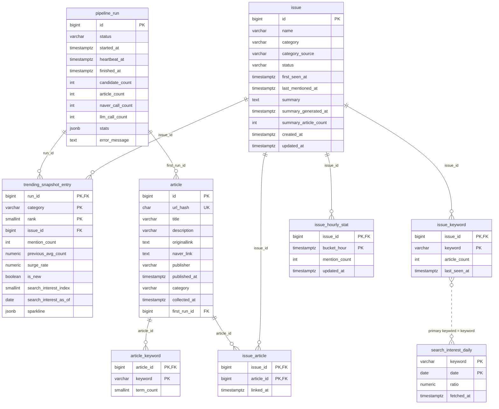

# Korea Pulse 백엔드 DB 설계

작성 기준: PRD §7(데이터 처리 흐름), §8(주요 기능), §9(급상승 판정), 시스템 설계서의 파이프라인 10단계.
문서 성격: 테이블과 컬럼의 의미를 정의하는 설계 문서다. 실제 DDL은 Flyway 마이그레이션 파일에서 관리하며 이 문서에는 싣지 않는다.

## 1. 설계 원칙

- DBMS는 PostgreSQL 16 이상을 전제로 한다. Railway PostgreSQL 플러그인이 제공하는 버전을 그대로 쓰고, jsonb와 부분 인덱스만 있으면 되므로 확장(extension)은 쓰지 않는다.
- 모든 시각 컬럼은 TIMESTAMPTZ이고 UTC로 저장한다. KST 변환은 API 응답 직전에만 한다(시스템 설계서 타임존 항목). 시간 버킷(bucket_hour)도 UTC 정시 기준이다.
- 스키마 변경은 Flyway 마이그레이션으로만 한다. 파일명은 `V{번호}__{설명}.sql`, 첫 파일 `V1__init.sql`에 아래 9개 테이블을 모두 담는다. JPA `ddl-auto`는 `validate`로 고정한다.
- 기사 본문은 어떤 테이블에도 저장하지 않는다. 네이버 뉴스 검색 API가 돌려주는 title, description, 링크, 발행 시각까지만 보관한다(기능 정의서 법적 제약 항목).
- TOP-10 순위·지표는 마지막 SUCCESS 런의 trending_snapshot_entry를 읽으며 불변·격리 보장은 이 저장값에 한정된다. 이슈명은 issue.name을 조인하고, 상세/통계/뉴스는 라이브 테이블 조회·계산이므로 진행 중이거나 실패한 런의 반영분도 보일 수 있다.
- MVP 제외 기능(회원, 개인화, 알림, 키워드 검색)을 위한 테이블은 만들지 않는다. 필요해지면 별도 마이그레이션으로 추가한다.
- 식별자는 BIGINT identity(`GENERATED ALWAYS AS IDENTITY`)를 쓴다. 복합 자연키가 분명한 연결·집계 테이블은 대리키 없이 복합 PK를 쓴다.
- 열거형 값(status, category)은 PostgreSQL enum 타입 대신 VARCHAR + CHECK 제약으로 둔다. 값 추가 시 마이그레이션이 단순해진다.

### 공통 코드 값

| 구분 | 값 | 비고 |
| --- | --- | --- |
| 카테고리 | ALL, ECONOMY, SPORTS, ENTERTAINMENT, POLITICS_SOCIETY, IT_SCIENCE, ETC | PRD §5의 전체/경제/스포츠/연예/정치사회/IT과학/기타. ALL은 스냅샷에만 쓰이고 article, issue에는 절대 저장하지 않는다 |
| pipeline_run.status | RUNNING, SUCCESS, FAILED | 기능 정의서 파이프라인 상태도 |
| issue.status | ACTIVE, DORMANT | 48시간 무언급 시 DORMANT |
| issue.category_source | HEURISTIC, LLM | 카테고리를 어떤 경로로 정했는지 |

## 2. ERD

9개 테이블. 실선은 FK 관계, 점선은 FK 없이 키워드 문자열로만 이어지는 논리적 관계다.

### 파이프라인 단계와 쓰기 대상

| 단계 | 쓰는 테이블 | 비고 |
| --- | --- | --- |
| 0 런 락 | pipeline_run | RUNNING 행 insert, heartbeat_at 주기 갱신 |
| 1 후보 키워드 | pipeline_run | 목록은 메모리, candidate_count와 stats에 런 메타 기록 |
| 2 수집 | article | url_hash 충돌 시 `ON CONFLICT DO NOTHING` |
| 3 정규화 | article | HTML 태그 제거, pubDate를 UTC로 변환해 저장 |
| 4 키워드 추출 | article_keyword | 신규 기사에 대해서만 |
| 5 클러스터링 | issue, issue_keyword, issue_article | 기존 ACTIVE/DORMANT 이슈에 병합하거나 새 issue 생성. DORMANT는 기존 issueId로 ACTIVE 복귀 |
| 6 집계 | issue_hourly_stat | published_at 기준 시간 버킷 upsert |
| 7 급상승 판정 | (없음) | issue_hourly_stat 읽기만 |
| 8 검색 관심도 검증 | search_interest_daily | 데이터랩 결과 upsert |
| 9 요약 | issue(summary) | 요약과 생성 시각 갱신 |
| 10 스냅샷 | trending_snapshot_entry, pipeline_run | 스냅샷 기록과 SUCCESS 전환을 단일 트랜잭션으로 수행 |

## 3. 테이블별 컬럼 설명

타입 표기는 PostgreSQL 기준이다. "제약" 열의 IDX는 별도 인덱스가 있다는 뜻이며 상세는 4절에 있다.

### 3.1 pipeline_run

파이프라인 실행 1회를 기록한다. 스케줄러 락, 쿼터 소비량 추적, API가 서빙할 "마지막 성공 런" 판별에 쓰인다.

| 컬럼 | 타입 | 제약 | 설명 |
| --- | --- | --- | --- |
| id | BIGINT | PK, identity | 런 식별자 |
| status | VARCHAR(10) | NOT NULL, CHECK(RUNNING/SUCCESS/FAILED), IDX | 런 상태. RUNNING은 동시에 최대 1건만 존재해야 한다 |
| started_at | TIMESTAMPTZ | NOT NULL | 런 시작 시각 |
| heartbeat_at | TIMESTAMPTZ | NOT NULL | 단계 전환 때마다 갱신. 현재 시각 기준 20분 넘게 갱신이 없는 RUNNING 행은 스테일로 보고 FAILED로 회수한다 |
| finished_at | TIMESTAMPTZ | NULL | SUCCESS 또는 FAILED 전환 시각. API의 computedAt 값이자 nextExpectedAt(= finished_at + 현재 케이던스 30분, 축퇴 시 60분) 계산 기준 |
| candidate_count | INT | NOT NULL DEFAULT 0 | 이번 런에서 검색한 후보 키워드 수 |
| article_count | INT | NOT NULL DEFAULT 0 | 이번 런에서 새로 저장한 기사 수(중복 제외) |
| naver_call_count | INT | NOT NULL DEFAULT 0 | 네이버 뉴스 검색 API 호출 수. QuotaBudget 일 카운터 산출에 합산한다 |
| llm_call_count | INT | NOT NULL DEFAULT 0 | 요약·카테고리 폴백 LLM 호출 수. 런당 상한 ~20 감시용 |
| stats | JSONB | NULL | 사용 후보 소스 목록, 케이던스, 추가 카운터 등 런 메타. 02 §5.2와 05 M4-07의 기록처이며 전용 카운터 컬럼은 그대로 사용한다 |
| error_message | TEXT | NULL | FAILED일 때 원인 요약. 스택 트레이스 전체는 넣지 않는다 |

### 3.2 article

네이버 뉴스 검색 API로 수집한 기사 메타데이터. 본문 컬럼은 없다.

| 컬럼 | 타입 | 제약 | 설명 |
| --- | --- | --- | --- |
| id | BIGINT | PK, identity | 기사 식별자 |
| url_hash | CHAR(64) | NOT NULL, UNIQUE | 정규화한 originallink(스킴·호스트 소문자화, 추적 파라미터 제거, 끝 슬래시 제거)의 SHA-256 hex. originallink가 비면 link로 대체. 중복 수집 방지의 유일한 기준이다 |
| title | VARCHAR(500) | NOT NULL | HTML 태그와 엔티티를 제거한 제목 |
| description | VARCHAR(1000) | NOT NULL | API가 준 요약 스니펫. 태그 제거 후 저장. 요약 LLM의 입력은 title과 이 컬럼뿐이다 |
| originallink | TEXT | NOT NULL | 언론사 원문 URL. 앱의 링크아웃 대상 |
| naver_link | TEXT | NULL | 네이버 뉴스 URL(API의 link). 원문과 동일하면 NULL |
| publisher | VARCHAR(100) | NULL | originallink 호스트에서 유도한 언론사 표시명. 도메인 매핑이 없으면 NULL 저장, API도 null |
| published_at | TIMESTAMPTZ | NOT NULL, IDX | API pubDate(RFC 1123, +0900)를 UTC로 변환한 값. 시간 버킷과 보존 정책의 기준 |
| category | VARCHAR(20) | NULL, CHECK(ALL 제외 6종) | link 패턴 휴리스틱으로 정한 기사 카테고리. 판별 실패 시 NULL. 이슈 카테고리 결정의 투표 재료다 |
| collected_at | TIMESTAMPTZ | NOT NULL | 최초 저장 시각 |
| first_run_id | BIGINT | NOT NULL, FK pipeline_run(id) | 이 기사를 처음 저장한 런. 디버깅·수집량 추적용 |

### 3.3 article_keyword

기사 하나에서 KOMORAN으로 뽑은 명사 키워드. 클러스터링의 입력이다.

| 컬럼 | 타입 | 제약 | 설명 |
| --- | --- | --- | --- |
| article_id | BIGINT | PK, FK article(id) ON DELETE CASCADE | 기사 |
| keyword | VARCHAR(50) | PK, IDX | 정규화한 키워드(공백 트림, 소문자화 없음). 불용어 제거 후 남은 것만 |
| term_count | SMALLINT | NOT NULL DEFAULT 1 | title + description 안 출현 횟수. 클러스터 병합 시 가중치 |

### 3.4 issue

클러스터링으로 묶인 이슈. 서비스가 사용자에게 보여주는 단위다.

| 컬럼 | 타입 | 제약 | 설명 |
| --- | --- | --- | --- |
| id | BIGINT | PK, identity | 이슈 식별자. API `/issues/{id}`의 id |
| name | VARCHAR(100) | NOT NULL | issue_keyword의 article_count 상위 대표 키워드 최대 3개를 공백으로 결합한 이슈명. 데이터랩 조회에는 이 중 최다 기사 수의 대표 키워드(primary) 1개를 쓴다 |
| category | VARCHAR(20) | NOT NULL, CHECK(ALL 제외 6종), IDX | 이슈 카테고리. 소속 기사 category 다수결. 과반 없음(동률 포함) 또는 분류된 기사 비율 50% 미만이면 LLM 폴백, 실패 시 ETC |
| category_source | VARCHAR(10) | NOT NULL, CHECK(HEURISTIC/LLM) | 카테고리 결정 경로. 휴리스틱 정확도 검증에 쓴다 |
| status | VARCHAR(10) | NOT NULL, CHECK(ACTIVE/DORMANT), IDX | ACTIVE/DORMANT 모두 클러스터 병합 대상. DORMANT: last_mentioned_at 기준 48시간 무언급. 새 기사 매칭 시 신규 이슈를 만들지 않고 기존 issueId를 ACTIVE로 복귀시킨다 |
| first_seen_at | TIMESTAMPTZ | NOT NULL | 이슈 최초 생성 시각(이슈 발생 시점으로 표시) |
| last_mentioned_at | TIMESTAMPTZ | NOT NULL, IDX | 소속 기사 중 가장 최근 published_at. DORMANT 전환 판정 기준 |
| summary | TEXT | NULL | LLM이 만든 2~3문장 요약. TOP-10에 든 적 없는 이슈는 NULL이며 API도 null로 준다 |
| summary_generated_at | TIMESTAMPTZ | NULL | 요약 생성 시각. 6시간 경과 재생성 판정 기준 |
| summary_article_count | INT | NULL | 요약 생성 시점의 소속 기사 수. 현재 기사 수가 이보다 30% 넘게 늘면 재생성 |
| created_at | TIMESTAMPTZ | NOT NULL | 행 생성 시각 |
| updated_at | TIMESTAMPTZ | NOT NULL | 행 갱신 시각 |

### 3.5 issue_keyword

이슈를 구성하는 키워드 집합. 클러스터 병합(Jaccard)과 상세 화면의 "관련 키워드"에 쓴다.

| 컬럼 | 타입 | 제약 | 설명 |
| --- | --- | --- | --- |
| issue_id | BIGINT | PK, FK issue(id) ON DELETE CASCADE | 이슈 |
| keyword | VARCHAR(50) | PK, IDX | 키워드 |
| article_count | INT | NOT NULL DEFAULT 0 | 이 키워드를 가진 소속 기사 수. 상세 API의 관련 키워드 top10 정렬 기준 |
| last_seen_at | TIMESTAMPTZ | NOT NULL | 이 키워드가 마지막으로 소속 기사에 나타난 시각 |

### 3.6 issue_article

이슈와 기사의 N:M 연결. 상세 화면의 관련 뉴스 목록 소스다.

| 컬럼 | 타입 | 제약 | 설명 |
| --- | --- | --- | --- |
| issue_id | BIGINT | PK, FK issue(id) ON DELETE CASCADE | 이슈 |
| article_id | BIGINT | PK, FK article(id) ON DELETE CASCADE, IDX | 기사. 하나의 기사가 여러 이슈에 속할 수 있다 |
| linked_at | TIMESTAMPTZ | NOT NULL | 연결 시각 |

### 3.7 issue_hourly_stat

이슈별 시간 버킷 언급량. 급상승 판정(PRD §9)과 상세 화면의 48시간 추이, 스파크라인의 원천이다.

| 컬럼 | 타입 | 제약 | 설명 |
| --- | --- | --- | --- |
| issue_id | BIGINT | PK, FK issue(id) ON DELETE CASCADE | 이슈 |
| bucket_hour | TIMESTAMPTZ | PK, IDX | UTC 정시로 내림한 시간 버킷(`date_trunc('hour', published_at)`) |
| mention_count | INT | NOT NULL DEFAULT 0 | 해당 버킷에 발행된 소속 기사 수. 런마다 재계산해 upsert |
| updated_at | TIMESTAMPTZ | NOT NULL | 마지막 upsert 시각 |

순위 판정에서 "현재 언급량"은 직전 완성 버킷만 사용하며 진행 중 버킷은 제외한다. "이전 평균"(previousAvgCount)은 현재 버킷 직전 24개 버킷의 평균이며 결측은 0으로 채운다. 이 24개 중 언급량 0이 아닌 버킷이 3개 미만이거나 previousAvgCount < 1.0이면 is_new=true다. stats 엔드포인트의 마지막 진행 중 포인트 허용은 별도 계약이다.

### 3.8 trending_snapshot_entry

런 하나가 계산한 카테고리별 TOP-10. `/trending` API의 순위·지표 원천이며, 런 시각은 pipeline_run, 이슈명은 issue를 조인한다.

| 컬럼 | 타입 | 제약 | 설명 |
| --- | --- | --- | --- |
| run_id | BIGINT | PK, FK pipeline_run(id) | 계산한 런 |
| category | VARCHAR(20) | PK, CHECK(7종, ALL 포함) | 스냅샷 카테고리. ALL은 전 카테고리 통합 순위 |
| rank | SMALLINT | PK, CHECK(1~10) | 순위. 이슈가 부족하면 10 미만까지만 존재한다 |
| issue_id | BIGINT | NOT NULL, FK issue(id) | 이슈 |
| mention_count | INT | NOT NULL | 판정 시점 현재 언급량 |
| previous_avg_count | NUMERIC(10,2) | NOT NULL | 현재 버킷 직전 24개 평균을 소수 둘째 자리로 반올림한 previousAvgCount |
| surge_rate | NUMERIC(8,4) | NOT NULL | (current - avg) / max(avg, 1.0). current는 mention_count, avg는 previous_avg_count. 소수 둘째 자리로 반올림해 저장하며 응답값도 동일하다. 1.82 = +182% |
| is_new | BOOLEAN | NOT NULL | 직전 24버킷 중 언급량 0이 아닌 버킷 <3 OR previousAvgCount <1.0이면 true(NEW 배지) |
| search_interest_index | SMALLINT | NULL, CHECK(0~100) | 최근 가용 일자의 ratio(NUMERIC(5,2))를 ROUND()한 정수. 미조회·미매칭이면 NULL |
| search_interest_as_of | DATE | NULL | search_interest_index가 어느 날짜의 값인지. API의 searchInterestAsOf. 최대 24시간 지연이 정상이다 |
| sparkline | JSONB | NOT NULL | 길이 24의 정수 배열(예: `[3,5,4,...,41]`). 오래된 버킷이 앞, 마지막 원소가 현재 버킷. 결측 버킷은 0으로 채운다. 배열 길이 24 검증은 애플리케이션이 담당 |

sparkline을 JSONB로 둔 이유: 조회 시 가공 없이 JSON 응답에 그대로 싣고, JPA 매핑이 `int[]` 네이티브 배열보다 단순하다. 버킷 단위로 쿼리할 일이 없으므로 정규화하지 않는다.

이슈 하나가 ALL과 자기 카테고리 두 곳에 동시에 실릴 수 있다. 같은 run_id + category 안에서 issue_id 중복은 애플리케이션이 막는다.

### 3.9 search_interest_daily

네이버 데이터랩 통합검색어 트렌드 응답을 키워드·날짜 단위로 보관한다. "검색 관심 배지"의 원천이다.

| 컬럼 | 타입 | 제약 | 설명 |
| --- | --- | --- | --- |
| keyword | VARCHAR(50) | PK | 대표 키워드(primary): issue_keyword 중 article_count 최다 키워드 1개. 복합 이슈명(issue.name)이 아닌 이 키워드와 문자열 일치 |
| date | DATE | PK | 데이터랩이 돌려준 기간(period) 날짜. KST 기준 하루 |
| ratio | NUMERIC(5,2) | NOT NULL, CHECK(0~100) | 데이터랩 상대값. 같은 요청 그룹·기간 안에서 최댓값을 100으로 정규화한 값 |
| fetched_at | TIMESTAMPTZ | NOT NULL | 마지막 조회 시각. 같은 (keyword, date)를 다시 받으면 ratio와 함께 덮어쓴다 |

granularity 주석: 데이터랩 API의 timeUnit은 date/week/month뿐이고 시간 단위가 없다. 그래서 이 테이블의 최소 단위는 date이며, 시간 단위 컬럼을 추가하거나 일 값을 24등분해 시간 단위로 백필하는 일은 금지한다. 시간 단위 급상승 판정은 issue_hourly_stat(뉴스 언급량)만으로 하고, 이 테이블은 "그 이슈가 검색에서도 관심을 받고 있는가"를 일 단위로 보조 표시하는 데만 쓴다(기능 정의서 검색 관심도 항목).

ratio는 요청 그룹 내 상대값이라 키워드 간 절대 비교가 안 된다. 배지 searchInterestIndex는 대표 키워드(primary)의 최근 7일 조회 구간 중 최근 가용 일자 ratio를 ROUND()한 정수다. NUMERIC(5,2) → int 반올림 변환을 스냅샷 저장과 상세 응답에 동일하게 적용한다(예: 87.65 → 88). 이전 7일 평균과 비교하지 않는다.

## 4. 인덱스 전략

PK와 UNIQUE가 만드는 인덱스 외에 아래 인덱스를 둔다. 조회 패턴이 근거이며, 근거 없는 인덱스는 추가하지 않는다.

| 테이블 | 인덱스 | 종류 | 근거가 되는 조회 |
| --- | --- | --- | --- |
| pipeline_run | (finished_at DESC) WHERE status = 'SUCCESS' | 부분 인덱스 | TOP-10과 health의 "마지막 SUCCESS 런" 1건 조회. 행 수가 적어도 매 요청마다 타므로 둔다 |
| pipeline_run | (status) WHERE status = 'RUNNING' | 부분 인덱스 | 런 락 획득과 스테일 락 회수 |
| article | (published_at) | B-tree | 시간 버킷 집계 범위 스캔, 14일 보존 정리 삭제 |
| article | (category, published_at DESC) | B-tree | 카테고리별 최근 기사 조회(클러스터링 시 후보 범위 축소) |
| article_keyword | (keyword, article_id) | B-tree | 키워드 공출현 그룹핑: 키워드로 기사 집합 찾기. PK (article_id, keyword)의 역방향 |
| issue | (status, last_mentioned_at) | B-tree | ACTIVE 이슈 목록 조회, DORMANT 전환 대상 탐색 |
| issue | (category, status) | B-tree | 카테고리별 ACTIVE 이슈 후보 조회(TOP-10 판정 입력) |
| issue_keyword | (keyword) | B-tree | 새 기사 키워드로 병합 후보 ACTIVE/DORMANT 이슈 찾기 |
| issue_article | (article_id) | B-tree | article 삭제 시 FK cascade 탐색, 기사 하나가 속한 이슈 조회. 이 인덱스가 없으면 14일 정리 삭제가 issue_article 전체 스캔을 유발한다 |
| issue_article | (별도 추가 없음) | | 뉴스 페이징은 PK의 issue_id로 연결 기사를 찾고 article 조인 후 article.published_at DESC로 정렬한다. linked_at은 뉴스 정렬 기준이 아니다 |
| issue_hourly_stat | (bucket_hour) | B-tree | 30일 보존 정리 삭제. 이슈별 48시간 조회는 PK (issue_id, bucket_hour) 범위 스캔으로 충분 |
| trending_snapshot_entry | (issue_id) | B-tree | issue 참조 무결성 확인, 특정 이슈의 TOP-10 진입 이력 조회 |
| search_interest_daily | (없음) | | PK (keyword, date) 범위 스캔으로 모든 조회가 끝난다 |

`/trending?category=` 조회는 마지막 SUCCESS run_id를 얻은 뒤 trending_snapshot_entry PK 선두 (run_id, category)로 최대 10행을 읽는다. 별도 인덱스가 필요 없다.

## 5. 데이터 보존 정책

보존 기간을 넘긴 행은 매일 1회(KST 04:00, 트래픽 최저 시간대) 스케줄 작업이 삭제한다. 삭제는 5,000행씩 끊어 실행해 긴 락과 WAL 급증을 피한다. 삭제 후 autovacuum에 맡기고 수동 VACUUM FULL은 하지 않는다.

| 테이블 | 보존 기간 | 기준 컬럼 | 비고 |
| --- | --- | --- | --- |
| article | 14일 | published_at | 삭제 시 article_keyword, issue_article이 cascade로 함께 지워진다 |
| article_keyword | 14일 | (article cascade) | 별도 작업 없음 |
| issue_article | 14일 | (article cascade) | 오래된 이슈의 관련 뉴스 목록은 비게 된다. 상세 API는 빈 목록을 정상 응답한다 |
| issue_hourly_stat | 30일 | bucket_hour | 48시간 추이와 24시간 베이스라인에 충분하고, 콜드스타트 재계산 여유를 둔다 |
| trending_snapshot_entry | 영구 | | 서비스 이력 자체. 행이 작고 증가량이 완만하다(6절) |
| pipeline_run | 영구 | | 스냅샷의 FK 대상. 하루 48행 수준이라 정리 불필요 |
| issue | 영구 | | 스냅샷과 issue_hourly_stat의 FK 대상. DORMANT 이슈도 지우지 않는다 |
| issue_keyword | 영구 | (issue에 종속) | 이슈가 남는 한 유지. 크기가 작다 |
| search_interest_daily | 영구 | | 하루 최대 수백 행. 배지 산출에 7일치만 쓰지만 정리 비용이 이득보다 크다 |

14일을 고른 이유: 급상승 판정은 최근 24~48시간만 본다. 14일이면 클러스터링 품질 문제를 사후 분석할 여유가 있고, 아래 용량 추정에서 Railway 기본 볼륨 안에 넉넉히 들어온다.

## 6. 용량 추정

가정: 키워드 풀 최대 200개 × 하루 48런 × display 100건이지만 대부분 중복이라, 하루 신규 고유 기사를 20,000건으로 잡는다. 기사당 키워드 8개, 하루 신규 이슈 300개, 동시 ACTIVE 이슈 1,000개, 스냅샷 카테고리 7종. 행 크기는 인덱스를 포함한 대략치다.

| 테이블 | 일 증가 행 수 | 행당 크기(인덱스 포함) | 일 증가량 | 보존 기간 도달 시 크기 |
| --- | --- | --- | --- | --- |
| article | 20,000 | ~1.2 KB (URL 2개, 제목, 스니펫) | ~24 MB | 14일: ~340 MB |
| article_keyword | 160,000 | ~90 B | ~14 MB | 14일: ~200 MB |
| issue_article | 25,000 (기사당 평균 1.25 이슈) | ~80 B | ~2 MB | 14일: ~28 MB |
| issue_hourly_stat | 24,000 (ACTIVE 1,000 × 24버킷) | ~70 B | ~1.7 MB | 30일: ~50 MB |
| trending_snapshot_entry | 3,360 (48런 × 7 × 10) | ~350 B (sparkline jsonb ~100 B) | ~1.2 MB | 월 ~35 MB, 연 ~430 MB |
| issue | 300 | ~600 B (summary 포함) | ~0.2 MB | 연 ~65 MB |
| issue_keyword | 3,000 | ~80 B | ~0.25 MB | 연 ~90 MB |
| search_interest_daily | ≤ 200 | ~60 B | ~12 KB | 연 ~4.5 MB |
| pipeline_run | 48 | ~150 B | 무시 | 연 ~2.6 MB |

정리하면 정상 상태(14일 보존 도달 후)에서 약 620 MB로 시작해 영구 보존 테이블 때문에 월 ~50 MB씩 자란다. 1년 운영 시 약 1.2 GB. Railway PostgreSQL 기본 볼륨(수 GB) 안에서 MVP 기간을 넘기기에 충분하며, 스냅샷이 부담이 되는 시점(수 년 뒤)에 sparkline 컬럼만 오래된 런에서 NULL 처리하는 마이그레이션을 검토하면 된다.

가장 큰 변수는 하루 고유 기사 수다. 실제 수치가 가정의 2배(40,000건)여도 article + article_keyword가 ~1.1 GB로, 여전히 문제 없다. 반대로 쿼터 축퇴 모드(시간 단위 케이던스)에서는 절반 이하로 줄어든다.

## 7. 다른 문서와의 대응

| 이 문서 | 대응 |
| --- | --- |
| trending_snapshot_entry 컬럼 | API 명세 `/trending` 응답 필드(rank, issueId, mentionCount, previousAvgCount, surgeRate, isNew, searchInterestIndex, searchInterestAsOf, sparkline) |
| issue.summary, summary_generated_at | API 명세 `/issues/{id}` 응답 summary, summaryGeneratedAt |
| issue_hourly_stat | API 명세 `/issues/{id}/stats` 응답 [{hour, mentionCount}] |
| article 컬럼 | API 명세 `/issues/{id}/news` 항목(title, originallink, naverLink, publisher, publishedAt) |
| pipeline_run.heartbeat_at, status | 시스템 설계서 스케줄링 항목(스테일 락 20분) |
| search_interest_daily granularity 주석 | 기능 정의서 검색 관심도 항목(일 단위, 최대 24시간 지연) |
