# Korea Pulse 백엔드 개발 계획서

| 항목 | 내용 |
| --- | --- |
| 문서 번호 | 05 |
| 문서 버전 | v0.2 정합 (2026-09-14) |
| 대상 | Korea Pulse MVP 백엔드 (Java 21, Spring Boot 4.1.1, PostgreSQL, Redis) |
| 근거 문서 | 00-프로젝트-정의서-v0.2 §6(MVP 범위), §11(운영 품질·데이터 검증), §13(일정 제안), §14(개발 전 결정 항목). 01~04 문서 |
| 관련 문서 | 00-프로젝트-정의서-v0.2, 01-기능-정의서, 02-시스템-설계서, 03-DB-설계, 04-API-명세 |

이 문서는 01~04의 설계를 "언제, 어떤 순서로, 무엇이 끝나면 끝난 것으로 보는가"로 옮긴다. 정의서 §13에 따라 일정은 **데이터 접근이 확보된 뒤의 6주 예시**이며 달력 고정이 아니다. 확대 여부는 날짜가 아니라 품질 검증과 사용자·고객 반응으로 판단한다.

---

## 1. 목표와 제약

### 1.1 출시의 정의

다음 다섯 가지가 동시에 성립하면 베타 공개 가능 상태로 본다.

1. 파이프라인이 목표 케이던스(15분, 축퇴 시 30·60분)로 돌고, 연속 24시간 SUCCESS 비율이 90% 이상이다.
2. 04 문서의 엔드포인트 7개가 명세대로 응답하고, 프론트엔드가 실제 서버로 정의서 §7의 화면 흐름을 끝까지 탄다.
3. 정의서 §6의 P0 7항목이 모두 동작한다. (파이프라인, 클러스터, 급상승·언급량 순위, 카테고리 필터, 상세, 검색, 상태 처리)
4. 정의서 §11의 데이터 검증을 통과한다. 24시간 표본 상위 20개 이슈 중 16개 이상이 일관된 주제로 설명된다 (6절).
5. 출시 전 점검 항목(모바일 화면, 키보드 접근, 검색 빈 결과, 공급자 API 장애, 지연 데이터 상태)을 프론트와 함께 확인했다.

성능 목표(메인 API P95 < 500ms)는 캐시 적중률·데이터량·동시 요청 조건을 기록한 측정 결과로만 통과 처리한다.

### 1.2 제약

| 제약 | 내용 | 계획에 미치는 영향 |
| --- | --- | --- |
| 데이터 접근 | 메인 뉴스 공급원 미확정. 승인·계약 기간을 통제할 수 없다 | W1 시작 조건이 "준비 단계 통과"다. 준비가 길어지면 전체가 밀린다 |
| 인력 | 백엔드 1인(이광석), 프론트·디자인 1인(이민서) | 백엔드 WBS의 의존관계가 곧 실행 순서다. 코드 리뷰 상대가 없으므로 테스트가 리뷰를 대신한다 |
| 협업 | 주 1회 미팅 + API 계약 우선 합의 | 마일스톤 완료 기준은 미팅에서 보여줄 수 있는 형태(실행 로그, 쿼리 결과, curl 응답)로 정한다 |
| 계약 | 04 API 명세가 유일한 계약 | 프론트는 W1 이후 04의 예시 JSON을 목 데이터로 쓴다. 필드 변경은 04 문서 수정과 동시에만 한다 |
| 범위 | 정의서 §6 "MVP 이후" 항목 | 회원·결제·알림·개인화·AI 요약·B2B 상품은 작업 단위로 등장하지 않는다 |

### 1.3 v1.0 계획에서 바뀐 점

| 항목 | v1.0 | v0.2 정합 |
| --- | --- | --- |
| 일정 기준 | 11월 27일 고정 출시일, 11주 | 데이터 접근 확보 후 준비 + 6주, 게이트 기반 |
| 마일스톤 | M1~M4 (수집→클러스터→API→요약·배포) | W1~W6 (계약·수집 → 클러스터 → 순위·API → 상세·검색 → 품질·성능 → 공개 준비) |
| AI 요약 | M4 필수 작업 | 범위 제외. LLM은 분류 폴백만 |
| 검색 | 범위 밖 | P0 작업 |
| 중복 제거 | url_hash 1건 | 중복 그룹 단계 신설 |
| 점수 | 증가율 정렬 | Hot Score + scoreVersion + 기준 집단 저장 |
| 캐시 | 없음 | Redis 랭킹 + 폴백 |
| 검증 | 단위·통합 테스트 | 위 + 정의서 §11 표본 검토 게이트 |
| 순위 저장 | hot 상위 50 1세트 | 정렬 3종 각각 상위 50 독립 선정 후 합집합 |
| 후보 풀 | 우선순위 합집합 150 절단 | 소스별 고정 슬롯 + 자가시딩 2티어 순환 |
| 결손 판정 | 버킷 1개 결손 = 구간 INSUFFICIENT | 결손 비율 임계 0.10 |
| 비용 | Railway + LLM 요약 | Railway(후보) + Redis + LLM 분류만. 데이터 사용료 $0 |
| 데이터 소스 | 네이버 뉴스 + DataLab | **네이버 뉴스(확정) + YouTube + Google Trends**. 빅카인즈·GDELT·DataLab 제외 |
| 준비 단계 | 공급원 계약 협의 포함 | 계약 협의 없음. 키 발급·약관 확인·표본으로 축소 |

---

## 2. 준비 단계 (데이터 접근과 결정)

W1 착수 전에 끝내야 하는 작업이다. 정의서 §14의 결정 항목 중 백엔드가 주도하는 것을 여기서 닫는다.

| ID | 작업 | 규모 | 산출물 / 완료 조건 |
| --- | --- | --- | --- |
| P-01 | **NAVER 뉴스 약관 확인**: 저장·캐시·재표시·상업 이용 범위, 보존 기간 상한 | S | 저장 정책표. 03 문서 보존 정책에 반영. 정의서 §5.1 |
| P-02 | **YouTube 쿼터 실측**: 인기차트·채널 업로드 호출의 실제 units 소모와 응답 필드 확인 | S | 런당 units 실측표. 02 문서 5.2.2절 추정(19 units/런) 검증 |
| P-02a | **YouTube 뉴스 채널 목록 선정**: 카테고리 커버리지, 특히 경제(인기 차트에 경제 카테고리 없음) | S | 채널 ID 12개와 업로드 플레이리스트 ID. `YOUTUBE_NEWS_CHANNEL_IDS` 초기값 |
| P-03 | **Google Trends 알파 신청**: 신청서 제출과 상태 추적 | S | 신청 접수 기록. **승인을 기다리지 않고 W1을 시작한다** |
| P-04 | **YouTube 약관 확인**: 메타데이터 저장 범위, 임베드·링크아웃 요건 | S | 저장·노출 정책표. 01 문서 9절 제약 6에 반영 |
| P-05 | 표본 수집 스크립트: 네이버 뉴스 24시간 표본 + 같은 기간 YouTube 인기차트·채널 표본 | S | 표본 파일과 기초 통계(기사 수, 매체 수, 지연 분포, 영상 수) |
| P-05a | **영상·이슈 매칭률 측정**: P-05 표본에서 상위 20개 이슈 중 몇 개가 영상을 가지는가 | S | 매칭률과 카테고리별 편향. **매칭률이 30% 미만이면 영상 관심도를 P2로 낮춘다** |
| P-06 | 카테고리 단서 조사: 공급자 응답에 섹션·분류 정보가 있는지, 없으면 링크 패턴 매칭률 | S | 패턴표 + 매칭률. 휴리스틱 1차 사용 여부 결정 (7절) |
| P-07 | 출시 카테고리 범위 합의: 정의서 §6 "첫 검증은 경제·스포츠 표본부터" | S | `coveredCategories` 초기값 확정 |

준비 단계 통과 기준: 네이버·YouTube 키가 발급됐고, 24시간 표본이 있고, 카테고리 결정 경로가 정해졌다. 세 소스 중 **데이터 접근이 불확실한 것은 Google Trends뿐**이고, 그것은 P1 보조 지표라 착수 조건이 아니다.

v1.0 계획 대비 준비 단계가 많이 짧아졌다. 빅카인즈 계약 협의와 대체 공급원 평가가 사라졌기 때문이다(정의서 §5.4). 외부 승인 대기가 일정을 잡아먹는 리스크가 제거된 것이 이번 소스 변경의 가장 큰 소득이다.

---

## 3. 주차별 마일스톤

정의서 §13의 6주 프레임에 백엔드 작업을 얹은 것이다. 순서 원칙은 데이터가 흐르는 방향이다.

```mermaid
gantt
    title Korea Pulse 백엔드 (데이터 접근 확보 후 6주)
    dateFormat  X
    axisFormat  W%d
    section 준비
    데이터 접근·표본·결정      :p, 0, 1
    section W1
    계약·스키마·수집           :w1, 1, 2
    section W2
    중복 제거·키워드·클러스터   :w2, 2, 3
    section W3
    집계·점수·순위 API         :w3, 3, 4
    section W4
    상세·시계열·기사·검색       :w4, 4, 5
    section W5
    캐시·장애·성능·품질 조정    :w5, 5, 6
    section W6
    배포·운영 안정화·공개 준비  :w6, 6, 7
```

### 3.1 W1: API 계약 + 스키마 + 수집

| # | 완료 기준 | 확인 방법 |
| --- | --- | --- |
| 1 | 04 문서의 예시 JSON이 프론트 목 데이터로 합의됐다 | W1 미팅 기록, 프론트 목 서버 동작 |
| 2 | Flyway `V1__init.sql`이 15개 테이블을 만들고 `ddl-auto=validate`로 기동한다 | 기동 로그 |
| 3 | 런 1회가 후보 → 수집 → 정규화를 거쳐 `article`을 적재하고 SUCCESS로 끝난다 | `SELECT status, candidate_count, attempted_keyword_count, article_count FROM collection_run` |
| 4 | 같은 런을 두 번 돌려도 기사가 중복 적재되지 않는다 | 두 번째 런의 `article_count`가 뚜렷이 작다 |
| 5 | RUNNING 행의 heartbeat를 15분 전으로 바꾸면 다음 런이 STALE로 회수하고 새 런을 시작한다 | `collection_run` 행 확인 |
| 6 | 쿼터 카운터 단위 테스트 통과 | `./gradlew test` |

### 3.2 W2: 중복 제거 + 키워드 + 클러스터

| # | 완료 기준 | 확인 방법 |
| --- | --- | --- |
| 1 | 재배포 기사가 하나의 중복 그룹으로 묶이고 대표 기사가 정해진다 | 표본 100건 수동 확인, `member_count` 분포 |
| 2 | 원본 기사 수와 중복 제거 후 기사 수가 구분되어 저장된다 | `topic_hourly_stat`의 두 컬럼 비교 |
| 3 | 신규 기사마다 키워드가 저장되고 불용어가 없다 | 상위 50개 키워드 목록 |
| 4 | 같은 사건이 하나의 이슈로 묶이고, 다음 런의 새 기사가 기존 이슈에 붙는다 | 대표 이슈 3개의 `topic_article` 증가 추적 |
| 5 | 서로 다른 사건이 기업명만으로 합쳐지지 않는다 | 표본 검토 메모 (정의서 §8 예시 기준) |
| 6 | 분류가 채워지고 UNCLASSIFIED 비율이 50% 미만이다 | `SELECT category, category_source, count(*) FROM topic GROUP BY 1,2` |

### 3.3 W3: 집계 + Hot Score + 순위 API

| # | 완료 기준 | 확인 방법 |
| --- | --- | --- |
| 1 | 버킷 집계가 언급량·원본 수·출처 수를 채우고, 재실행해도 중복 집계되지 않는다 | 같은 구간 재계산 전후 값 동일 |
| 2 | 기간 4종의 현재·비교 구간이 `[T-P,T)` / `[T-2P,T-P)`로 계산된다 | 단위 테스트 + 수동 쿼리 대조 |
| 3 | 이전 0건은 `growthRate: null` + `NEW`, 비교 구간 결손은 `INSUFFICIENT`로 나온다 | 픽스처 테스트 |
| 4 | Hot Score가 `hot-v0.2-exp1` 공식으로 계산되고 스냅샷 헤더에 `score_norm_params`(기간별 min·max·클리핑 경계·기준 집단 크기)가 저장된다 | 스냅샷 헤더 행 확인 |
| 4-1 | 순위권 밖 이슈의 hotScore가 저장된 파라미터로 재현되고, 파라미터가 없으면 null + `SCORE_UNAVAILABLE`이 나온다 | 순위 밖 이슈 curl 2케이스 |
| 5 | 스냅샷이 단일 트랜잭션으로 기록된 뒤에만 게시되고 포인터가 전환된다 | 쓰기 중 예외 주입 시 PUBLISHED 스냅샷이 바뀌지 않는다 |
| 6 | `/api/v1/trends`가 04 문서 2.2절 형태로 응답하고 sort 3종이 동작한다 | curl 비교 |
| 6-1 | 정렬 3종이 **각각 독립으로** 상위 50을 선정한다. hot 상위 50 밖이지만 growth 상위인 이슈가 `sort=growth`에 나온다 | 픽스처로 hot 순위 밖 급상승 이슈를 주입하고 curl 비교 |
| 6-2 | `/trends` 응답에 `searchInterest`가 없다 | 응답 필드 확인 |
| 7 | 잘못된 category·period·sort는 400, 게시 스냅샷이 없으면 503 + `Retry-After` | curl |

### 3.4 W4: 상세 + 시계열 + 기사 + 검색

| # | 완료 기준 | 확인 방법 |
| --- | --- | --- |
| 1 | `/topics/{id}`가 요약 지표·근거 문장·대표 기사·태그를 04 문서 3.2절 형태로 응답한다 | curl |
| 2 | `/timeline`이 PARTIAL·MISSING을 실제 0과 구분해 응답한다 | 수집 실패를 주입한 버킷이 PARTIAL로 표시 |
| 3 | `/articles`가 중복 그룹 단위로 페이징되고 본문·스니펫이 없다 | 응답 필드 확인 |
| 4 | `/related-keywords`가 상위 10개를 준다 | curl |
| 5 | `/search`가 제목·별칭·연관 키워드로 매칭하고, 미추적 키워드는 `NOT_TRACKED` 빈 결과를 준다 | curl 2케이스 |
| 6 | 같은 `snapshotId`로 순위와 상세를 읽으면 지표가 일치한다 | 연속 호출 비교 |
| 7 | 모든 시각이 `+09:00` ISO 8601이고 에러 5종이 공통 형식이다 | 응답 헤더·본문 |

W4가 끝나면 프론트에 실제 서버 주소를 넘겨 연동을 시작한다.

### 3.5 W5: 캐시 + 장애 + 성능 + 품질 조정

| # | 완료 기준 | 확인 방법 |
| --- | --- | --- |
| 1 | Redis 랭킹 적재·조회가 동작하고, Redis를 내려도 같은 응답이 나온다 | Redis 중지 후 응답 비교 |
| 2 | 공급자 API를 강제 실패시켜도 마지막 정상 스냅샷과 `dataStatus: stale`로 서빙된다 | WireMock 장애 주입 |
| 3 | 부분 수집 실패 구간이 0건으로 계산되지 않는다 | `bucket_coverage`와 `INSUFFICIENT` 확인 |
| 3-1 | 결손 비율 임계 판정이 동작한다. 24h 구간에 PARTIAL 1개를 주입해도 INSUFFICIENT가 되지 않고 `COVERAGE_DEGRADED`만 붙는다 | 버킷 주입 후 `/trends?period=24h&sort=growth` |
| 3-2 | 쿼터 축퇴가 발동한 날에도 24h·7d 급상승 순위가 살아 있다 | 축퇴 주입 후 24시간 `growth_status` 분포 |
| 4 | 메인 API P95 측정값과 조건(캐시 적중률, 항목 수, 동시 요청)이 기록됐다 | 측정 리포트 1장 |
| 5 | 정의서 §11 데이터 검증 1차를 수행하고 결과를 기록했다 | 6절 산출물 |
| 6 | 임계값(최소 언급량·출처 수, 유사도, 평활 상수)이 표본 결과로 조정됐다 | 설정 변경 이력과 근거 |
| 7 | 레이트 리밋이 동작한다 (분당 60회/IP, `/health` 제외) | 61번째 요청이 429 |

### 3.6 W6: 배포 + 운영 안정화 + 공개 준비

| # | 완료 기준 | 확인 방법 |
| --- | --- | --- |
| 1 | 배포 환경이 정해지고 컨테이너·PostgreSQL·Redis가 기동한다 | 배포 로그, `/health` |
| 2 | 배포 후 24시간 SUCCESS 비율 90% 이상 | `SELECT status, count(*) FROM collection_run WHERE started_at > now() - interval '24 hours' GROUP BY 1` |
| 3 | `ingestLagMinutes`와 `cadenceMinutes`가 health에 실측으로 노출된다 | curl |
| 4 | 프론트가 운영 서버로 화면 흐름을 끝까지 탄다 | W6 미팅 시연 |
| 5 | 출시 전 점검 5종(모바일, 키보드 접근, 검색 빈 결과, 공급자 장애, 지연 데이터)을 확인했다 | 점검 체크리스트 |
| 6 | 데이터 검증 2차를 통과했다 (20개 중 16개 이상) | 6절 |

---

## 4. 작업 단위 (WBS)

규모는 상대 단위다. S는 1일 이내, M은 2~3일, L은 4~5일이다. 각 작업은 자기 코드의 단위 테스트를 포함한다.

### 4.1 W1

| ID | 작업 | 규모 | 의존 | 완료 조건 |
| --- | --- | --- | --- | --- |
| W1-01 | 스캐폴딩: Gradle, Spring Boot 4.1.1, Java 21, 02 문서 2.1절 패키지, 프로필 `all`/`web`/`worker`, DataSource 변환, JVM UTC 고정 | M | P-01 | 두 가지 URL 형식으로 기동, 변환 실패 시 기동 실패 |
| W1-02 | Flyway `V1__init.sql`: 15개 테이블, CHECK, 인덱스 | S | W1-01 | Testcontainers 적용 테스트 1건 + validate 통과 |
| W1-03 | domain 엔티티·리포지토리·enum(RunStatus, TopicStatus, Category, Period, Sort, GrowthStatus, SnapshotStatus, CoverageStatus) | M | W1-02 | 컴파일 + validate |
| W1-04 | `NewsProvider` 인터페이스 + `NaverNewsProvider`: 헤더 인증, display=100, sort=date, 429 백오프 3회, 5xx 1회 재시도 | M | W1-01 | WireMock 픽스처(정상·빈 결과·429·401) 테스트 |
| W1-04a | `VideoProvider` + `YoutubeVideoProvider`: `videos.list?chart=mostPopular`, `playlistItems.list`, `videos.list?id=` 배치 50. **`search.list` 호출 경로를 두지 않는다** | M | W1-01 | WireMock 테스트 + `search.list`를 호출하는 코드가 없음을 ArchUnit으로 고정 |
| W1-05 | `QuotaBudget`: 소스별 독립 카운터(네이버 25,000호출 / YouTube 10,000units / Trends), 런당 300, KST 자정 리셋, 네이버 70%/85% 축퇴 신호, YouTube 80% 시 조회수 갱신 중단 | M | W1-03 | 경계값 테스트. 소스별 카운터가 서로 오염되지 않는다 |
| W1-06 | 오케스트레이터 + 런 락: RUNNING 삽입, `FOR UPDATE`, heartbeat 10분 스테일 회수, 단계 슬롯 11개 | M | W1-03 | 3.1절 기준 5 |
| W1-07 | `CandidateSource` + 시드 파일 + `YoutubeCandidateSource`(영상 제목 키워드) + `TrendsCandidateSource`(미승인 시 빈 목록) + **고정 슬롯 병합**(자가시딩 110 / YouTube 25 / Trends 15) | M | W1-03, W1-04a | 외부 소스를 죽여도 후보가 시드로 채워지고, 자가시딩이 신규 유입 슬롯 40개를 잠식하지 않는다. **Trends 미승인이 기본 경로로 테스트된다** |
| W1-08 | 수집 단계: 공급자 호출 → `article` upsert, 시도 키워드 실패율 50% 초과만 FAILED, 미시도 제외, `bucket_coverage` 기록 | M | W1-04~07 | 3.1절 기준 3, 4 |
| W1-09 | 정규화 단계: 태그·엔티티 제거, 발행 시각 UTC 변환, URL 정규화, `source_domain` 추출, 카테고리 단서 추정 | M | P-06, W1-08 | 픽스처 20건의 기대값 일치 |
| W1-10 | 관측 노출 제한: health 단일 노출 고정, 키 로그 마스킹 | S | W1-01 | `/health`만 200, 그 외 액추에이터 경로 404. MockMvc 테스트 1건 |

### 4.2 W2

| ID | 작업 | 규모 | 의존 | 완료 조건 |
| --- | --- | --- | --- | --- |
| W2-01 | 중복 제거 단계: 정규화 URL·공급자 ID 동일 판정, 제목 시그니처 후보 축소, 유사도 임계값 병합, 대표 기사 선정 | M | W1-09 | 3.2절 기준 1, 2 |
| W2-02 | `KeywordExtractor` + `keyword`/`keyword_alias` 적재 | M | W2-01 | 3.2절 기준 3 |
| W2-03 | 클러스터 단계: 공출현 그룹핑, 기존 이슈와 유사도 + 시간 근접성 병합, 이슈 제목 생성, DORMANT 복귀 | L | W2-02 | 3.2절 기준 4, 5 |
| W2-04 | 분류 단계: 기사 카테고리 다수결 → `TopicClassifier` LLM 폴백 → UNCLASSIFIED, 보조 태그 저장, 미분류 재시도 | M | W2-03 | 3.2절 기준 6 |
| W2-05 | `SelfSeedingCandidateSource`: 핫 티어(1h·6h 순위 진입 이슈 전량, 최대 60) + 순환 티어(`topic.last_collected_at` 오름차순 라운드로빈 50), `selfSeedRotationHours` 기록 | M | W2-03 | ACTIVE 1,000건 픽스처에서 순환 주기가 6시간 이내이고, 핫 티어 이슈는 매 런 재수집된다 |
| W2-06 | 보존 정리 작업: KST 04:00, article 14일 / 버킷 60일 / 스냅샷 항목 7일 + archived 보존, 5,000행 배치 | S | W1-03 | 기준일 넘긴 행만 삭제되고 cascade 전파 |

### 4.3 W3

| ID | 작업 | 규모 | 의존 | 완료 조건 |
| --- | --- | --- | --- | --- |
| W3-01 | 집계 단계: 버킷별 언급량·원본 수·출처 수 upsert, `last_mentioned_at` 갱신, 48시간 DORMANT 전이, `bucket_coverage` 확정 | M | W2-03 | 3.3절 기준 1 |
| W3-02 | `PeriodWindow` + 구간 집계기: 기간 4종의 현재·비교 구간 합계, 구간 출처 수 재집계, **결손 비율 기반** 판정(임계 0.10) | M | W3-01 | 3.3절 기준 2, 3 |
| W3-03 | `HotScoreCalculator`: 4개 입력 정규화(평활 상수 k=3, 상위 1% 클리핑, log1p), 가중치 45/30/15/10, `score_norm_params` 산출 | M | W3-02 | 3.3절 기준 4 |
| W3-03a | `RankSelector`: 정렬 3종 각각 상위 50 독립 선정 → 합집합 행 생성(`rank_hot`/`rank_growth`/`rank_mentions`), growth는 INSUFFICIENT 제외 후 매김 | S | W3-03 | 3.3절 기준 6-1 |
| W3-04 | 게시 단계: `trend_snapshot` BUILDING(+`score_norm_params`) → 항목 기록 → Redis 정렬별 Sorted Set 3종 적재 → PUBLISHED 전환 → 런 SUCCESS | M | W3-03a, W1-06 | 3.3절 기준 5 |
| W3-05 | api 공통: 에러 핸들러, `meta` 매퍼, KST 변환 단일 지점, 4xx/5xx `no-store`, ArchUnit 규칙 | S | W1-01 | 에러 5종이 04 문서 9.1절 모양 |
| W3-06 | `GET /trends`: Redis 우선 조회 + PostgreSQL 폴백, 정렬별 `rank_*` 조회, limit, `Cache-Control` 계산, 400/503 | M | W3-04, W3-05 | 3.3절 기준 6, 6-1, 6-2, 7 |

### 4.4 W4

| ID | 작업 | 규모 | 의존 | 완료 조건 |
| --- | --- | --- | --- | --- |
| W4-01 | `GET /topics/{id}`: 스냅샷 지표 + 순위권 밖 조회 시점 계산, 태그, 대표 기사, `snapshotId` 고정·폴백 | M | W3-04, W3-05 | 3.4절 기준 1, 6 |
| W4-02 | `GET /topics/{id}/timeline`: interval hour/day, 반개구간, 폭 14일 제한, `status` 부여 | M | W3-01, W3-05 | 3.4절 기준 2 |
| W4-03 | `GET /topics/{id}/articles`: 중복 그룹 단위 페이징, `duplicateCount`, `providerNotice`, 본문·스니펫 미포함, 보강 실패 시 `partial` | S | W2-01, W3-05 | 3.4절 기준 3 |
| W4-04 | `GET /topics/{id}/related-keywords` | S | W2-03, W3-05 | 3.4절 기준 4 |
| W4-05 | `GET /search`: 정규화 매칭(제목·별칭·키워드), `matchedBy`, `NOT_TRACKED` 빈 결과 | M | W2-02, W3-05 | 3.4절 기준 5 |
| W4-06 | `TrendsClient` + 검색 관심도 단계: 일관 스케일 값 저장, `asOf`(2일 전) 보존, 당일 재호출 금지, **자격 미설정이면 `NO_ACCESS`로 통짜 생략** | M | W1-01, W3-04 | 자격 있고/없고 두 경로 모두 테스트. 없는 경로가 기본값 |
| W4-07 | 영상 관심도 단계: 영상 제목 키워드·이슈 키워드 매칭(`match_score` ≥ 2), `topic_video` 적재, 상위 영상 조회수 배치 갱신 | M | W1-04a, W3-04 | 상세 응답의 `videoInterest`가 `coverage`·`statsAsOf`와 함께 채워진다 |

### 4.5 W5

| ID | 작업 | 규모 | 의존 | 완료 조건 |
| --- | --- | --- | --- | --- |
| W5-01 | Redis 키 설계 구현 + 폴백 경로 + `kp.redis.enabled=false` 지원 | M | W3-06 | 3.5절 기준 1 |
| W5-02 | 축퇴 케이던스: 70%/85% 임계값에서 15 → 30 → 60분, 자정 복귀, `stats` 기록 | S | W1-05, W1-06 | 카운터 강제 주입 시 케이던스 변경, health 반영 |
| W5-03 | 장애 시나리오 테스트: 네이버·YouTube·Trends·LLM·Redis 각각 강제 실패 + YouTube 쿼터 소진 + Trends 미승인 | M | W5-01 | 3.5절 기준 2, 3. **보조 소스 2개가 동시에 죽어도 순위·상세·검색이 200으로 동작한다** |
| W5-04 | 성능 측정: 조건 기록형 부하 측정과 리포트 | S | W5-01 | 3.5절 기준 4 |
| W5-05 | 레이트 리밋 필터: 분당 60회/IP, 429 + `Retry-After` | S | W3-05 | 3.5절 기준 7 |
| W5-06 | 품질 조정: 유사도·최소 조건·평활 상수·클리핑 튜닝, `scoreVersion` 갱신 규칙 적용 | M | 6절 1차 | 3.5절 기준 5, 6 |

### 4.6 W6

| ID | 작업 | 규모 | 의존 | 완료 조건 |
| --- | --- | --- | --- | --- |
| W6-01 | 배포: Dockerfile, 환경변수 7종, `-Xmx512m -Duser.timezone=UTC`, PostgreSQL·Redis 연결, 마이그레이션 적용 | M | W5-01 | 3.6절 기준 1 |
| W6-02 | 운영 관측: health 확장(`currentSnapshotId`, `ingestLagMinutes`), 실패 알림 경로(최소 로그 기준) | S | W6-01 | 3.6절 기준 3 |
| W6-03 | 24시간 안정화 관측과 튜닝: 메모리, 쿼터, 축퇴 발동, 실패 원인 | M | W6-01 | 3.6절 기준 2 |
| W6-04 | 프론트 연동 QA 대응과 명세 불일치 수정 | M | W6-01 | 3.6절 기준 4, 5 |
| W6-05 | 데이터 검증 2차 수행 | S | W6-03 | 3.6절 기준 6 |

### 4.7 부하 점검

| 구간 | S / M / L | 추정 합계 | 비고 |
| --- | --- | --- | --- |
| 준비 | 6 / 1 | 약 9일 | 외부 승인 대기 시간은 제외한 작업량 |
| W1 | 4 / 6 | 약 16일 | 가장 무겁다. 스캐폴딩·수집이 몰려 있다 |
| W2 | 2 / 3 / 1 | 약 13일 | 클러스터(L)와 중복 제거가 변수 |
| W3 | 1 / 5 | 약 13일 | |
| W4 | 3 / 4 | 약 12일 | 엔드포인트는 패턴이 같아 뒤로 갈수록 빨라진다 |
| W5 | 3 / 3 | 약 10일 | |
| W6 | 1 / 4 | 약 11일 | |
| 합계 | | 약 84일 | **주 5일 1인 기준 약 17주 분량이다.** 6주 프레임은 정의서 §13의 예시이므로, 실제 투입 시간에 맞춰 5절 우선순위로 범위를 조정하거나 기간을 늘린다 |

이 불일치를 숨기지 않는다. 6주 안에 끝내려면 투입을 늘리거나, 5절의 P2 이하를 빼거나, 출시 카테고리를 경제·스포츠로 좁혀야 한다. 셋 중 무엇을 택할지는 준비 단계 종료 시점에 공동으로 정한다.

---

## 5. 우선순위

정의서 §6의 P0/P1 구분을 그대로 따른다.

| 등급 | 범위 | 해당 작업 | 원칙 |
| --- | --- | --- | --- |
| P0 | 파이프라인, 클러스터, 순위, 카테고리 필터, 상세, 검색, 상태 처리 | 준비 전체, W1~W4 전체, W5-01·W5-03, W6-01·W6-03 | 자르지 않는다 |
| P1 | 캐시 최적화·성능 측정·품질 조정·검색 관심도 보조 지표 | W4-06, W4-07, W5-02, W5-04, W5-06 | 출시 품질 항목. 밀리면 공개 후 첫 주로 미룰 수 있다 |
| P2 | 보조 후보 소스, 레이트 리밋 강화, 보조 태그 활용 | W4-07(중복 등급), W5-05 | 가장 먼저 조정 |

같은 등급 안에서는 "런이 FAILED가 되는 경로"를 먼저 만든다. 실패 경로가 없는 파이프라인은 첫 장애에서 데이터를 오염시킨다.

---

## 6. 데이터 검증 게이트 (정의서 §11)

일정보다 우선하는 품질 기준이다. W5(1차)와 W6(2차) 두 번 수행한다.

| 항목 | 내용 |
| --- | --- |
| 표본 | 최근 24시간, 상위 20개 이슈, 각 이슈의 대표 기사 3건 |
| 검토자 | 두 사람이 각자 검토 후 대조 |
| 통과 기준 | 20개 중 16개 이상이 일관된 주제로 설명된다 |
| 기록 항목 | 오합침(다른 사건이 한 이슈), 과분리(같은 사건이 여러 이슈), 복제 기사 처리 실패, 분류 오류 |
| 실패 시 | W5-06 튜닝 후 재검토. 두 번 연속 실패하면 출시 카테고리를 좁힌다 |

이 수치는 초기 내부 기준이며 대표성이나 정확성을 입증하는 통계가 아니다. 결과는 미팅 기록에 남긴다.

---

## 7. 카테고리 분류 검증 (준비 단계 P-06)

공급자 응답이 카테고리를 주지 않을 경우를 대비한 조사다.

| 항목 | 내용 |
| --- | --- |
| 입력 | 카테고리별 대표 검색어 5개 × 5개 분야 = 25개, 각 최대 100건 |
| 조사 | (a) 공급자 응답에 섹션·분류 필드가 있는가 (b) 링크 호스트·경로에 섹션 단서가 있는가 (c) 원문 링크와 공급자 링크가 같은 비율 |
| 판정 | 검색어 의도 카테고리와 추정 카테고리의 일치율 |
| 산출물 | 패턴표, 카테고리별 매칭률·미분류율, 익명화 표본 200건(픽스처), 결정 메모 |

| 매칭률 | 결정 | 영향 |
| --- | --- | --- |
| 70% 이상 | 휴리스틱 1차 확정 | W1-09에 패턴 반영, LLM은 미분류에만 |
| 40~70% | 휴리스틱은 힌트로 격하, 다수결 기준 상향 | W2-04 기준 변경, LLM 호출량 증가 |
| 40% 미만 | LLM 분류를 1차로 승격 | W2-04가 LLM 클라이언트에 의존. 비용표 갱신 |

---

## 8. 테스트 전략

### 8.1 원칙: tests-after

테스트는 구현 직후 같은 작업 단위 안에서 쓴다. 각 WBS 항목의 완료 조건에 테스트 통과가 들어 있으므로 테스트 없이 다음 항목으로 넘어가지 않는다.

### 8.2 도구

| 도구 | 용도 |
| --- | --- |
| JUnit 5 + AssertJ | 단위 테스트 |
| 픽스처 (`src/test/resources/fixtures/`) | 공급자 응답 표본, 기사 제목·스니펫 세트, 클러스터 입력, 버킷 시계열. 준비 단계 표본을 익명화해 재사용 |
| WireMock | NAVER News, YouTube Data API, Google Trends, LLM. 외부 API를 실제로 호출하지 않는다 |
| Testcontainers | PostgreSQL 마이그레이션·validate 1건, 런 락 동시성 1건, Redis 폴백 1건 |
| ArchUnit | 02 문서 2.2절 의존 규칙 1건 |

### 8.3 단위 테스트 필수 대상

틀려도 예외가 나지 않고 조용히 잘못된 순위를 내보내는 로직이다. 이들 없이 마일스톤을 닫지 않는다.

| 대상 | 반드시 포함하는 케이스 |
| --- | --- |
| 중복 제거 (`DuplicateGrouper`, W2-01) | 정규화 URL 동일 → 같은 그룹 / 공급자 ID 동일 → 같은 그룹 / 제목 유사도 경계 / 대표 기사 선정 규칙 / 그룹 귀속 버킷은 최초 발행 시각 |
| 클러스터 병합 (`ClusterMerger`, W2-03) | 공출현 키워드 그룹핑 / 임계값 이상은 병합, 미만은 신규 / 시간 근접성 밖이면 별도 이슈 / DORMANT 복귀 / 기사 1건이 두 이슈에 속할 수 있다 |
| 구간 집계 (`PeriodWindow`, W3-02) | 현재 `[T-P,T)`·비교 `[T-2P,T-P)` 경계 / 진행 중 버킷 제외 / **결손 비율 ≤ 0.10은 OK, > 0.10은 INSUFFICIENT** / PARTIAL은 0.5 가중 / 24h에 PARTIAL 1개는 INSUFFICIENT가 아니다 / 7d는 168버킷 |
| Hot Score (`HotScoreCalculator`, W3-03) | 가중치 합 1.0 / 이전 0건도 동일 가중치로 계산 / 상위 1% 클리핑 / log1p 정규화 / 동일 입력은 동일 점수(결정성) / `score_norm_params` 기록 / **기준 집단 밖 이슈도 저장된 파라미터로 같은 점수를 재현** / 범위 밖 입력은 0·100 클램프 |
| 순위 선정 (`RankSelector`, W3-03a) | 정렬 3종이 **각각** 상위 50을 선정 / **hot 51위이면서 growth 1위인 이슈가 `rank_growth=1`로 남는다** / growth는 INSUFFICIENT 제외 후 NEW가 OK 뒤 / 세 rank가 모두 NULL인 행은 생성되지 않는다 / 합집합 행 수 ≤ 150 |
| 후보 병합 (`CandidateMerger`, W1-07·W2-05) | 슬롯 110/20/20 고정 / 자가시딩이 신규 유입 40슬롯을 침범하지 않는다 / 외부 소스 공백 시 자가시딩이 회수 / 순환 티어가 `last_collected_at` 오름차순로 골고루 방문 |
| 증가율 표시 (`GrowthCalculator`, W3-02) | 이전 12 현재 42 → 250.00% / 이전 0 → null + NEW / 결손 → null + INSUFFICIENT / 반올림 둘째 자리 |
| 쿼터 (`QuotaBudget`, W1-05) | 런당 300 경계 / KST 자정 리셋 / 70%·85% 신호 / 재시작 후 복원 |

### 8.4 그 외

- 컨트롤러는 `@WebMvcTest`로 04 문서 예시와 비교한다. 엔드포인트당 정상 1건, 에러 1건 이상.
- 파이프라인 통합은 WireMock을 띄우고 오케스트레이터를 한 번 돌려 런이 SUCCESS로 끝나고 스냅샷이 게시되는지 보는 테스트 1건으로 대신한다.
- `Thread.sleep`과 실제 시각 의존을 넣지 않는다. 시각은 `Clock` 주입으로 고정한다.
- 에러 `message` 문구와 근거 문장 문구는 테스트로 고정하지 않는다. `code`, 필드 존재, 숫자만 검증한다.

---

## 9. 비용 추정

정의서 §12의 공헌이익 계산에 들어갈 인프라·데이터 비용이다. 배포 환경이 미확정이므로 Railway Hobby를 기준 후보로 잡고, 확정 시 다시 계산한다.

### 9.1 인프라

| 항목 | 산정 | 월 비용 |
| --- | --- | --- |
| 기준 요금제 | Railway Hobby, $5 사용량 포함 | $5.00 |
| 백엔드 컨테이너 RAM | `-Xmx512m` + 논힙 약 150MB → 0.5~0.65GB × $10/GB-mo | $5.0~6.5 |
| PostgreSQL RAM | 0.15~0.25GB × $10/GB-mo | $1.5~2.5 |
| Redis RAM | 0.1~0.25GB × $10/GB-mo | $1.0~2.5 |
| vCPU | 15분마다 수 분 실행 | 약 $1~2 |
| 합계(사용량) | | $8.5~13.5 |

v1.0 대비 Redis가 추가되고 케이던스가 짧아져 CPU 사용이 늘었다. 대신 LLM 요약이 빠져 전체 비용은 낮아진다.

### 9.2 LLM (분류 폴백만)

| 시나리오 | 일 호출 수 | 근거 | 월 비용(소형 모델 기준) |
| --- | --- | --- | --- |
| 기대 | 약 150콜 | 신규·미분류 이슈 하루 약 150건, 이슈당 1회 | $0.3~0.6 |
| 상한 | 960콜 | 런당 10콜 × 96런 | $1.9~3.8 |

입력은 대표 키워드 + 제목 5건으로 호출당 약 300~500 토큰, 출력은 코드 1개와 태그 몇 개다. 요약 생성이 없으므로 v1.0 추정($1.8~12.1)보다 크게 줄었다.

### 9.3 데이터 사용료

**$0이다.** 세 소스 모두 무료 할당 범위 안에서 쓴다.

| 소스 | 할당 | 사용 | 비용 |
| --- | --- | --- | --- |
| NAVER News Search | 25,000호출/일 | 약 14,400 | $0 |
| YouTube Data API v3 | 10,000 units/일 | 약 1,824 | $0 |
| Google Trends API | 알파 | 상위 이슈만 | $0 (승인 시) |

빅카인즈 계약을 제외하면서 정의서 §12 공헌이익 식(매출 − 데이터 사용료 − 인프라 − 수수료 − 고객별 운영비)에서 미정 변수 하나가 사라졌다. 단, 무료 할당은 공급자가 정책을 바꿀 수 있으므로 유료 상품 단계에서는 유상 플랜을 다시 산정한다.

### 9.4 합계

| 시나리오 | 인프라 | LLM | 데이터 | 합계 |
| --- | --- | --- | --- | --- |
| 기대 | $8.5~13.5 | $0.3~0.6 | $0 | 약 $9~14 |
| 상한 | $8.5~13.5 | $1.9~3.8 | $0 | 약 $10~17 |

두 사람의 운영 시간도 기록한다(정의서 §12). 수작업 비용을 빼면 수익성을 과대평가하게 된다.

---

## 10. 리스크와 대응

| # | 리스크 | 발생 신호 | 완화책 (작업) | 발생 시 대응 |
| --- | --- | --- | --- | --- |
| 1 | 네이버 약관이 저장·재표시를 제한 | P-01 검토 결과 보존 기간이 14일 미만 | 공급원 추상화(W1-04), 보존 기간 설정화(W2-06) | 약관 기간으로 낮춰 운영한다. 7d 순위는 `topic_hourly_stat`로 계산되므로 기사 삭제가 순위를 깨지 않는다 |
| 1a | YouTube 쿼터 정책 변경 | 403 quotaExceeded가 예상보다 일찍 발생 | 런당 19 units로 고정(02 5.2.2), 80% 축퇴(W1-05) | 조회수 갱신 → 인기차트 순으로 끌다. 영상 관심도는 P1이므로 전면 중단해도 출시는 가능하다 |
| 1b | Google Trends 알파 미승인 장기화 | 신청 후 응답 없음 | `NO_ACCESS` 경로가 기본값(W4-06) | **검색 관심도 없이 출시한다.** 승인을 출시 선행 조건으로 두지 않는다 |
| 2 | 네이버 쿼터 소진 | 일 카운터 70% 초과, 케이던스 30·60분 전환 | 풀 150·런당 300 상한(W1-05), 축퇴(W5-02) | 축퇴가 즣으면 재시도 폭주·풀 누수를 먼저 의심한다 |
| 10 | 영상 커버리지 편향을 사용자가 오해 | “영상 0개 = 화제성 없음”으로 읽힌다 | `coverage` 필드 노출(04 6.2), 순위 미반영(정의서 §8) | UI 문구를 “수집 범위에서 찾은 영상”으로 고친다. 영상 수를 이슈 간 비교에 쓰지 않는다 |
| 3 | 클러스터 품질 (오합침·과분리) | 무관한 키워드 제목, 같은 사건이 여러 순위 차지 | 유사도 + 시간 근접성(W2-03), 임계값 설정화, 검증 게이트(6절) | 임계값 조정 → 재검토. 두 번 실패하면 출시 카테고리를 좁힌다 |
| 4 | 증가율 노이즈·콜드스타트 | 초기 전 항목 NEW, 소량 기사 이슈가 1위 | 최소 언급량·출처 수, 평활 상수 k, INSUFFICIENT 처리(W3-02·W3-03) | 최소 조건을 올린다(설정값). 초기 며칠 NEW가 많은 것은 정상이며 UI가 그대로 표시한다 |
| 8 | ACTIVE 모수가 키워드 풀 용량을 초과 | `selfSeedRotationHours` > 6, 순환 티어 이슈의 24h 지표 지연 | 슬롯 분할·2티어 자가시딩(W2-05), 순환 주기 상시 기록 | DORMANT 기준을 48h → 24h로 조이거나 최소 언급량 조건을 올려 ACTIVE 모수를 줄인다. 신규 유입 슬롯을 깎아 대응하지 않는다 |
| 9 | 결손 임계 오설정으로 급상승 순위 상시 공백 | 24h·7d의 `growth_status`가 대부분 INSUFFICIENT | 결손 비율 임계 0.10 설정화(W3-02) | 임계를 올리기 전에 `bucket_coverage` 분포를 먼저 본다. PARTIAL이 과다하면 쿼터 축퇴·재시도 폭주를 의심한다 |
| 5 | 스냅샷 혼입 | 순위와 상세의 지표 불일치 | 포인터 원자 전환(W3-04), `snapshotId` 고정 조회(W4-01) | 불일치가 재현되면 게시 순서를 먼저 확인한다 |
| 6 | 6주 일정과 작업량 불일치 | W2 종료 시점에 W3 착수가 밀림 | 4.7절의 공개된 추정, 5절 우선순위 | 투입 확대·범위 축소·기간 연장 중 하나를 공동으로 선택한다. 필수 항목을 조용히 빼지 않는다 |
| 7 | 단일 JVM 라이프사이클 | 스테일 FAILED 반복, P95 초과, OOM 재시작 | DB 행 락(W1-06), `-Xmx512m`(W6-01), `web`/`worker` 프로필(W1-01) | P95 초과가 지속되면 프로필 분리로 파이프라인을 떼어낸다 |

---

## 11. MVP 이후 (참고)

정의서 §6·§12의 후속 항목이다. 이 계획에는 작업 단위로 넣지 않지만, 설계가 막지 않도록 아래만 지킨다.

| 항목 | 지금 지켜야 할 것 |
| --- | --- |
| AI 요약 | 상세 응답에 필드를 추가만 하면 되도록 기존 필드를 바꾸지 않는다 |
| B2B 키워드 워치 | 유료 고객 키워드가 공개 순위에 영향을 주지 않도록, 순위 계산 입력에 고객 정보를 넣지 않는다 |
| 알림·브리핑 | 스냅샷 이력(archived)과 `collection_run` 지표를 남겨 둔다 |
| 회원·결제 | MVP API는 인증이 없으므로 `/api/v2`에서 도입한다 |
| 글로벌 비교 | `article.provider`로 공급원을 구분해 두었으므로 소스 추가가 스키마 변경을 강제하지 않는다 |

---

## 12. 다른 문서와의 대응

| 이 문서 | 대응 |
| --- | --- |
| 2절 준비 단계 | 정의서 §5(데이터 소스), §14(결정 항목) |
| 3절 주차 마일스톤 | 정의서 §13, 02 문서 3.2절 파이프라인 11단계 |
| 4절 WBS | 03 문서 15개 테이블, 04 문서 7개 엔드포인트 |
| 6절 검증 게이트 | 정의서 §11 데이터 검증 제안 |
| 8절 테스트 | 01 문서 2.3·8절 규칙, 02 문서 2.2절 |
| 9절 비용 | 02 문서 7·8장, 정의서 §12 공헌이익 |
