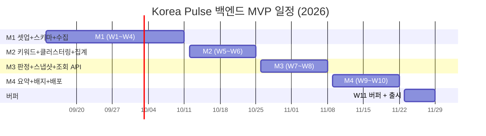

# Korea Pulse 백엔드 개발 계획서

| 항목 | 내용 |
| --- | --- |
| 문서 번호 | 05 |
| 대상 | Korea Pulse MVP 백엔드 (Java 21, Spring Boot 3.5.x, PostgreSQL, Railway) |
| 근거 문서 | PRD "사이드 프로젝트.txt" §12(반드시 구현), §14(핵심 가치), §16(담당자), §18(협업), §19(개발 기간). 01~04 문서 전체 |
| 관련 문서 | 01-기능-정의서, 02-시스템-설계서, 03-DB-설계, 04-API-명세 |
| 작성 기준일 | 2026-09-13 |

이 문서는 01~04에서 확정한 설계를 11월 안에 돌아가는 서비스로 만들기 위한 순서와 작업 단위를 정한다. 무엇을 만들지는 앞의 네 문서가 이미 정했으므로 여기서는 "언제, 어떤 순서로, 무엇이 끝나면 끝난 것으로 보는가"만 다룬다. 작업 단위는 02의 파이프라인 10단계, 03의 테이블 9개, 04의 엔드포인트 5개에서 그대로 끌어냈다.

---

## 1. 목표와 일정 제약

### 1.1 목표

PRD §19에 따라 MVP를 2026년 11월 안에 출시한다. 출시의 정의는 다음 세 가지가 동시에 성립하는 상태다.

1. Railway에 배포된 백엔드가 30분 주기로 파이프라인을 돌리고, 연속 24시간 동안 SUCCESS 런 비율이 90% 이상이다.
2. 04 문서의 엔드포인트 5개가 명세대로 응답하고, 앱(이민서)이 실제 서버를 붙여 PRD §13의 사용자 흐름을 끝까지 탄다.
3. PRD §12 "반드시 구현" 11항목이 모두 동작한다. 요약은 실제로 2~3문장 요약 생성이 동작해야 하며, LLM 호출 실패 등 개별 요청의 경우에만 null 폴백을 허용한다.

### 1.2 제약

| 제약 | 내용 | 계획에 미치는 영향 |
| --- | --- | --- |
| 기한 | 11월 말. 출시 목표일은 11월 27일(금), 최종 기한은 11월 30일(월) | 개발 가용 주차는 9월 14일 주부터 11주(W1~W11). 마지막 W11은 버퍼로 비워 둔다 |
| 인력 | 백엔드 1인(이광석, PRD §16) | 병렬 작업이 없다. WBS의 의존관계는 곧 실행 순서다. 코드 리뷰 상대가 없으므로 테스트가 리뷰를 대신한다 |
| 미팅 | 주 1회 온·오프라인(PRD §18) | 마일스톤 완료 기준은 미팅에서 보여줄 수 있는 형태(실행 로그, 쿼리 결과, curl 응답)로 정한다 |
| 투입량 | 이 계획은 주 5일 개발 투입을 가정한다 | 투입이 그보다 적으면 4절 우선순위에 따라 비필수 범위를 조정한다. PRD §12 필수 항목은 빼지 않고 일정 연장 또는 마일스톤 재조정으로 대응한다 |
| 앱과의 계약 | 04 API 명세가 유일한 계약이다 | 앱은 M3 완료 전까지 04 문서의 예시 JSON을 목 데이터로 쓴다. 필드명 변경은 04 문서 수정 없이는 하지 않는다 |

### 1.3 범위 밖

PRD §12가 MVP에서 제외한 회원가입, 로그인, 개인화, 관심 키워드 저장, 알림, 사용자 직접 키워드 검색, 세부 카테고리, 추천 시스템은 이 계획에 작업 단위로 등장하지 않는다. MVP 이후 로드맵의 일정은 이 문서에서 다루지 않는다.

---

## 2. 구현 마일스톤

네 개의 마일스톤을 순서대로 진행한다. 순서의 원칙은 하나다. 데이터가 흐르는 방향대로 만든다. 수집이 없으면 키워드가 없고, 키워드가 없으면 이슈가 없고, 이슈가 없으면 순위도 API도 없다. 요약과 배지는 순위 위에 얹는 장식이므로 마지막이다.

### 2.1 M1: 프로젝트 셋업 + DB 스키마 + 네이버 수집 (W1~W4, 9/14~10/11)

가장 긴 마일스톤이다. 프로젝트 골격, 9개 테이블, 런 락, 네이버 뉴스 수집까지 파이프라인의 0~3단계를 만든다. 첫 주에는 카테고리 휴리스틱의 전제가 되는 네이버 `link` 필드 패턴 조사를 병행한다(8절).

완료 기준:

| # | 기준 | 확인 방법 |
| --- | --- | --- |
| 1 | 로컬 PostgreSQL에서 Flyway `V1__init.sql`이 9개 테이블을 만들고 JPA `ddl-auto=validate`로 기동한다 | 기동 로그에 마이그레이션 성공과 validate 통과가 남는다 |
| 2 | 파이프라인 런 1회가 시드 키워드 파일로 시작해 네이버 API를 호출하고 `article`에 기사를 적재한 뒤 SUCCESS로 끝난다 (4~10단계는 no-op 통과) | `SELECT status, candidate_count, article_count, naver_call_count FROM pipeline_run`에서 SUCCESS 행과 article_count > 0 |
| 3 | 같은 런을 두 번 돌려도 `article` 행 수가 `url_hash` 중복만큼 늘지 않는다 | 두 번째 런의 article_count가 첫 번째보다 뚜렷이 작다 |
| 4 | RUNNING 행을 수동으로 남긴 뒤 heartbeat_at을 25분 전으로 바꾸면 다음 런이 그 행을 FAILED로 회수하고 새 런을 시작한다 | pipeline_run에 FAILED(stale) 행과 새 RUNNING/SUCCESS 행 |
| 5 | `link` 패턴 조사 결과표가 나와 있고, 휴리스틱을 1차로 쓸지 LLM을 1차로 승격할지 결정돼 있다 | 8절의 산출물 |
| 6 | QuotaBudget 단위 테스트가 통과한다 | `./gradlew test` 녹색 |

### 2.2 M2: 키워드 추출 + 클러스터링 + 집계 (W5~W6, 10/12~10/25)

수집된 기사를 이슈로 묶고 시간 버킷별 언급량을 쌓는다. 파이프라인 4~6단계다. 여기서 만든 `issue_hourly_stat`이 M3 판정의 유일한 입력이므로, M2가 끝나면 최소 48시간 동안 파이프라인을 계속 돌려 베이스라인을 쌓아 둔다.

완료 기준:

| # | 기준 | 확인 방법 |
| --- | --- | --- |
| 1 | 신규 기사마다 `article_keyword`에 명사 키워드가 저장되고, 불용어("기자", "뉴스", 매체명)가 들어 있지 않다 | `SELECT keyword, count(*) FROM article_keyword GROUP BY 1 ORDER BY 2 DESC LIMIT 50`에 불용어가 없다 |
| 2 | 같은 사건의 기사들이 하나의 `issue`로 묶이고, 다음 런에서 같은 사건의 새 기사가 새 이슈를 만들지 않고 기존 이슈에 붙는다 | 대표 이슈 3개를 골라 두 런에 걸친 `issue_article` 증가를 확인 |
| 3 | 이슈마다 `category`와 `category_source`가 채워져 있고 ETC 비율이 50% 미만이다 | `SELECT category, category_source, count(*) FROM issue GROUP BY 1, 2` |
| 4 | `issue_hourly_stat`이 UTC 정시 버킷으로 upsert되고, 48시간 무언급 이슈가 DORMANT로 바뀐다 | 테스트용으로 `last_mentioned_at`을 49시간 전으로 바꾼 이슈가 다음 런 후 DORMANT |
| 5 | 자가시딩 후보 소스가 ACTIVE 이슈의 대표 키워드를 후보에 넣는다 | pipeline_run.candidate_count가 시드 파일 개수보다 커진다 |
| 6 | 키워드 추출과 클러스터링 병합 단위 테스트가 통과한다 | `./gradlew test` 녹색 |

### 2.3 M3: 급상승 판정 + 스냅샷 + 조회 API (W7~W8, 10/26~11/8)

PRD §14가 말하는 핵심 가치가 여기서 완성된다. 파이프라인 7단계와 10단계, 그리고 04 문서의 엔드포인트 5개를 만든다. 8~9단계(검증, 요약)는 아직 no-op이라 배지와 요약은 null이다. 이 상태로도 앱은 전체 흐름을 붙일 수 있다.

완료 기준:

| # | 기준 | 확인 방법 |
| --- | --- | --- |
| 1 | 런마다 `trending_snapshot_entry`에 카테고리 7종 × 최대 10행이 단일 트랜잭션으로 기록되고, 그 뒤에만 런이 SUCCESS가 된다 | 스냅샷 쓰기 중 예외를 주입하면 런이 FAILED이고 해당 run_id의 스냅샷 행이 0개 |
| 2 | `GET /api/v1/trending?category=ECONOMY`가 04 문서 2.2절 형태로 응답하고, `sparkline` 길이가 항상 24다 | curl 응답을 04 예시와 필드 단위로 비교 |
| 3 | 잘못된 category는 400 `INVALID_CATEGORY`, 스냅샷을 모두 지운 상태에서는 503 `NO_SNAPSHOT_AVAILABLE` + `Retry-After: 300` | curl로 각 케이스 확인 |
| 4 | `GET /api/v1/issues/{id}`, `/stats`, `/news`가 04 문서 3~5절 형태로 응답하고 없는 id는 404 | curl. `/news` 응답에 description과 본문이 없다 |
| 5 | 모든 시각 필드가 `+09:00` 오프셋의 ISO 8601이고, `/trending`에 `Cache-Control: public, max-age=`가 붙는다 | 응답 헤더와 본문 확인 |
| 6 | `GET /health`의 `pipeline.details.minutesSinceLastSuccess`가 실제 경과 분과 일치한다 | 런 직후와 20분 뒤 값을 비교 |
| 7 | 급상승 점수 계산 단위 테스트와 ArchUnit 의존 규칙 테스트가 통과한다 | `./gradlew test` 녹색 |

M3가 끝나는 W8 미팅에서 앱 담당에게 로컬 서버(또는 임시 터널) 주소를 넘겨 실제 연동을 시작한다.

### 2.4 M4: 요약 + 검증 배지 + 배포 (W9~W10, 11/9~11/22)

파이프라인 8~9단계를 채우고 Railway에 올린다. 배포는 M4의 첫 작업이다. 요약과 배지는 배포된 서버에서 실제 쿼터와 비용을 보며 붙이는 편이 안전하다.

완료 기준:

| # | 기준 | 확인 방법 |
| --- | --- | --- |
| 1 | Railway 서비스가 Dockerfile로 빌드되어 기동하고, `DATABASE_URL`이 JDBC로 변환되어 Flyway가 운영 DB에 적용된다 | Railway 배포 로그와 `/health`의 `db.status: UP` |
| 2 | 배포 후 24시간 동안 파이프라인이 30분 주기로 돌고 SUCCESS 비율이 90% 이상이다 | `SELECT status, count(*) FROM pipeline_run WHERE started_at > now() - interval '24 hours' GROUP BY 1` |
| 3 | TOP-10에 오른 이슈의 `summary`가 2~3문장 한국어로 채워지고, 하루 `llm_call_count` 합계가 960을 넘지 않는다 | `SELECT sum(llm_call_count) FROM pipeline_run WHERE started_at::date = current_date` |
| 4 | `/trending` 응답의 `searchInterestIndex`와 `searchInterestAsOf`가 함께 채워지거나 함께 null이며, asOf가 전일 이하다 | curl 응답 확인 |
| 5 | LLM 또는 데이터랩을 WireMock으로 강제 실패시켜도 런은 SUCCESS이고 요약/배지만 null이다 | 로컬 프로필에서 확인 |
| 6 | Railway 메모리 그래프가 `-Xmx512m` 기준으로 안정되고, 월 비용 추정이 6절 표 안에 들어온다 | Railway 사용량 대시보드 |
| 7 | 앱이 운영 서버로 PRD §13 사용자 흐름을 끝까지 탄다 | W10 미팅에서 시연 |

### 2.5 W11 버퍼 (11/23~11/29)

새 기능을 넣지 않는다. M4에서 밀린 항목, 앱 연동 중 발견된 명세 불일치, 판정 파라미터 조정(최소 언급량 3건, 베이스라인 24버킷)에만 쓴다. 11월 27일(금)에 출시 상태를 선언한다.

---

## 3. 작업 단위 (WBS)

규모는 상대 단위다. S는 1일 이내, M은 2~3일, L은 4~5일을 뜻한다. 의존은 "이 작업을 시작하려면 끝나 있어야 하는 작업"이며, 같은 마일스톤 안에서는 번호 순서가 기본 실행 순서다. 마일스톤 간 의존은 항상 앞 마일스톤을 가리키므로 순환이 없다.

각 작업은 자기 코드의 단위 테스트를 포함한다(tests-after, 5절). 별도의 "테스트 작성" 작업은 두지 않는다.

### 3.1 M1 작업

| ID | 작업 | 규모 | 의존 | 산출물 / 완료 조건 |
| --- | --- | --- | --- | --- |
| M1-01 | 프로젝트 스캐폴딩: Gradle, Spring Boot 3.5.x, Java 21, 02 문서 2.1절 패키지 6개, 프로필 `all`/`web`/`worker`, `DataSourceConfig`(DATABASE_URL → JDBC 변환), JVM UTC 고정 | M | 없음 | 빈 앱이 두 가지 URL 형식으로 기동. 변환 실패 시 기동 실패 |
| M1-02 | 네이버 `link` 필드 패턴 표본 조사 (8절) | S | 없음 | 패턴표 + 매칭률 + 1차 분류기 결정. W1 안에 끝낸다 |
| M1-03 | Flyway `V1__init.sql`: 03 문서의 9개 테이블, CHECK 제약, 4절 인덱스 전부 | S | M1-01 | 마이그레이션 적용 + `ddl-auto=validate` 통과. Testcontainers로 적용 테스트 1건 |
| M1-04 | domain 엔티티와 리포지토리 인터페이스 9개, 상태 enum(RunStatus, IssueStatus, Category, CategorySource) | M | M1-03 | 컴파일 + validate 통과. 비즈니스 로직 없음 |
| M1-05 | `NaverNewsClient`(infra): 헤더 인증, `display=100`, `sort=date`, 429 백오프 재시도 최대 3회, 5xx 1회 재시도, 응답 DTO | M | M1-01 | WireMock 픽스처(정상, 빈 결과, 429, 401)로 단위 테스트 |
| M1-06 | `QuotaBudget`(infra.quota): 런당 상한 400, KST 자정 리셋 일 카운터(DB 저장), 70% 초과 신호 | S | M1-04 | tests-after 대상. 경계값 테스트 통과 |
| M1-07 | 파이프라인 오케스트레이터 + 런 락: `pipeline_run` RUNNING 삽입, `SELECT ... FOR UPDATE`, heartbeat_at 20분 초과 미갱신 시 스테일 회수, 단계 전환마다 heartbeat 갱신, 단계 인터페이스(`PipelineStage`) 10개 슬롯 | M | M1-04 | 2.1절 완료 기준 4 통과. 미구현 단계는 no-op으로 통과 |
| M1-08 | `CandidateSource` 인터페이스 + 시드 키워드 파일(카테고리별 약 30개, 콜드스타트용) + `TrendsRssCandidateSource`(타임아웃 5초, 실패 시 빈 목록) + 병합·중복 제거·200개 절단 | M | M1-04 | RSS를 WireMock으로 죽여도 후보 목록이 시드로 채워진다 |
| M1-09 | 수집 단계(collect): 후보 → `NaverNewsClient` → `article` upsert(`url_hash`, `ON CONFLICT DO NOTHING`), 수집 시도 키워드 중 50% 초과 실패일 때만 FAILED(401/403 포함). 런당 상한/일 쿼터 도달은 미시도 키워드를 실패율에서 제외하고 부분 수집으로 계속 | M | M1-05, M1-06, M1-07, M1-08 | 2.1절 완료 기준 2, 3 통과 |
| M1-10 | 정규화 단계(normalize): `<b>` 태그·엔티티 제거, pubDate(RFC 1123 +0900) → UTC, `publisher` 도메인 매핑, 카테고리 휴리스틱 1차(M1-02 결과 반영) | M | M1-02, M1-09 | 픽스처 기사 20건의 기대 카테고리와 일치 |
| M1-11 | Actuator 노출 제한: `management.endpoints.web.exposure.include=health`로 health 단일 노출 고정(02 문서 8.4절). 기본값 실수로 `/actuator/env` 등이 열리면 네이버·LLM 키가 노출되므로 설정 + 회귀 테스트로 고정한다 | S | M1-01 | `/health`(매핑된 경로)만 200, `/actuator/env`·`/actuator/beans` 등은 404. MockMvc 테스트 1건 |

### 3.2 M2 작업

| ID | 작업 | 규모 | 의존 | 산출물 / 완료 조건 |
| --- | --- | --- | --- | --- |
| M2-01 | `KeywordExtractor`: KOMORAN 명사 추출(상세 계약은 02 §11), `article_keyword` 저장, 초기화 실패 시 런 FAILED | M | M1-10 | tests-after 대상. 2.2절 완료 기준 1 통과 |
| M2-02 | 클러스터링 단계(cluster): 키워드 공출현 그룹핑(connected components), 기존 ACTIVE/DORMANT 이슈와 Jaccard 병합(임계값 설정값), `issue`/`issue_keyword`/`issue_article` 저장, 이슈명(대표 키워드 최대 3개), DORMANT → ACTIVE 복귀 | L | M2-01 | tests-after 대상. 2.2절 완료 기준 2 통과 |
| M2-03 | 이슈 카테고리 결정: 소속 기사 카테고리 다수결, 과반 없음(동률 포함) 또는 분류된 기사 비율 50% 미만이면 `CategoryFallbackClient` 인터페이스 호출. M2에서는 ETC를 돌려주는 NoOp 구현으로 연결 | S | M2-02 | `category_source`가 HEURISTIC 또는 LLM으로 기록. 실 LLM 연결은 M4-06 |
| M2-04 | `SelfSeedingCandidateSource`: ACTIVE 이슈 대표 키워드를 후보에 추가, 우선순위 자가시딩 > 데이터랩 > RSS | S | M2-02 | 2.2절 완료 기준 5 통과 |
| M2-05 | 집계 단계(aggregate): `issue_article` + `published_at`으로 `issue_hourly_stat` upsert(UTC 정시), `last_mentioned_at` 갱신, 48시간 무언급 ACTIVE → DORMANT 일괄 전이 | M | M2-02 | 2.2절 완료 기준 4 통과 |
| M2-06 | 데이터 보존 정리 작업: KST 04:00 스케줄, `article` 14일 / `issue_hourly_stat` 30일, 5,000행 배치 삭제 | S | M1-04 | 테스트 DB에서 기준일 넘긴 행만 삭제되고 cascade가 `article_keyword`, `issue_article`에 전파 |

M2가 끝나면 파이프라인을 멈추지 않고 M3 개발 중에도 로컬에서 계속 돌린다. 판정 테스트에 쓸 실제 베이스라인이 필요하기 때문이다.

### 3.3 M3 작업

| ID | 작업 | 규모 | 의존 | 산출물 / 완료 조건 |
| --- | --- | --- | --- | --- |
| M3-01 | 판정 단계(detect) + `SurgeCalculator`: 직전 완료 버킷 현재값, 직전 24버킷 평균, 최소 언급량 3, 최소 분모 1.0, `isNew` 규칙, 증가율 내림차순·언급량 보조 정렬, 카테고리 7종 순위, 스파크라인 24점(결측 0) | M | M2-05 | tests-after 대상. 01 문서 2.3~2.4절 규칙을 픽스처로 재현 |
| M3-02 | 스냅샷 단계(snapshot): `trending_snapshot_entry` 7 × 최대 10행 기록 + `pipeline_run` SUCCESS 마킹을 단일 트랜잭션으로. 같은 run_id + category 내 issue_id 중복 방지 | M | M1-07, M3-01 | 2.3절 완료 기준 1 통과 |
| M3-03 | api 공통: `@RestControllerAdvice` 에러 핸들러(code/message/timestamp), KST 응답 매퍼(단일 지점), 4xx/5xx `Cache-Control: no-store`, ArchUnit 의존 규칙 테스트(02 문서 2.2절) | S | M1-01 | 에러 5종이 04 문서 7.2절 예시와 같은 모양. ArchUnit 통과 |
| M3-04 | `GET /api/v1/trending`: query 계층 스냅샷 조회(마지막 SUCCESS run_id → PK 선두 조회), `computedAt`/`nextExpectedAt`, `Cache-Control` 계산(하한 30, 상한 1800), 400/503 | M | M3-02, M3-03 | 2.3절 완료 기준 2, 3, 5 통과 |
| M3-05 | `GET /api/v1/issues/{id}`: 이슈 기본 정보, 조회 시점 `mentionCount`/`surgeRate`(M3-01 계산기 재사용), `keywords` top10, `summary` null 허용, 404 | M | M3-01, M3-03 | 2.3절 완료 기준 4 통과 |
| M3-06 | `GET /api/v1/issues/{id}/stats`: from/to 파싱(오프셋 생략 시 KST), 정각 내림, 반개구간 `[from, to)`(from 포함, to 제외), 폭 7일(168버킷) 제한, 빈 버킷 0 채움 | S | M2-05, M3-03 | 기본 요청이 48개 points, 폭 초과가 400 |
| M3-07 | `GET /api/v1/issues/{id}/news`: issue_id로 필터링하고 article 조인 후 `article.published_at DESC` 페이징, `totalCount`, `source` 고정 필드, `naverLink` null 대체, 본문·description 미포함 | S | M2-02, M3-03 | 04 문서 5.2절과 필드 일치. size 51은 400 |
| M3-08 | `/health` 커스텀 `HealthIndicator`(pipeline): `lastSuccessAt`, `minutesSinceLastSuccess`, `lastRunStatus`, `cadenceMinutes`. DB 연결이 되는 한 UP 유지 | S | M1-07 | 2.3절 완료 기준 6 통과 |
| M3-09 | IP당 레이트 리밋 필터: Bucket4j 기반 분당 60회/IP(설정값), 초과 시 429 + 공통 에러 형식 + `Retry-After` 헤더(04 문서 7.1절). 읽기 전용 API라 보안보다는 Railway 사용량 과금(스크래이핑 봇) 방어 목적 | S | M3-03 | 분당 61번째 요청이 429와 공통 에러 형식. `/health`는 제외 |

### 3.4 M4 작업

| ID | 작업 | 규모 | 의존 | 산출물 / 완료 조건 |
| --- | --- | --- | --- | --- |
| M4-01 | Dockerfile + Railway 배포: 서비스 생성, PostgreSQL 플러그인, 환경변수 5종(02 문서 8.5절), `JAVA_TOOL_OPTIONS=-Xmx512m -Duser.timezone=UTC`, 헬스 체크 경로 | M | M3-04, M3-08 | 2.4절 완료 기준 1 통과. M4 첫 작업으로 W9 초에 끝낸다 |
| M4-02 | `DatalabClient`(infra): 5그룹/콜, 최근 7일 `timeUnit=date` 조회, 응답 DTO | S | M1-01 | WireMock 픽스처로 단위 테스트 |
| M4-03 | 검증 단계(validate): TOP-10 후보 대표 키워드를 5개씩 묶어 조회, `search_interest_daily` upsert, 당일 조회 키워드 재호출 금지, 일 카운터 500 초과 시 다음 날로 이월, 배지 산출(대표 키워드(primary)의 최신 가용 일자 ratio를 ROUND()한 정수, asOf 동반), 실패 시 null | M | M3-01, M4-02 | 2.4절 완료 기준 4, 5 통과 |
| M4-04 | `DatalabCandidateSource`: 전일 검색 관심도 상승 키워드를 후보에 추가 | S | M1-08, M4-02 | 후보 병합 우선순위에서 자가시딩 다음, RSS 앞 |
| M4-05 | `SummaryClient` 구현 1종: GPT 루나 또는 딥시크 중 하나를 짧게 비교해 선택, 고정 프롬프트, 타임아웃, 실패 시 `Optional.empty()` | S | M1-01 | WireMock 픽스처(정상, 타임아웃, 빈 응답)로 단위 테스트. 벤치마크 방법은 이 문서 범위 밖 |
| M4-06 | 요약 단계(summarize): 대상 선정(TOP-10 진입 + null 또는 재생성 조건 30%/6h), 런당 20콜 상한과 우선순위 3단계, 스니펫 최대 20건 입력, 후처리(빈 결과·300자 초과 폐기), `summary`/`summary_generated_at`/`summary_article_count` 저장, `llm_call_count` 기록. `CategoryFallbackClient`를 같은 클라이언트로 실 연결 | M | M2-03, M3-02, M4-05 | 2.4절 완료 기준 3, 5 통과 |
| M4-07 | 축퇴 케이던스: 일 카운터 70%(17,500) 초과 시 `fixedDelay` 60분 전환, 자정 리셋 시 30분 복귀, `pipeline_run.stats` JSONB(03 §3.1)에 케이던스와 사용 소스 기록 | S | M1-06, M1-07 | 카운터를 강제로 17,501로 두면 다음 런 간격이 60분. `/health`의 `cadenceMinutes`가 60 |
| M4-08 | 운영 관측과 튜닝: Railway 메모리 그래프 확인, `-Xmx` 조정, 일 쿼터·LLM 콜 수 확인, ETC 비율·판정 파라미터 조정, 앱 연동 QA 대응 | M | M4-01, M4-03, M4-06 | 2.4절 완료 기준 2, 6, 7 통과. W10 미팅에서 시연 |

### 3.5 부하 점검

| 마일스톤 | 기간 | S / M / L 개수 | 추정 합계(중앙값) | 비고 |
| --- | --- | --- | --- | --- |
| M1 | 4주(20일) | 4 / 7 / 0 | 약 21일 | 가장 무겁다. M1-02는 API 키만 있으면 되므로 W1 첫날 시작 |
| M2 | 2주(10일) | 3 / 2 / 1 | 약 12일 | 클러스터링(L)이 변수. 임계값 튜닝은 M4-08로 넘긴다 |
| M3 | 2주(10일) | 5 / 4 / 0 | 약 14일 | 엔드포인트 4개는 패턴이 같아 뒤로 갈수록 빨라진다 |
| M4 | 2주(10일) | 4 / 4 / 0 | 약 13일 | 배포(M4-01)를 먼저 끝내야 나머지가 운영 환경에서 검증된다 |
| 합계 | 10주(50일) + 버퍼 5일 | 16 / 17 / 1 | 약 60일 | 버퍼 5일을 포함해도 약 5일 초과. 4절 우선순위로 흡수한다 (M1-11·M3-09는 각 1일 미만의 보호 작업) |

---

## 4. 우선순위

PRD §14는 "수많은 뉴스 속에서 지금 관심이 빠르게 늘고 있는 이슈를 찾아내는 것"을 핵심 가치로 정하고, 급상승 TOP-10과 이슈 상세·관련 뉴스 두 기능의 완성도를 가장 우선한다. 이 계획의 우선순위는 그 문장을 그대로 따른다.

| 등급 | 범위 | 해당 작업 | 원칙 |
| --- | --- | --- | --- |
| P0 | 수집 → 판정 → 조회 API | M1 전체, M2 전체, M3 전체 | 어떤 경우에도 자르지 않는다. 일정이 밀리면 M4를 줄여서라도 P0을 지킨다 |
| P1 (출시 필수) | 배포·운영 신호·PRD §12 필수 구현 | M4-01, M4-02, M4-03, M4-05, M4-06, M4-07, M4-08 | 출시 게이트에 포함하며 어떤 경우에도 컷하지 않는다. 실패한 개별 요청의 null 폴백은 허용하지만 기능 구현 자체를 대체하지 않는다 |
| P4 | 후보 소스 보강 | M4-04 | 자가시딩과 RSS만으로도 파이프라인은 돈다. 비필수 범위이므로 가장 먼저 조정한다 |

PRD §12 필수 구현 11항목(요약 생성과 검색 관심도 제공 포함)은 모두 MVP 출시 게이트 안에 있으며 컷할 수 없다. P4→P3→P2 순서는 PRD §12 비필수 범위(예: P4 보조 후보 소스, 내부 편의 기능)에만 적용한다. 그 범위를 넘어 일정이 밀리면 필수 항목을 삭제하지 않고 일정 연장 또는 마일스톤 재조정으로 대응한다. 요약·검색 관심도의 null/빈 값은 LLM 호출 실패나 데이터랩 미조회 같은 개별 요청의 런타임 폴백일 뿐, 기능을 영구적으로 구현하지 않는 대체재가 아니다.

같은 등급 안에서는 "런이 FAILED가 되는 경로"를 먼저 만든다. 예를 들어 M1에서는 후보 생성의 RSS 소스보다 런 락과 수집 실패 규칙이 먼저다. 실패 경로가 없는 파이프라인은 첫 장애에서 데이터를 오염시키기 때문이다.

---

## 5. 테스트 전략

### 5.1 원칙: tests-after

테스트는 구현이 끝난 직후, 같은 작업 단위 안에서 쓴다. 테스트를 먼저 쓰는 방식은 채택하지 않는다. 1인 개발에서 설계 탐색과 테스트 작성이 겹치면 둘 다 느려지고, 이 프로젝트의 핵심 로직은 입력과 기대 출력이 명확해 사후 테스트로도 충분히 잡힌다. 다만 "나중에 몰아서"는 아니다. 각 WBS 항목의 완료 조건에 테스트 통과가 들어 있으므로, 테스트 없이 다음 항목으로 넘어가지 않는다.

### 5.2 도구

| 도구 | 용도 |
| --- | --- |
| JUnit 5 + AssertJ | 모든 단위 테스트 |
| 픽스처 파일 (`src/test/resources/fixtures/`) | 네이버 응답 JSON 표본, 기사 제목·스니펫 세트, 클러스터 입력 키워드 집합, 시간 버킷 시계열. M1-02 조사에서 확보한 실제 응답 표본을 익명화해 재사용한다 |
| WireMock | 네이버 뉴스 검색, 데이터랩, Google Trends RSS, LLM. 외부 API는 어떤 테스트에서도 실제로 호출하지 않는다 |
| Testcontainers (PostgreSQL) | Flyway 마이그레이션 적용과 `ddl-auto=validate` 확인 1건, 런 락 `FOR UPDATE` 동시성 확인 1건. 그 외 리포지토리 테스트는 두지 않는다 |
| ArchUnit | 02 문서 2.2절 의존 방향 규칙(`api`·`query`는 `pipeline` 임포트 금지 등) 1개 테스트 |

### 5.3 tests-after 필수 대상

아래 네 가지는 파이프라인의 판단 로직이고, 틀려도 예외가 나지 않아 운영에서 조용히 잘못된 순위를 내보낸다. 그래서 이 넷은 단위 테스트 없이 마일스톤을 닫지 않는다.

| 대상 | 클래스 | 반드시 포함하는 케이스 |
| --- | --- | --- |
| 키워드 추출 | `KeywordExtractor` (M2-01) | 명사만 남는다 / 불용어("기자", "뉴스", 매체명)가 제거된다 / 등장 순서가 유지되고 중복이 없다 / 명사 0개 입력은 빈 목록 / `<b>` 제거 후 텍스트를 받는다 |
| 클러스터링 병합 | `ClusterMerger` (M2-02) | 공출현 키워드가 있는 기사가 같은 그룹 / Jaccard가 임계값 이상이면 기존 이슈에 병합, 미만이면 신규 / DORMANT 이슈에 매칭되면 ACTIVE 복귀 / 기사 1건이 두 이슈에 속할 수 있다 / 빈 입력은 no-op |
| 급상승 점수 계산 | `SurgeCalculator` (M3-01) | `ROUND((41 - 14.5) / 14.5, 2) = 1.83` / 분모 1.0 미만은 1.0으로 고정 / 현재 3건 미만은 순위 제외 / 0이 아닌 베이스라인 버킷 3개 미만 OR previousAvgCount <1.0이면 `isNew` / NEW도 증가율 내림차순, 동률은 언급량 큰 쪽이 앞 / 스파크라인은 결측 0 포함 길이 24 |
| 쿼터 예산 | `QuotaBudget` (M1-06) | 런당 400 도달 시 거부 / 일 카운터 KST 자정 리셋 / 70%(17,500) 초과 신호 / 재시작 후 DB 값 복원 / 400회째는 허용, 401회째는 거부 |

### 5.4 그 외

- 컨트롤러는 `@WebMvcTest`로 04 문서의 예시 JSON과 응답을 비교한다. 엔드포인트당 정상 1건, 에러 1건 이상.
- 파이프라인 단계 통합은 WireMock 4종을 띄우고 오케스트레이터를 한 번 돌려 `pipeline_run`이 SUCCESS로 끝나는지 보는 테스트 1건으로 대신한다. 단계별 상세는 단위 테스트가 담당한다.
- 테스트에 `Thread.sleep`과 실제 시각 의존을 넣지 않는다. 시각은 `Clock`을 주입해 고정한다. 런 락 스테일 판정은 `Clock`과 heartbeat_at을 고정해 20분 이내/초과 미갱신을 확인한다. 시작 후 25분이 지나도 heartbeat_at이 최신이면 회수하지 않는다.
- 요약 문장이나 에러 `message` 문구는 테스트로 고정하지 않는다. `code`, 필드 존재 여부, 숫자만 검증한다.

---

## 6. 비용 추정

월 예산 가정은 약 $10 이내다(드래프트 Open assumptions). 아래 표는 그 가정이 성립하는 조건과 깨지는 조건을 함께 보인다. 단가는 리서치로 확인한 값(Railway Hobby $5/월, RAM $10/GB-mo, LLM 동급 모델 2종 단가)만 쓰고, GPT 루나·딥시크의 확정 단가는 M4-05에서 선택할 때 다시 확인한다.

### 6.1 인프라 (Railway)

| 항목 | 산정 | 월 비용 |
| --- | --- | --- |
| Hobby 요금제 | 고정. $5 상당의 사용량 포함 | $5.00 |
| 백엔드 컨테이너 RAM | `-Xmx512m` + 논힙 약 150MB → 평균 RSS 약 0.5~0.65GB × $10/GB-mo | $5.0~6.5 |
| PostgreSQL 플러그인 RAM | 소규모 인스턴스 평균 약 0.15~0.25GB × $10/GB-mo | $1.5~2.5 |
| vCPU | 30분마다 수 분 실행, 나머지는 유휴. 단가 미조사이나 RAM 대비 소액 | 약 $1 |
| 사용량 합계 | | $7.5~10 |
| Railway 청구 예상 | 사용량이 포함분 $5를 넘는 만큼 추가 청구 | 약 $7.5~10 |

RAM이 비용의 대부분이다. `-Xmx`를 384m으로 낮출 수 있으면 약 $1.5가 줄고, KOMORAN 사전(약 250MB 상주) 때문에 그 아래로는 내려가지 않는다. M4-08에서 실측 후 결정한다.

### 6.2 LLM 요약

호출당 토큰: 입력은 스니펫 최대 20건(title + description) + 프롬프트로 약 1,200~2,000 토큰, 출력은 2~3문장으로 약 200 토큰이다.

| 시나리오 | 일 호출 수 | 산정 근거 | 월 토큰 (입력 / 출력) | GPT-4o-mini급 ($0.15 / $0.60 per 1M) | Gemini Flash급 ($0.30 / $2.50 per 1M) |
| --- | --- | --- | --- | --- | --- |
| 기대 | 약 200콜 | 순위권 고유 이슈 약 40개 × 6시간 재생성 4회 + 신규 진입 요약 약 40건 | 7.2M~12M / 1.2M | $1.8~2.5 | $5.2~6.6 |
| 상한 | 960콜 | 런당 20콜 × 48런. 01 문서 7.2절의 설계 상한 | 34.6M~57.6M / 5.8M | $8.7~12.1 | $24.8~31.7 |

### 6.3 합계와 결론

| 시나리오 | Railway | LLM (4o-mini급) | 합계 |
| --- | --- | --- | --- |
| 기대 | $7.5~10 | $1.8~2.5 | 약 $9.3~12.5 |
| 상한 | $7.5~10 | $8.7~12.1 | 약 $16~22 |

결론은 세 가지다.

1. 기대 시나리오에서 월 약 $10 가정은 4o-mini급 단가일 때 성립한다. Gemini Flash급 단가면 $12.7~16.6으로 넘어간다. M4-05에서 후보를 고를 때 출력 토큰 단가를 첫 기준으로 본다.
2. 960콜은 예산이 아니라 방어선이다. 이 수치에 매일 닿는다면 재생성 조건이 너무 자주 걸리는 것이므로 6시간을 12시간으로 늘린다. 이 조정은 설정값 하나다.
3. 비용 가드로 `pipeline_run.llm_call_count`의 일 합계가 3일 연속 500을 넘으면 재생성 주기를 자동으로 12시간으로 늘리는 규칙을 M4-06에 넣는다. 예산은 veto 가능한 가정이므로, 실측 청구서를 W10 미팅에서 공유하고 유지할지 정한다.

---

## 7. 리스크와 대응

아키텍처 자문에서 나온 리스크 5종을 그대로 가져와 이 계획에서의 대응 시점을 붙였다. 완화책은 02 문서에 설계로 이미 들어 있고, 여기서는 어느 작업이 그것을 구현하는지와 발생 시 무엇을 볼지를 정한다.

| # | 리스크 | 발생 신호 | 완화책 (구현 작업) | 발생 시 대응 |
| --- | --- | --- | --- | --- |
| 1 | 네이버 뉴스 검색 쿼터 소진 (25,000회/일) | `naver_call_count` 일 합계가 17,500 초과. `/health`의 `cadenceMinutes`가 60 | 키워드 풀 200 상한과 런당 400 상한(M1-06), 70% 초과 시 60분 케이던스(M4-07). 정상 사용량 9,600콜은 한도의 38% | 축퇴가 발동했다는 것은 재시도 폭주나 키워드 풀 누수 버그라는 뜻이다. 쿼터 자체를 늘리려 하지 말고 `candidate_count`와 재시도 로그를 먼저 본다 |
| 2 | Google Trends RSS 장애 또는 형식 변경 | 런 메타의 사용 소스 목록에서 RSS가 빠짐. 신규 이슈 생성 수 감소 | CandidateSource 3중화(M1-08, M2-04, M4-04). RSS는 타임아웃 5초, 실패 시 빈 목록. 후보가 0개여도 시드 파일로 런 지속 | 파서를 고치되 하루 이상 걸리면 그냥 끈다. 데이터랩 + 자가시딩만으로 기존 이슈 추적은 정상이다 |
| 3 | 클러스터링 품질: 다른 사건이 한 이슈로 합쳐지거나, 같은 사건이 여러 이슈로 쪼개짐 | 이슈명이 무관한 키워드 조합. TOP-10에 같은 사건이 2~3개 순위를 차지. ETC 비율 50% 초과 | Jaccard 임계값을 설정값으로 노출(M2-02), 대표 이슈 3개 추적을 M2 완료 기준에 포함, 14일 보존으로 사후 분석 가능 | 임계값 조정은 M4-08에서 실데이터로. KOMORAN 명사 추출의 상세 계약은 02 §11을 따른다. 알고리즘 교체는 MVP 범위 밖 |
| 4 | 증가율 노이즈와 콜드스타트: 베이스라인이 없어 모든 이슈가 NEW, 또는 기사 1~2건으로 순위 진입 | 첫 24시간 동안 `isNew=true` 비율 100%. 심야 시간대에 언급량 3건 이슈가 1위 | 최소 언급량 3건, 최소 분모 1.0, 베이스라인 부족 시 NEW 배지, NEW 포함 증가율 내림차순·동률 시 언급량 정렬(M3-01). M2 종료 후 48시간 이상 파이프라인을 미리 돌려 베이스라인 확보 | 배포 직후 첫날은 NEW가 많은 것이 정상이다. 앱은 NEW 배지를 그대로 보여주면 된다. 심야 노이즈가 문제면 최소 언급량을 5로 올린다(설정값) |
| 5 | 단일 JVM 라이프사이클: 재배포 중 두 인스턴스가 겹치거나, 파이프라인이 API 응답 시간을 잡아먹거나, OOM으로 재시작 | `pipeline_run`에 stale FAILED 행 반복. API P95 500ms 초과. Railway 재시작 로그 | DB 행 락 + heartbeat_at 20분 초과 미갱신 회수(M1-07), `-Xmx512m` 명시(M4-01), `web`/`worker` 프로필과 `WorkerEntryPoint`(M1-01), health는 DB 연결만으로 UP 유지(M3-08) | OOM이면 먼저 `-Xmx`를 올리고 비용을 본다. P95 초과가 하루 이상이면 `worker` 프로필로 파이프라인을 Railway cron으로 분리한다. 02 문서 2.2절 의존 규칙 덕에 코드 수정 없이 프로필 변경만으로 끝나야 하며, ArchUnit 테스트가 그것을 보증한다 |

리스크 표에 없는 일정 리스크는 3.5절 부하 점검과 4절 우선순위가 다룬다. 추정이 약 3일 초과이고 버퍼가 5일이므로, M4에서 P4 하나만 빼도 균형이 맞는다.

---

## 8. 카테고리 휴리스틱 검증 (M1 첫 주)

### 8.1 왜 첫 주인가

네이버 뉴스 검색 API는 카테고리를 주지 않는다. 01 문서 5절은 `link` 필드의 섹션 패턴을 1차 분류기로 쓰기로 했지만, 그 패턴이 실제로 존재하는지는 아직 확인하지 않은 전제다. 이 전제가 틀리면 M1-10(정규화), M2-03(카테고리 결정), M4-06(LLM 폴백)의 역할 분담이 바뀌고, LLM 호출량과 비용 추정(6절)도 달라진다. 그래서 다른 어떤 작업보다 먼저, API 키만 받으면 바로 시작할 수 있는 W1 첫날에 착수한다.

### 8.2 작업 (M1-02)

| 항목 | 내용 |
| --- | --- |
| 입력 | 카테고리별 대표 검색어 5개 × 6개 카테고리(ALL 제외) = 30개 검색어. 각 `display=100`으로 1회 호출. 총 30콜, 최대 3,000건 |
| 조사 항목 | (a) `link` 호스트 분포: `n.news.naver.com`, `sports.news.naver.com`, `entertain.naver.com` 등 서브도메인이 카테고리와 대응하는가. (b) 경로에 섹션 식별자(예: `/mnews/article/`, `/sid1=` 계열 파라미터)가 있는가. (c) `originallink`와 `link`가 같은 비율(네이버 미제휴 매체) |
| 판정 기준 | 표본 3,000건 중 검색어의 의도 카테고리와 패턴 추정 카테고리가 일치하는 비율(매칭률)을 카테고리별로 계산 |
| 산출물 | (1) 패턴표: 호스트/경로 패턴 → 카테고리 매핑과 표본 수. (2) 카테고리별 매칭률과 미분류율. (3) 익명화한 응답 표본 200건을 `fixtures/naver/`에 저장(5.2절 픽스처). (4) 결정 메모 1단락 |
| 규모 | S. 호출 스크립트와 집계는 반나절, 패턴 정리와 판정 반나절 |

### 8.3 결정 규칙

| 매칭률 | 결정 | 영향 받는 작업 |
| --- | --- | --- |
| 70% 이상, 미분류 30% 이하 | 휴리스틱을 1차로 확정. 01 문서 5.3절 그대로 | M1-10에 패턴표 반영. M4-06의 LLM 폴백은 미분류 이슈에만 |
| 40~70% | 휴리스틱을 "힌트"로 격하. 다수결 과반 기준을 60%로 올리고 LLM 폴백 비중을 키운다 | M2-03 다수결 기준 변경. 6절 LLM 비용에 카테고리 분류 콜을 별도 행으로 추가(신규 이슈 일 약 300건 × 소량 토큰) |
| 40% 미만 또는 패턴 부재 | LLM 분류를 1차로 승격. 휴리스틱은 스포츠·연예 서브도메인처럼 확실한 것만 남긴다 | M2-03이 M4-05의 클라이언트에 의존하게 되므로 M4-05를 M2 앞으로 당긴다. 01 문서 5.3절 갱신 |

어느 쪽이든 결과는 W1 미팅에서 공유하고, 01 문서 5절의 "미검증" 표기를 조사 결과로 바꾼다.

---

## 9. 다른 문서와의 대응

| 이 문서 | 대응 |
| --- | --- |
| 2절 마일스톤 순서 | 02 문서 3.2절 파이프라인 10단계 (M1 = 0~3, M2 = 4~6, M3 = 7·10, M4 = 8~9) |
| 3.1절 M1-03, M1-04 | 03 문서 2절 ERD 9개 테이블, 4절 인덱스 |
| 3.3절 M3-04~M3-08 | 04 문서 2~6절 엔드포인트 5개 |
| 3.4절 M4-06 | 01 문서 7절 요약 생성 정책 |
| 5.2절 ArchUnit | 02 문서 2.2절 의존 방향 규칙 |
| 6절 비용 | 02 문서 6.4절 LLM 예산 행, 8.1절 Railway 요금 |
| 7절 리스크 | 02 문서 5.2절 축퇴 모드, 6.3절 축퇴 규칙, 7.2절 런 락 |
| 8절 휴리스틱 검증 | 01 문서 5.3절 "검증되지 않았다", 02 문서 4.1절 |
